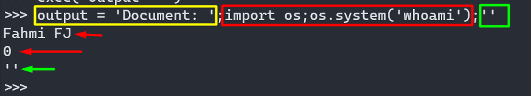

## Code review - Abuse format.


```python
>>> info = "output = 'Document: {}'"
>>> path='\';import os;os.system(\'whoami\');\'' # this works
>>> path="';import os;os.system(\'whoami\');'" # this also works
>>> exec(info.format(path))
Fahmi FJ
```

Breakdown:
```python
>>> path="';import os;os.system(\'whoami\');'"
>>> vuln_path = info.format(path)
>>> print(vuln_path)
output = 'Document: ';import os;os.system('whoami');''
>>> exec("output = 'Document: ';import os;os.system('whoami');''")
>>> output = 'Document: ';import os;os.system('whoami');''
Fahmi FJ
```

```python
# exec("output = 'Document: ';import os;os.system('whoami');''")
>>> exec("output = 'Document'") # simply executed, it assigning the value
>>> output
'Document'
# ; = indentation
>>> exec("import os;os.system('whoami')") # simply executed, return 0 if success, 1 if failed.
Fahmi FJ
>>> exec("''") # None
<no output>
```



> - `exec`(*object*[, *globals*[, *locals*]])
>
>   This function supports dynamic execution of Python code. *object* must be either a string or a code object.  If it is a string, the string is parsed as a suite of Python statements which is then executed (unless a syntax error occurs). [[1\]](mk:@MSITStore:C:\Users\fahmi\AppData\Local\Programs\Python\Python39\Doc\python392.chm::/library/functions.html#id2) If it is a code object, it is simply executed.
>
>   ... <snip>...